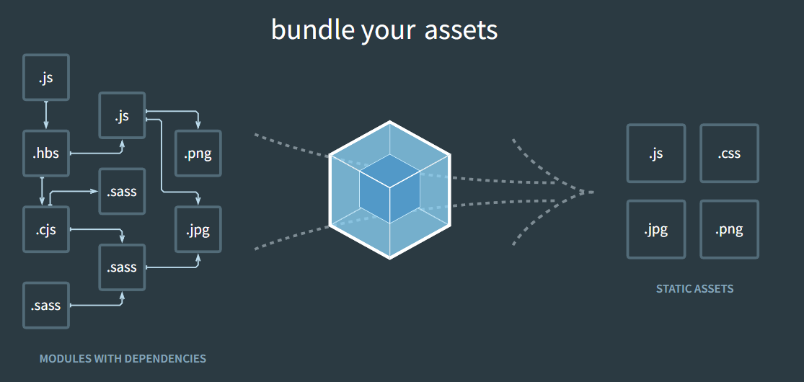
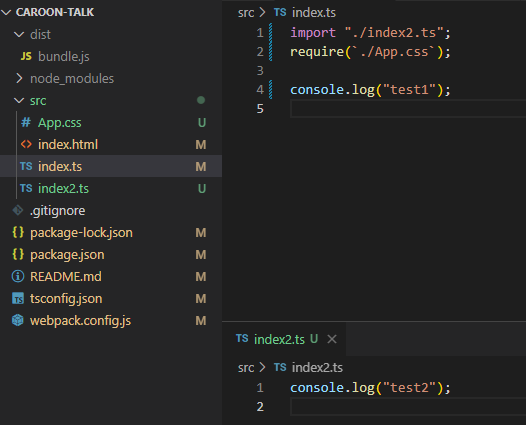
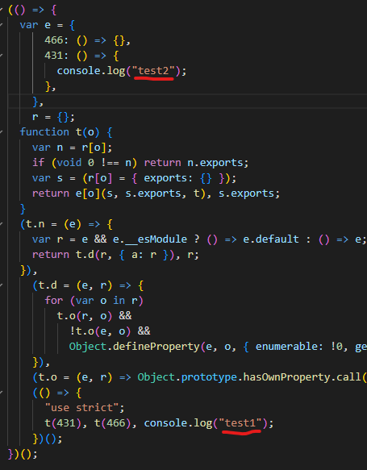
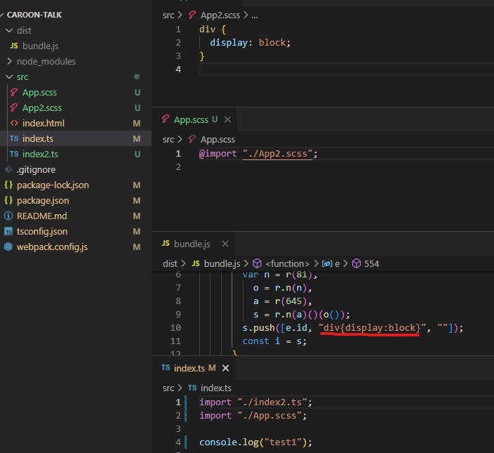
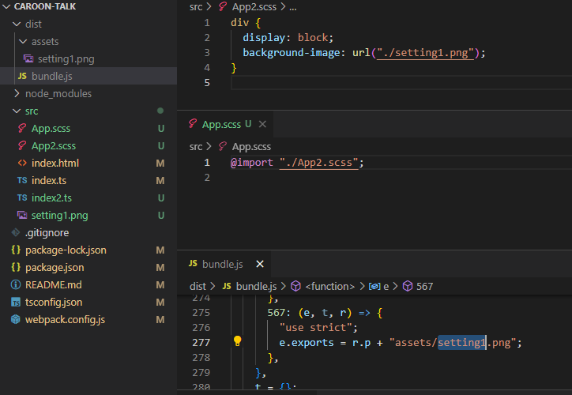
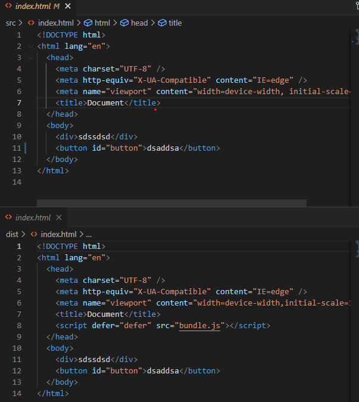

CRA로 프로젝트를 해본 사람들이라면 Webpack에 대해서 한번쯤은 다 들어봤을 것입니다. CRA가 자체적으로 webpack을 잘 짜뒀지만 그 양이 너무 많아 확장이나 수정을 할 때 많이 힘들다고 합니다.
이번 기회에 간단한 typescript webpack 설정을 해보도록 하겠습니다.

## Webpack

웹팩의 공식 사이트의 문서에 따르면 웹팩에 대산 설명은 다음과 같습니다.

At its core, webpack is a static module bundler for modern JavaScript applications. When webpack processes your application, it internally builds a dependency graph from one or more entry points and then combines every module your project needs into one or more bundles, which are static assets to serve your content from.

웹팩은 정적 모듈 번들러로 여러개의 종류의 여러 파일들을 하나 혹은 여러개의 번들로(보통은 하나일 것입니다.) 모아주는 역할을 합니다.



### Webpack을 사용하는 이유

> CommonJS의 도입으로 인한 보다 편한 script 관리와 보다 빠른 속도

현재 JS는 CommonJS가 도입되면서 require이나 export와 같은 함수들로 다른 파일들을 import할 수 있게 됩니다.

기본의 JS는 이 기능이 없어 HTML에 여러가지의 script를 적여야할 필요가 있었습니다.
하지만 이렇게 스크립트를 관리하게 되면 각 스크립트가 미치는 영향을 확인하기가 어려운 단점이 있었습니다.

반면 Webpack을 이용해서 하나의 root js 파일에서 다른 js파일에 다가갈 수 있다는 점을 이용하면 하나의 script만 html 파일에 적어도 프로젝트 관리가 가능했습니다.

하지만 이 경우도 완벽한 것은 아니었습니다. CommonJS를 사용하는 과정에서 다른 파일에 접근하는만큼 그 속도가 느리고 당장 lodash을 사용한다고 가정할 경우 하나의 함수만 이용하고 싶더라도
모든 lodash를 받아와야 하는 등 속도와 용량이 너무 비효율 적이었습니다.

이런 상황을 개선시키기 위해서 Webpack은 다른 파일에서 사용된 함수들을 IIFE를 이용해
(즉시 실행되는 함수 표현식으로 (function () { console.log('Hello World') })(); 와 같이 함수를 적으면 바로 실행되는 방식입니다.)
하나의 bundle.js 파일에 표현하여 최종적으로 생긴 하나의 js파일에서 모든 파일들이 가지고 있던 정보들을 관리할 수 있게 됩니다.

즉, 다른 파일에 접근하지 않게되고 더 빠른 속도로 처리가 가능하게 됩니다.

## 웹팩 시작하기

```
npm i -D typescript // 타입스크립트
tsc --init // 타입스크립트 설정 초기화
```

```
// ***** ./tsconfig.json *****
{
  "compilerOptions": {
    "target": "es2016",
    "module": "commonjs",
    "esModuleInterop": true,
    "forceConsistentCasingInFileNames": true,
    "strict": true,
    "skipLibCheck": true
  }
}
```

tsconfig.json 생성을 위의 커맨드를 이용해서 작동시킨다고 가정할 경우
자동적으로 생기는 초기 파일입니다.

```
npm i -D webpack
npm i -D webpack-cli
```

웹팩을 설치해줍니다.

pakage.json에 webpack 커맨드를 추가해줍니다.

```
"scripts": {
    "build": "webpack"
  },
```

이 때 webpack이 아닌 webpack --progress를 적으면 빌드 진행율을 보여줍니다.

이제 가장 상위 폴더에(package.json이 있는) webpack.config.js를 생성하고
프로젝트 파일들이 모여있을 src폴더와 build 결과물이 나타날 dist 폴더를 만듭니다.

```
project
├─ node_modules
├─ .gitignore
├─ dist
├─ src
├─ package.json
├─ package-lock.json
├─ Readme.md
├─ tsconfig.json
└─ webpack.config.js
```

그 후 webpack.config.js을 합니다.

```webpack.config.js
const path = require("path");

module.exports = {
  mode: "development", // or production
  entry:  "./src/index.ts", // 초기 파일 경로
  output: {
    filename: "bundle.js", // js 파일 이름 설정
    path: path.resolve("./dist"), // 빌드 결과물을 생성할 경로(절대경로)
    assetModuleFilename: "assets/[name][ext]", // asset 폴더에 있던 파일들은 dist 내부에 asset 폴더 생성후 이름과 확장자를 그대로 사용하여 저장
    clean: true, // 빌드 이전 결과물 제거
  },
};
```

`entry`: 모든 프로젝트의 시작이 되는 root 파일입니다. 이 파일로부터 시작하여 모든 모듈들을
탐색해 하나의 번들로 만들 수 있게 됩니다.

`output`: 번들링된 최종 결과물이 나오는 폴더입니다. asset 폴더 설정을 하거나 기존 파일을 지우는 등의 설정이 가능합니다.

`mode`: build 모드를 설정합니다. 개발용과 배포용으로 나뉘게 되며 development와 production 중 하나의 값을 적으면 됩니다.

이제 잘 되는지 확인해보겠습니다.



src 폴더 안에 위의 webpack에서 설정한 index.ts와 간단한 번들링이 잘 되는지 확인하기 위한
index2.ts를 만든후 num run build를 해보겠습니다.



번들링이 잘 됐습니다.(보기 편하게 하기 위해 production mode로 build 했습니다.)

## Loaders

번들링이 잘 되긴 했지만 사실 지금 상황에서는 ts파일과 js 파일만 번들링이 되는 상황입니다.
css, img 등 여러가지 asset을 번들링 하기 위해서는 각 파일마다 loader을 설치해야합니다.

loader을 이용하면 jsx와 같은 파일들을 js로 변경하거나
scss와 같은 파일들을 css로 변경할 수 있습니다.

scss를 사용해서 프로젝트를 진행 하겠습니다.

`npm i -D style-loader css-loader sass sass-loader`

```
// ***** ./webpack.config.js *****

module.exports = {
  ...
  module: {
    rules: [
      {
        test: /\.(scss|css)$/, // 확장자가 scss, css인 모든 파일
        use: [
          'style-loader',
          'css-loader',
          'sass-loader',
        ],
      },
    ],
  },
  ...
}
```

기존에 작성했던 webpack.config.js에 module을 추가해주면 됩니다.
module.rules.use를보면 style-loader, css-loader, sass-loader 순서대로
적힌것을 볼 수 있는데 이 경우 역순으로 작동하여 sass -> css -> dom에 추가
순으로 작동하게 됩니다.

잘 작동하는지 확인해봅시다.



src에 scss파일을 생성한 후 index.ts에 import 해주면 bundler에 추가적으로 해당 내용이 기입된 것을 확인할 수 있었습니다.

## Asset Modules

Asset Modules는 이미지나 폰트 등의 파일을 사용할 수 있게 해주는 모듈입니다.

```
module.exports = {
  ...
    module: {
    rules: [
      ...
      {
        test: /\.(png|jpg|svg|gif)$/,
        type: 'asset', // resource와 inline 중에서 자동으로 선택
        parser: {
          dataUrlCondition: {
            maxSize: 4 * 1024, // 크기가 4kb 미만인 파일은 inline 모듈로 처리되고 그렇지 않으면 resource 모듈로 처리
          },
        },
      },
      ...
    ]
  }
  ...
}
```

webpack.config.js에서 rules에 추가해주시면 됩니다.



dist폴더에 asset파일과 이미지가 생성된 것을 확인할 수 있습니다.
현재 세팅에서는 png, jpg, svg, gif만 설정 되었지만 ttf와 같은 글꼴도 추가하면 asset 폴더 내부에 추가가 가능합니다.

## HtmlWebpackPlugin

js 파일들이 번들링되는 것을 확인했지만 결국 최종적으로 저희가 배포해야할 것은 html 파일일 것입니다.
그리고 그 html 파일은 bundle.js를 자동적으로 import해야할 필요가 있습니다.

```
...
const HtmlWebpackPlugin = require('html-webpack-plugin');

module.exports = {
  ...
    plugins: [
    new HtmlWebpackPlugin({
      template: "./src/index.html", // 템플릿 위치
    }),
  ],
};
```

HtmlWebpackPlugin을 plugin으로 추가합니다.



아래가 빌드 후 dist에 생성된 html 파일입니다. script 태그가 생성되어 bundle.js을 import 할 수 있습니다.

---

[참조1](https://joshua1988.github.io/webpack-guide/motivation/why-webpack.html#%ED%8C%8C%EC%9D%BC-%EB%8B%A8%EC%9C%84%EC%9D%98-%EC%9E%90%EB%B0%94%EC%8A%A4%ED%81%AC%EB%A6%BD%ED%8A%B8-%EB%AA%A8%EB%93%88-%EA%B4%80%EB%A6%AC)

[참조2](https://velog.io/@husbumps/TS-Boilerplate-1)
