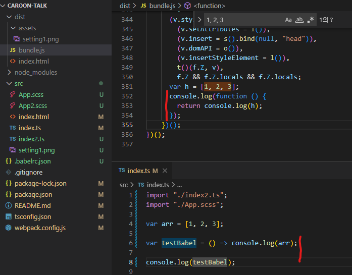

프론트엔드 언어는 매우 빠르게 변경되는 편입니다. 자연스럽게 구버전의 브라우저는
사용하지 못하는 언어들이 생기게 됩니다. 이런 점을 해결해주는 것이 바로 Babel입니다.
바벨은 구버전의 브라우저에서도 잘 사용될 수 있도록 코드를 변경해줍니다.

`npm install -D @babel/core @babel/cli`

바벨을 설치해줍니다.

이제 바벨을 설정할 필요가 있습니다. 바벨을 설정하기에는 너무 많은 플러그인들이 있어
일일이 설정하는 것은 너무 비효율 적입니다. 이를 보완하기 위해서
몇몇 목적을 위해서 사용할 Babel의 초기 세팅을 제공하는 것을 preset이라고 합니다.

대표적인 예시로

@babel/preset-env

@babel/preset-typescript

@babel/preset-react

등이 있어 필요한 목적에 따라서 사용하면 됩니다.

저의 경우 리액트를 사용하지 않고 Ts와 ES2015 구문을 컴파일하는 목적으로
사용할 예정이기 때문에 위의 두가지면 설치하겠습니다.

`npm i -D @babel/preset-env @babel/preset-typescript`

이제 최상단 폴더에 전에 webpack.config.js를 만들었던 것처럼
`.babelrc.json`을 생성해줍니다.

.babelrc.json

```
{
  "presets": ["@babel/preset-env", "@babel/preset-typescript"]
}

```

babel을 이용하면 구형 브라우저들이 문법을 사용할 수 있게 되는 장점이 있었지만
preset 설정만으로는 최신 브라우저의 기능을 사용할 수 없을 수도 있습니다.
이를 보완하기위해서 사용하는 것을 polyfill이라고 부릅니다.

이번 경우에는 corejs를 사용하겠습니다.

`npm install core-js`

core-js의 설치가 완료되면 .babelrc을 수정해줍니다.

```
{
  "presets": [
    [
      "@babel/preset-env",
      {
        "targets": ">= 0.25%, not dead",
        "useBuiltIns": "usage",
        "corejs": 3
      }
    ],
    "@babel/preset-typescript"
  ]
}
```

이로써 babel의 사용준비가 끝났습니다. 이제 이를 webpack에 적용시켜줘야 합니다.

이전에 scss를 사용하기 위해 사용했던 loader처럼 babel을 사용하기 위한 로더가 있습니다.

`npm install -D babel-loader`

webpack.config.js의 rule 부분을 추가해줍니다. ts를 다룰 때 사용할 예정이므로 기존에 설정한
css,scss와 같이 ts 부분을 추가해줍니다.

```
...
module.exports = {
  ...
    rules: [
      {
        test: /\.ts$/,
        exclude: /node_modules/, // node_mudules를 제외한다.
        loader: "babel-loader",
      },
      ...
    ]
};
```

잘 작동하는지 확인해보겠습니다.
index.ts를 화살표 함수로 쓰고 bundle을 확인해보니 함수 선언문으로 변경되어 있었습니다.
잘 작동합니다!



최종 파일

babelrc

```
{
  "presets": [
    [
      "@babel/preset-env",
      {
        "targets": ">= 0.25%, not dead",
        "useBuiltIns": "usage",
        "corejs": 3
      }
    ],
    "@babel/preset-typescript"
  ]
}
```

webpack.config.js

```
const path = require("path");
const HtmlWebpackPlugin = require("html-webpack-plugin");
// const mode = process.env.NODE_ENV || "development";

module.exports = {
  mode: "production", // or production
  entry: "./src/index.ts", // 초기 파일 경로
  output: {
    filename: "bundle.js", // js 파일 이름 설정
    path: path.resolve("./dist"), // 빌드 결과물을 생성할 경로(절대경로)
    assetModuleFilename: "assets/[name][ext]", // asset 폴더에 있던 파일들은 dist 내부에 asset 폴더 생성후 이름과 확장자를 그대로 사용하여 저장
    clean: true, // 빌드 이전 결과물 제거
  },
  module: {
    rules: [
      {
        test: /\.ts$/,
        exclude: /node_modules/, // node_mudules를 제외한다.
        loader: "babel-loader",
      },
      {
        test: /\.(sass|scss|css)$/, // 확장자가 scss, css인 모든 파일
        use: ["style-loader", "css-loader", "sass-loader"], // 배열의 역순으로 로더가 동작. scss파일을 css파일로 컴파일 -> css-loader를 적용해 모듈화 -> 동적으로 돔에 추가
      },
      {
        test: /\.(png|jpg|svg|gif)$/,
        type: "asset", // resource와 inline 중에서 자동으로 선택
        parser: {
          dataUrlCondition: {
            maxSize: 4 * 1024, // 크기가 4kb 미만인 파일은 inline 모듈로 처리되고 그렇지 않으면 resource 모듈로 처리
          },
        },
      },
    ],
  },

  plugins: [
    new HtmlWebpackPlugin({
      template: "./src/index.html", // 템플릿 위치
    }),
  ],
};

```

---

[참조2](https://velog.io/@husbumps/TS-Boilerplate-2)

```

```
