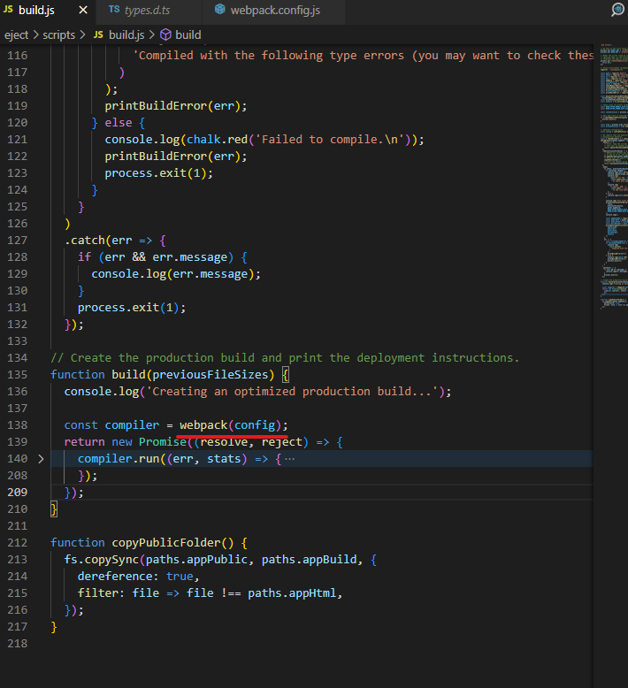
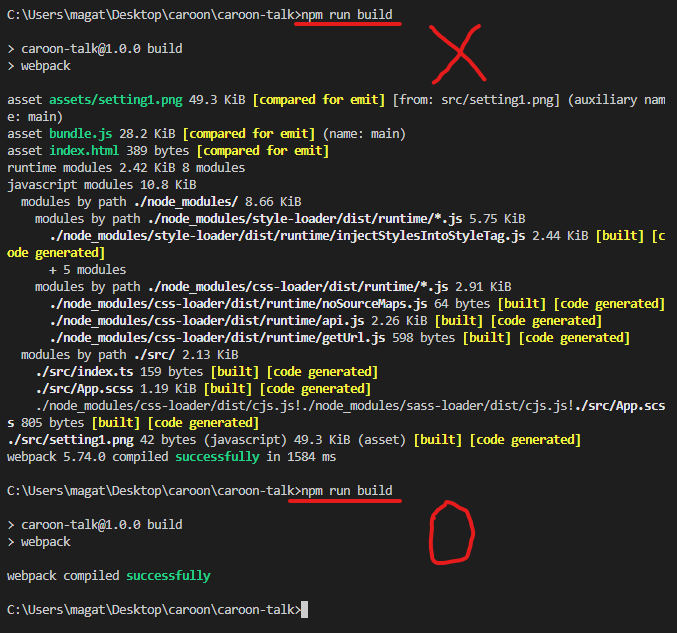

`npm run build`를 위한 build.js를 살펴보면 webpack을 이용했다는 것을 살펴볼 수 있습니다.



이번에는 CRA의 webpack를 참고해서 기존의 제가 전에 설정했던 webpack을 보완해보겠습니다.

먼저 CRA를 작성한 후 commit을 한 뒤 `npm run eject`를 하게 되면 CRA의 웹팩 설정이 나타나게 됩니다.

그 양이 너무 많으니 너무 길다 싶으면 생략할테니 직접 찾아보시길 바랍니다.

CRA의 webpack.config.js을 살필 수 있을겁니다.

CRA의 webpack.config.js은

```
{
  target:{...},
  stats:'...',
  mode:'...',
  bail:'...',
  devtool:'...',
  entry:'...',
  cache:{...},
  infrastructureLogging:{...},
  optimization:{...},
  resolve:{...},
  module:{...},
  plugins:[...].filter(Boolean),
  performance:false,
}
```

정도로 나눌 수 있을 것 같습니다. 이제 하나하나씩 살펴보겠습니다.

## mode

먼저 살펴볼 것은 mode입니다.

```
mode: isEnvProduction ? 'production' : isEnvDevelopment && 'development'
```

CRA에서는 이렇게 설정되어 있습니다. Production 모드일 경우, Development 모드일 경우, 설정하지 않은 none 경우로 나뉘게 됩니다.(webpack의 default 설정은 production입니다.)

production의 경우 development보다 추가적인 압축이 들어가게 됩니다.

반면 development은 production보다 웹팩 로그나 결과물을 좀 더 쉽게 알 수 있다고 합니다.

일단 배포하기 전이니 저의 webpack 설정을 development로 설정하겠습니다.

(결과물은 마지막에 챕터마다 올리도록 하겠습니다.)

## target

webpack이 어떤 환경에서 사용될지에 대한 설정입니다. node등 설정이 있지만
저희는 front-end 환경설정이기 때문에 CRA에서 설정한 것처럼 ['browserslist']로 설정하겠습니다.

## stats

stats는 표시되는 번들에 대한 정보를 정확하게 알 수 있다고 합니다.

CRA의 설정인 `stats: 'errors-warnings'`을 적용해보겠습니다.



사진처럼 에러가 발생하지 않자 웹팩에 대한 로그가 모두 지워졌습니다.
굳이 에러가 발생하지 않았을 경우 로그를 볼 필요가 없을테니 저도 CRA를 따라가겠습니다.

이 외 `summary`나 `normal`과 같은 여러 preset과 여러분이 원하는대로 stats을 세부적인 설정이
존재하니 관심있으시면 살펴보시면 됩니다.

## entry

웹팩 빌드가 시작될 지점입니다 CRA에서는 절대경로를 설정했지만 저는 그냥 간단하게 초기 index의 위치를 설정했습니다.

## output

출력 파일에 대한 정보입니다.

1.  path

절대 경로로 출력 디렉터리를 결정합니다. CRA에서는 따로 지정하지 않으면 build 폴더에 생성되는데 저는 dist라는 폴더에 생성되도록 하겠습니다.

2. pathinfo

포함된 모듈에 대한 정보를 주석으로 번들에 포함하도록 합니다. 보통 development에서 true고 production모드에서는 false입니다.
CRA와 같이 설정하겠습니다.

3. filename

생성될 파일의 이름입니다. CRA에서는 production모드와 development의 결과 파일이 해시의 유무로 차이가 있지만
저는 그러지 않고 bundle.js로 사용하겠습니다.

4. chunkFilename

웹팩의 codeSpliting을 위해 만들어질 chunk의 이름 설정입니다.

5. assetModuleFilename

생성될 asset의 파일 이름입니다. 저의 경우 assets 폴더를 만든 후 파일을 저장하도록 했습니다.

6. publicPath

브라우저에서 참조될 때의 출력 파일의 공용 URL 주소를 지정합니다.

## optimization

```
    optimization: {
      minimize: isEnvProduction,
      minimizer: [
        new TerserPlugin({
          terserOptions: {
            parse: {
              ecma: 8,
            },
            compress: {
              ecma: 5,
              warnings: false,
              comparisons: false,
              inline: 2,
            },
            mangle: {
              safari10: true,
            },
            keep_classnames: isEnvProductionProfile,
            keep_fnames: isEnvProductionProfile,
            output: {
              ecma: 5,
              comments: false,
              ascii_only: true,
            },
          },
        }),
        new CssMinimizerPlugin(),
      ],
    },
```

배포시 코드 최적화를 위한 설정입니다. 배포될 코드이기에 production 모드에서만 작동하도록 설정되어 있습니다.
이 부분은 CRA를 따라가겠습니다.

단, 저는 keep_classnames와 keep_fnames의 설정 결과를 보고 build된
웹팩 결과를 보고 굳이 사용해야할 필요가 없다고 판단하여 각각 undefined와 false로 설정하겠습니다.

세부 설정은 직접 찾아보시는 것이 좋을 것 같습니다.

## resolve

resolve는 모듈을 해설할 때 필요한 정보를 제공합니다. extension에 사용될 파일들의 자료형을 적을 필요가 있습니다.
node_modules로부터 라이브러리를 사용하기 위한 modules 설정도 추가해줍니다.

```
  resolve: {
    extensions: ['.js', '.jsx', '.ts', '.tsx', 'json'],
    modules: ['node_modules'],
  }
```

저는 이렇게 설정했습니다.

CRA에서 설정된 모듈에 별명을 주는 resolve.alias와 모듈 해석을 위한 resolve.plugin은
앞으로의 프로젝트에서 사용할 필요가 없다고 생각하여 저는 뺐습니다.

## plugin

plugin은 빌드 과정에서 적용할 수 있는 plugin들을 클래스로 구현하여 적용합니다.

inline으로 css를 넣게 해주는 등 여러가지 플러그인이 존재하지만
일단 저는 HTML 파일을 생성해주는 HtmlWebpackPlugin만 사용하겠습니다.

추후 작업 부분에서 필요하다 싶은 plugin을 하나씩 추가하는 과정에서 저만의 webpack을 만들 수 있을 거라는 생각입니다.

## modules

모듈은 바벨과 로더 등 최종적으로 js로 나타내야할 코드들을 어떻게 코드로 설정할지를 정하는 부분입니다.
CRA에서 기본적으로 설정해둔 파일들이 여럿 있지만 전에 직접 작성한 modules가 있기 때문에 따로 추가하지는 않겠습니다.
만약 추가될 파일이 있으면 그때 새로 로더를 찾아가며 추가하는 것의 의의를 둘 예정입니다.

## cache 적용중

---

1. 질문 굳이 절대경로로 어렵게 설정한 이유??
2. 해시를 붙이고 안 붙이고의 차이?
3. 코드 스플리팅을 처리하기 위한 cunkFilename을 설정해보려고 했는데 어떻게 하면 될 적용할 수 있을까?
4. publicPath가 어떤 속성인지 잘 이해가 되지 않음 - 아마 이미지 같은 파일을 참조할 때 공용 URL 주소를 의미하는 것 같은데...
   추후 이미지 속성을 다루면서 직접 살펴봐야 할 것으로 예상됨

추후 추가할 내용 : output.devtoolModuleFilenameTemplate

[참고1](https://webpack.kr/concepts/)
