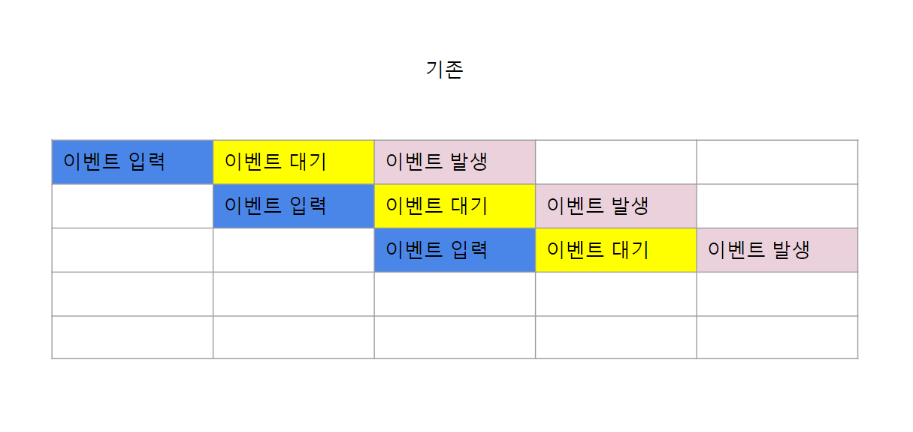
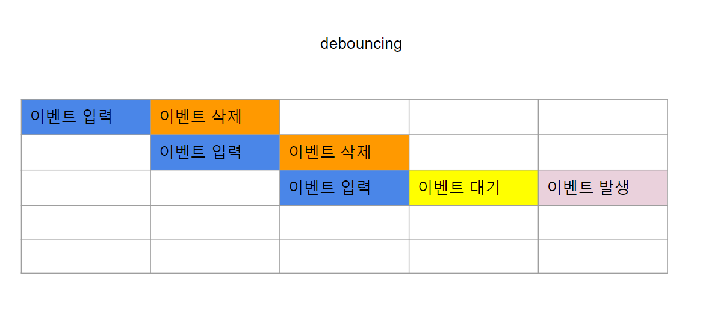
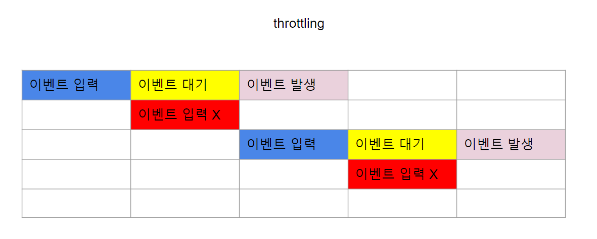
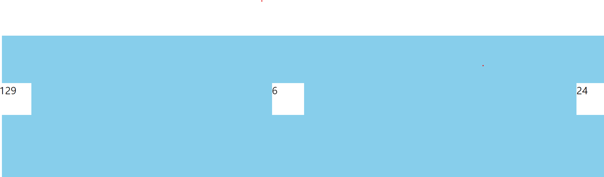

저희는 Dom을 다루면서 event를 사용합니다. 모두 잘 알고 계시겠지만 event에는 click, wheel등 여러가지가 있지요.

모두 개발하면서 한번씩은 느끼셨을 일정시간마다 한번만 일어나면 좋겠는데 이벤트 발생할 때마다 여러번 작동하는 이벤트가 있었을 것입니다.

예를들면 wheel 이벤트를 할 경우 한번 wheel을 할 때마다 한번만 일어나면 좋겠는데 각 wheel을 이벤트로 인식하는 경우가 있겠죠.

이 상황을 해결하기 좋은 방법의 대표적인 예시로 throttling과 debouncing이 있습니다.

각 throttling과 debouncing을 간단하게 설명하면 throttling은 일정 시간동안 이벤트를 금지시키는 것이고 debounce는 일정 시간 내 이벤트가 감지된 경우 기존 이벤트를 삭제 후 재할당 하는 것으로 생각하면 될 것 같습니다.



먼저 별다른 처리를 하지 않은 경우입니다. 이벤트를 실행하면 그대로 계속 여러번 진행됩니다.



debouncing의 경우입니다. 기존 진행중인 이벤트가 삭제되고 마지막 입력된 이벤트가 실행됩니다.



throttling의 경우입니다. 이벤트 대기 중에는 이벤트가 입력되지 않습니다.

다음은 typescript 구현입니다.

debouncer.ts

```
///debouncer.ts


export const debounce = <F extends (...args: any[]) => any>(
  func: F,
  waitFor: number
) => {
  //   let timeout: ReturnType<typeof setTimeout> | null = null;

  let timeout: NodeJS.Timeout = null;
  const debounced = (...args: Parameters<F>) => {
    if (timeout !== null) {
      clearTimeout(timeout);
      timeout = null;
    }
    timeout = setTimeout(() => func(...args), waitFor);
  };

  return debounced as (...args: Parameters<F>) => ReturnType<F>;
};

export const throttler = <F extends (...args: any[]) => any>(
  func: F,
  waitFor: number
) => {
  let throttleCheck: NodeJS.Timeout;
  const throttled = (...args: Parameters<F>) => {
    if (!throttleCheck) {
      throttleCheck = setTimeout(() => {
        func(...args);
        throttleCheck = null;
      }, waitFor);
    }
  return throttled as (...args: Parameters<F>) => ReturnType<F>;
};
```

index.ts

```
///index.ts
import './App.scss';
import { debounce, throttler } from './debouncer';


const fixed_box1 = document.getElementsByClassName('fixed-box')[0];
const fixed_box2 = document.getElementsByClassName('fixed-box2')[0];
const fixed_box3 = document.getElementsByClassName('fixed-box3')[0];

let box1Counter = 0;
let box2Counter = 0;
let box3Counter = 0;

const box1plus = () => {
  box1Counter += 1;
  fixed_box1.innerHTML = `${box1Counter}`;
};
const box2plus = () => {
  box2Counter += 1;
  fixed_box2.innerHTML = `${box2Counter}`;
};
const box3plus = () => {
  box3Counter += 1;
  fixed_box3.innerHTML = `${box3Counter}`;
};

const throttleFunc = throttler(box2plus, 100);
const debounceFunc = debounce(box3plus, 300);
window.addEventListener('wheel', () => {
  box1plus();
  throttleFunc();
  debounceFunc();
});

console.log('ters');
```

App.scss

```
//App.scss


.long-box {
  width: 100%;
  height: 300vh;
  background-color: skyblue;
}

.fixed-box {
  position: fixed;
  width: 100px;
  height: 100px;
  left: 0;
  top: 50%;
  background-color: white;
}
.fixed-box2 {
  position: fixed;
  width: 100px;
  height: 100px;
  right: 0;
  top: 50%;
  background-color: white;
}

.fixed-box3 {
  position: fixed;
  width: 100px;
  height: 100px;
  right: 50%;
  top: 50%;
  background-color: white;
}

```

index.html - webpack으로 build 했으므로 script 태그가 없습니다.

```
// index.html
<!DOCTYPE html>
<html lang="en">
  <head>
    <meta charset="UTF-8" />
    <meta http-equiv="X-UA-Compatible" content="IE=edge" />
    <meta name="viewport" content="width=device-width, initial-scale=1.0" />
    <title>Document</title>
  </head>
  <body>
    <!-- debouncer, throttling -->
    <div class="long-box"></div>
    <div class="fixed-box">0</div>
    <div class="fixed-box2">0</div>
    <div class="fixed-box3">0</div>
  </body>
</html>
```

결과입니다.



---

[참고](https://gist.github.com/fr-ser/ded7690b245223094cd876069456ed6c)
