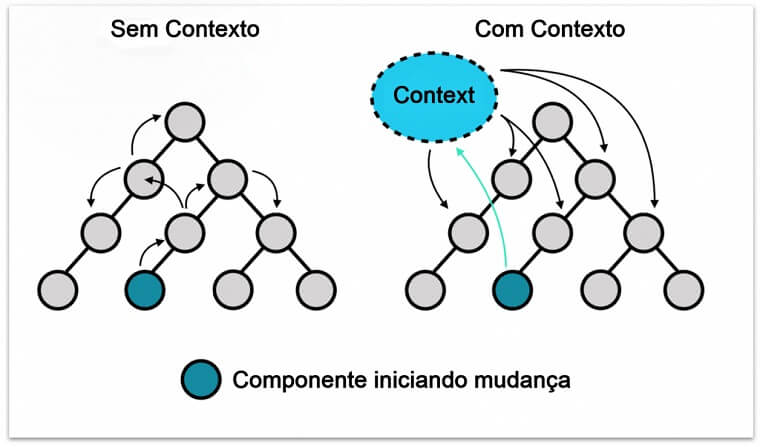
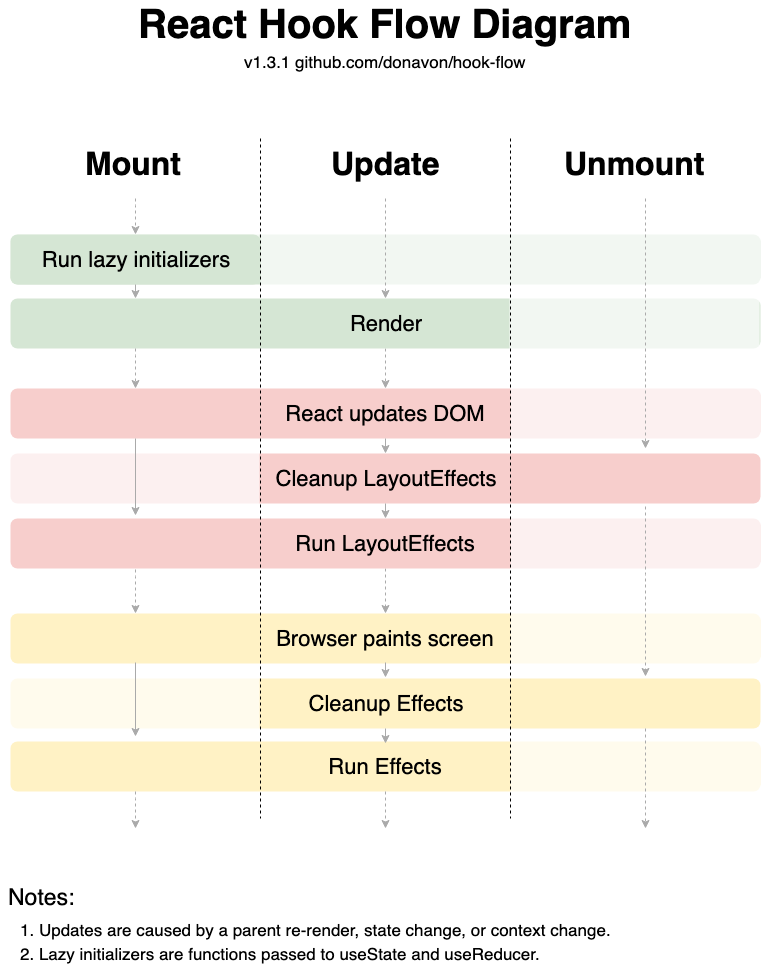
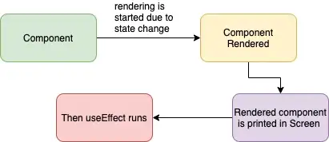
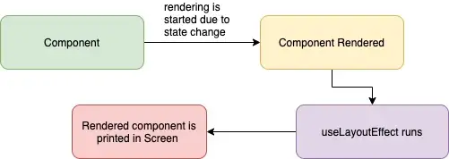

Hook란?

함수 컴포넌트에서 React state와 생명주기 기능을 연동할 수 있게 하는 함수입니다. Hook는 class 안에서는 동작하지 않지만 class 없이 React를 사용할 수 있게 합니다.
Hook와 class는 점진적으로 나란히 작동하기 때문에 추후 만들어질 컴포넌트만 Hook를 이용하면 됩니다.

hook의 등장 배경으로 세가지의 이유를 리액트에서는 세가지로 밝혔습니다.

1. 컴포넌트 상이에서 샅애 로직을 재사용하기 아렵습니다.

2. 복잡한 컴포넌트들을 이해하기 어렵습니다.

3. Class의 this가 사람과 기계를 혼동시킵니다.

더 쉽게 사용하기 위해서 hook이 개발되었습니다..

---

## 1. useState

기존 class에서 state를 선언할 때 constructor에 state를 객체 형식으로 선언하는 것과는 달리 hook에서는 setState를 통해 일종의 변수 선언과 같이 state를 선언할 수 있습니다.

```
const [state, setState] = useState(initialState);
const [apple, setApple] = useState(initialState);
const [apiData, setApiData] = useState(initialState);
```

setState를 이용하기 위해서는 state의 정보가 담겨져 있을 state와 state를 변경할 setState 함수를 정해줘야합니다. 만약 두개의 변수를 지정해주지 않고 하나의 변수만 지정하게 된다면.

```
const state = useState(initialState);
```

state[0], state[1]에 각각 state에 담길 state와 이를 변경할 함수가 정해집니다. 한 리액트 컴포넌트 내에는 여러개의 state를 지정할 수 있습니다.

setState는 기본적으로 Object.is 비교를 통해 전 변경 전 값과 변경 후 값을 비교한 후 작동하게 됩니다.

```
const value1 = {a:1};
const value2 = {a:1};

console.log(Object.is(value1, value2));
```

위의 경우 value1과 value2는 내부 형태가 같지만 JS 특성상 다른 객체의 주소값으로 각 value1과 value2에 저장되어 있으므로 같은 객체는 아니게 됩니다. 만약 위와 같은 방식으로
state를 관리할 경우 객체의 값이 같지만 결국 setState가 실행됩니다.

우리는 위에서 useState가 어떻게 작동하는지를 알았습니다. 그런데 왜 굳이 저희는 state를 사용하면서 변수를 관리할까요?

첫번째 이유는 리액트의 작동 과정 때문입니다. 단순히 변수를 변경할 경우 리액트는 그 변수에 무슨 값이 변경되었는지 알 수 있는 방법이 없습니다. 리액트의 생명주기를 살펴보겠습니다.


해당 부분은 hook의 사이클은 아니긴 하지만 전체적인 궤는 같으니 참고 바랍니다.

여기서 setState() 부분을 살펴봅시다. setState는 shouldComponentUpdate로 넘어가고 shouldComponentUpdate는 업데이트가 필요한지를 판단합니다.
즉, 리액트에서 무언가 값이 변했는지 확인을 하기 위한 shouldComponentUpdate를 작동시키기 위해서는
이를 위한 트리거가 필요한데 이 부분을 담당하는 것이 setState와 Props 부분입니다.

두번째 이유는 useState가 클로저를 이용하여 구현되어 있기 때문입니다.

```
  let state

  function useState = (initialVal) => {
    if(state === undefined){
      state = initialVal; // 2 5(실행 안됨)
    }// 초기화가 되어 있지 않으면 초기화;
    const setState = changedState => { //4
      state = changedState;
    }// 값을 변경 setState

    return [state, useState];
  }
```

위와 같은 useState 함수를 만들었습니다.

```
  const [stateEx, setStateEx] = useState("hello") //1  --> 5 리렌더링 되면서 해당 값이 있는지 확인, stateEx는 state로 초기화

  return <div onClick{()=>{ //클릭해서 실행
    stateEx = "bye"; // stateEx 값 변함 3
    setStateEx("hellohello"); //  4 setState실행 후 리렌더링
  }}/>
```

위의 경우에서 stateEx에 직접적으로 stateEx = "bye"를 할당한다고 하더라도 저희는 useState의 state의 값을 직접적으로 변경하지는 못합니다. 하지만 클로저를 통해
setState를 이용하여 값을 변경할 수 있게 되는 것이죠. 만약 저희가 setState를 호출하게 될 경우 해당 컴포넌트가 리렌더링 되면서 useState가 다시 호출되게 되는데,
임의적으로 바꾼 stateEx의 값은 결국 state의 값으로 다시 초기화가 됩니다.

### 추가

`지연 초기 state`

다른 말로는 lazy initialization이라고도 합니다. useState이 처음 실행될 경우 해당 변수에 값이 할당되어 있는지 확인합니다.
만약 값이 없다면 초기 값을 할당하고 값이 있다면 해당 과정을 건너뛰게 됩니다.
이 과정에서 생길 수 있는 문제가 있습니다.

```
const [state, setState] = useState(new Date);
```

만약 저희가 이렇게 state를 선언할 경우 useState는 단지 초기값이 있는지만 확인하면 되는데 new Date가 실행되어
해당 컴포넌트가 리렌더링 될 때마다 useState는 new Date를 호출하게 됩니다. 쓸모없는 메모리 낭비가 생기게 되는것이죠.

```
const [state, setState] = useState(()=>{
  const date = new Date;
  return date;
})
```

반면 위와 같이 함수를 바꾸면 참조에 의한 부름에 의해 new Date는 실행되지 않고 해당 무명 함수가 생성되게 됩니다. 만약 state가 처음 선언된 것이었으면 값이 비워져 있기 때문에 new State가 호출되지만 이미 선언이 되어있고 초기화가 되어 있으면 new Date가 실행되지 않을 것입니다.

즉, 함수를 생성하는 메모리보다 초기 값의 메모리 소요가 클 경우 지연 초기 state를 사용하는 것을 고려할만 합니다.

## 2. useEffect

useEffect는 react class의 componentDidMount(첫 렌더링시 실행), componentDidUpdate(state 변경시 실행), componentWillUnmount(생명주기가 끝날 때 실행)가 하나로 합쳐진 것으로 생각하면 편합니다.

단, componentDidMount와 componentDidUpdate는 레이아웃 생성 전에 일어나지만 useEffect는 레이아웃이 생성된 후에 발생합니다. 이를 보완하기 위해 useLayoutEffect가 있으니 이는 뒤에 후술하겠습니다.

```
useEffect(() => {
  func();
  return ()=>{
    endFunc();
  };
},[flag]);
```

위와 같은 useEffect가 component 안에서 선언될 경우 첫 렌더링을 할 때 func()가 실행되고 useEffect의 두번째 인자로 준 flag가 Object.is비교를 통해 변경될 경우 func()가 또 실행됩니다.
만약 component가 사라질 경우 return 함수가 실행되어 endFunc()가 실행되게 됩니다.

만약 두번째 인자를 [] 빈배열로 두게 된다면 Object.is로 비교할 대상이 없어 처음 렌더링 될 때와 사라질 때만 해당 함수가 실행되게 됩니다.

두번째 인자가 없을 경우, 컴포넌트 내부 모든 변화를 감지해서 func()가 실행됩니다.

두번째 인자는 배열 형식으로 하나가 아닌 여러개의 인자를 조건으로 넣을 수도 있습니다.

## 3. useContext

개념적인 요약만 하고 넘어가겠습니다.

만약 하위 컴포넌트에서 상위 컴포넌트에 뭔가 영향을 주기 위해서는 어떻게 해야할까요? 대표적인 방법으로는 상위 컴포넌트에서 생성한 state를 하위 component에 전달하는 것입니다.

```
const UpComponent = () => {
  const [sampleState, setSampleState] = useState(0)

  return (
    <DownComponent ssetSampleState={setSampleState} />
  )
}
const DownComponent = (setSampleState) => {

  return (
    <div  onclick={setSampleState("hello")}/>
  )
}
```

위와 같은 형식으로 적용할 수 있습니다. 하지만 이렇게 state를 관리하게 된다면 component나 state가 너무 많아 관리가 힘들어집니다.
이를 보다 편하게 사용하기 위해서 전역으로 State를 관리할 수 있게 하는 것이 바로 Context입니다.



하지만 useContext에도 문제가 있습니다. 바로 Context의 일부가 수정될 경우 모든 Context가 수정된다는 것입니다.

이를 해결하기 위한 대표적인 방법으로는 한 Context로 너무 많은 값을 제어하려하지 말고 여러개의 Context로 쪼개서 관리하는 것입니다.

## 4. useCallback

메모이제이션된 콜백 함수를 반환합니다.

useCallback을 사용하지 않으면 매번 setState등을 실행할 때마다 해당 해당 함수에 대한 재 정의를 하게 될 것입니다.

```
import { useCallback, useState } from "react";
import "./styles.css";

export default function Example() {
  let [sample, setSample] = useState(1);
  let [sample2, setSample2] = useState(2);

  const memoizedCallback = useCallback(() => {
    console.log(sample + sample2);
  }, []);

  return (
    <div className="App">
      <button
        type="button"
        onClick={() => {
          memoizedCallback();
        }}
      >
        button
      </button>
      <button
        type="button"
        onClick={() => {
          setSample((v) => v + 1);
        }}
      >
        button2
      </button>
    </div>
  );
}
```

위와 같이 예시를 둘 경우, button2를 누르면 sample의 값이 1 올라가고 button을 누르면 sample + sample2가 출력됩니다. 하지만 useCallback의 종속성을 []로 설정했기 때문에 sample의 값이 커지더라도 항상 값이 3이 출력됩니다.

```
import { useCallback, useState } from "react";
import "./styles.css";

export default function Example() {
  let [sample, setSample] = useState(1);
  let [sample2, setSample2] = useState(2);

  const memoizedCallback = useCallback(() => {
    console.log(sample + sample2);
  }, [sample, sample2]);

  return (
    <div className="App">
      <button
        type="button"
        onClick={() => {
          memoizedCallback();
        }}
      >
        button
      </button>
      <button
        type="button"
        onClick={() => {
          setSample((v) => v + 1);
        }}
      >
        button2
      </button>
    </div>
  );
}
```

위와 같이 종속성을 변경하면 다른 결과를 나타내게 됩니다.

useCallback을 사용하는 이유는 매번 리렌더링 될 때마다 재정의 될 함수의 메모리를 아끼는 것에 있습니다.

## 5. useMemo

`const memoizedValue = useMemo(() => computeExpensiveValue(a, b), [a, b]);`

useMemo는 useCallback과 같이 메모이제이션 된 값을 전달합니다. useCallback은 메모이제이션 된 함수를 제공하는 것과는 달리 계산된 값을 제공하게 됩니다.

뒤의 의존성 배열이 변경될 때만 그 값이 변할 것입니다.

## 6. useLayoutEffect





기본적으로 useEffect는 렌더링 된 후에 일어나기 때문에 처음 렌더링을 할 때 잠시 반짝이거나 레이아웃의 모양이 변하는 문제가 있을 수도 있습니다.



하지만 useLayoutEffect를 이용하면 렌더링 이전에 이벤트가 발생하여 이를 방지할 수 있습니다.

## 7. custom Hook

custom Hook은 말그대로 자신만의 hook입니다. custom hook을 이용하면 컴포넌트 로직을 함수로 뽑아내어 재사용할 수 있습니다.

예시를 들어보겠습니다.

```
function App() {
  const [menu, setMenu] = useState([]);
  const url = 'https//점심메뉴는?';

  useEffect(() => {
    fetch(url)
     .then(res => res.json())
     .then(res => setMenu(res))
  }, [])

  return <>{menu}</>
  }
```

위와 같이 점심메뉴를 받아오는 컴포넌트가 있다고 가정합시다. 그런데 작업을 하다보니 점심메뉴를 요구하는 곳이 많아져 각 컴포넌트마다 점심메뉴를 받아오는 로직이 너무 많이 사용되었습니다.

```
function useFetchMeny() {
  const [value, setValue] = useState([]);

  useEffect(() => {
    fetch('https://점심메뉴는?')
     .then(res => res.json())
     .then(res => setValue(res))
  }, [url])

  return value
```

```
import useFetch from './hooks/useFetch';

function App() {
  const user = useFetch();

  return (
    <>{menu}</>
    );
};
export default App;
```

그런 경우 위와 같이 사용하면 같은 컴포넌트 로직을 여러번 사용할 수 있게 됩니다.

쉽게 생각하면 함수와 같이 여러번 사용되는 state를 관리하기 위해서 custom hook를 사용할 수 있겠습니다.

---

[참고](https://developerplus.com.br/tema-escuro-no-react-native-hook-usecontext/)

[참고](https://all-dev-kang.tistory.com/entry/%EB%A6%AC%EC%95%A1%ED%8A%B8-useEffect%EC%99%80-useLayoutEffect-%EB%B9%84%EA%B5%90%EC%8B%9C%EB%A6%AC%EC%A6%88)

[참고] (https://velog.io/@niboo/React-Custom-Hook-%EC%9D%B4%EB%9E%80)

[참고] (https://pubudu2013101.medium.com/what-is-the-real-difference-between-react-useeffect-and-uselayouteffect-51723096dc19)
