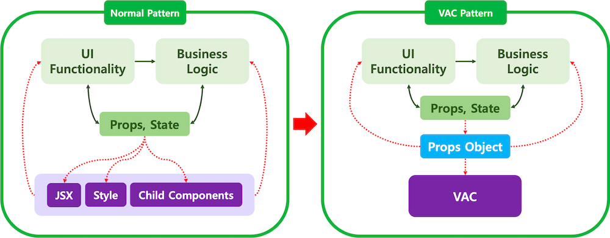

View Asset Component, VAC 패턴은 JSX 스타일을 관리하는 컴포넌트를 의미합니다.



리액트에서 VSC는 JSX와 스타일, UI 로직 등을 관리하기 위한 컴포넌트입니다.

VAC는 다음과 같습니다.

1. 렌더링만 관여하기. 반복 생성, 조건부 노출, 스타일 관리 등이 있습니다.

2. VAC는 stateless 컴포넌트로 렌더링 되는 View를 직접 관리하지 않고 오직 props에 의해서만 제어 됩니다.

3. VAC는 추가적인 로직을 담당하지 않습니다.

이제 VAC를 만들어볼까요?

### 1단계

VAC에 넣을 props 를 담당하는 컴포넌트를 만듭니다.

```
const SpinBoxUI = () => {
  // props object of VAC
  const spinBoxViewProps = {};

  // VAC Debugger
  return <VAC name="SpinBoxView" data={spinBoxViewProps} />;

  // VAC to be developed
  // return <SpinBoxView {...spinBoxViewProps} />;
};
```

### 2단계

props에 로직과 state를 추가합니다.

const SpinBoxUI = () => {
const [value, setValue] = useState(0);

const add = (n) => {
setValue(value + n);
};

// props object of VAC
const spinBoxViewProps = {
value,
onIncrease: () => add(1),
onDecrease: () => add(-1),
};

// VAC Debugger
return <VAC name="SpinBoxView" data={spinBoxViewProps} />;
};

### 3단계

VAC 컴포넌트를 생성합니다.

```
const SpinBoxView = ({ value, onIncrease, onDecrease }) => (
  <div>
    <button onClick={onDecrease}> - </button>
    <span>{value}</span>
    <button onClick={onIncrease}> + </button>
  </div>
);
```

### 4단계

앞서 만든 로직 컴포넌트에 VAC를 연결합니다.

```
const SpinBoxUI = () => {
  const [value, setValue] = useState(0);

  const add = (n) => {
    setValue(value + n);
  };

  // props object of VAC
  const spinBoxViewProps = {
    value,
    onIncrease: () => add(1),
    onDecrease: () => add(-1),
  };

  // VAC
  return <SpinBoxView {...spinBoxViewProps} />;

  // VAC Debugger
  //return <VAC name="SpinBoxView" data={spinBoxViewProps} />;
};
```

VAC를 이용하면서 렌더링을 위한 컴포넌트와 state 혹은 함수 로직을 다루는 컴포넌트를 분리시킴으로써 코드 이해와 코드 관리가 보다 쉬워집니다.

대부분의 데이터를 props에 의존하는 Presentational 패턴과 거의 비슷하지만 Presentational 패턴은 상황에 따라 View Logic 제어용 state를 사용하는 것과는 다르게 VAC는 stateless 컴포넌트를 추구합니다.

큰 차이가 없어보이지만 보다 일관성 있는 설계를 할 수 있다는 장점이 있습니다.

---

https://www.npmjs.com/package/react-vac
