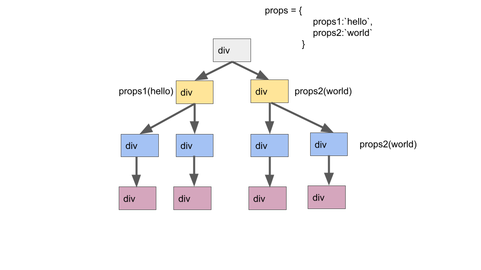
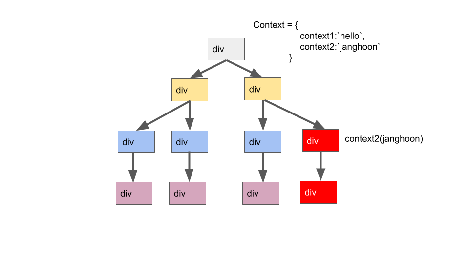

## props drilling이란?

저희는 컴포넌트의 상태관리를 할 때 state와 props를 사용할 수 있습니다. state가 해당 컴포넌트 자체의 상태값임에 반하여 props는 상위 컴포넌트에서 받아오는 값이죠.

props가 변경되면 해당 props를 받는 컴포는트는 React.memo를 통해 메모이제이션을 하지 않을 경우 리렌더링을 하게 됩니다.

만약 props가 한, 두 컴포넌트가 아닌 10 개의 컴포넌트(물론 이렇게 구조를 따지 않을 것입니다.)가 같은 props를 내려준다고 할 경우 해당 props를 받는 모든 component들이 rerendering이 될 것입니다.

이 상황을 보고 props drilling이라고 합니다.

props drilling으로 인해 개발자 입장에서는 매번 props를 지정해줘야하는 귀찮음이 있고 컴포넌트 관리 측면에서도 불필요한 렌더링이 일어나게 됩니다.

이를 해결하기 위한 방법으로 Context가 있습니다.

## Context 사용하기

```
import React, { useContext } from 'react';

const ExampleContext = React.createContext();

function Parent() {
  const value = 'Other components can get me through context!';

  return (
    <ExampleContext.Provider value={value}>
      <Child />
    </ExampleContext.Provider>
  );
}

function Child() {
  const value = useContext(ExampleContext);

  return <h1>{value}</h1>
}
```

context는 별도의 props를 내려주지 않더라도 Context 하위 컴포넌트들이 value로 넣어준 값을 useContext를 통해 사용할 수 있는 일종의 상태관리 API입니다. 우리는 이 방법을 통해서 props-drilling에서 벗어날 수 있습니다.

그림으로 나타내보겠습니다.



먼저 props의 경우입니다. 4층으로 된 간단한 컴포넌크 구조를 그림으로 나타냈습니다.


최하단 component에서 props를 사용할 경우에도 불구하고 2층과 3츰의 컴포넌트도 리렌더링이 되었습니다.


반면 conText를 이용해보겠습니다.



conText의 경우 conText를 호출한 component만 리렌더링이 되게 됩니다.


만약 해당 component의 하위 component가 conText의 정보를 props로 받는 등 변화가 없다면 하위 컴포넌트도 리렌더링이 일어나지 않을 수도 있습니다.

기존의 props형식이 3개의 컴포넌트를 리렌더링 한 것에 비해 한 컴포넌트만 리렌더링을 하게 됐습니다. 하지만 conText에도 문제점은 있습니다.


바로 conText를 이용하는 모든 컴포넌트들이 리렌더링이 일어난다는 것입니다. 위의 사진에서 context2의 값과 context1의 값이 있을 경우 context2의 값만 변경되었음에도 불구하고
context1의 값을 사용하는 컴포넌트도 리렌더링이 일어나게 됩니다.

이런 문제점을 해결할 수 있는 대표적인 방법으로는 conText 세분화 등이 있습니다. 아니면 redux와 같은 다른 API를 사용하는 것도 좋은 방법입니다.

---

https://levelup.gitconnected.com/beyond-prop-drilling-in-react-using-context-reducers-and-custom-hooks-to-connect-components-f427b7d4289
