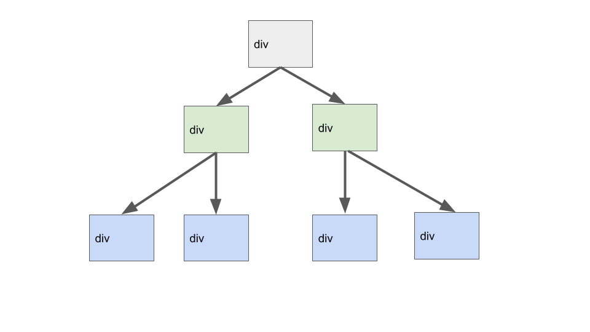
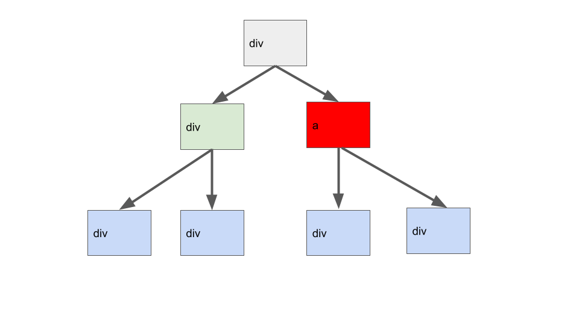
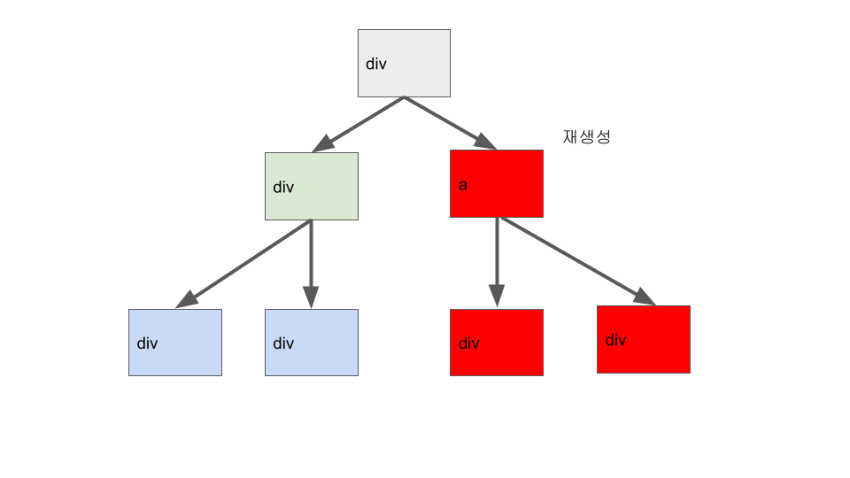
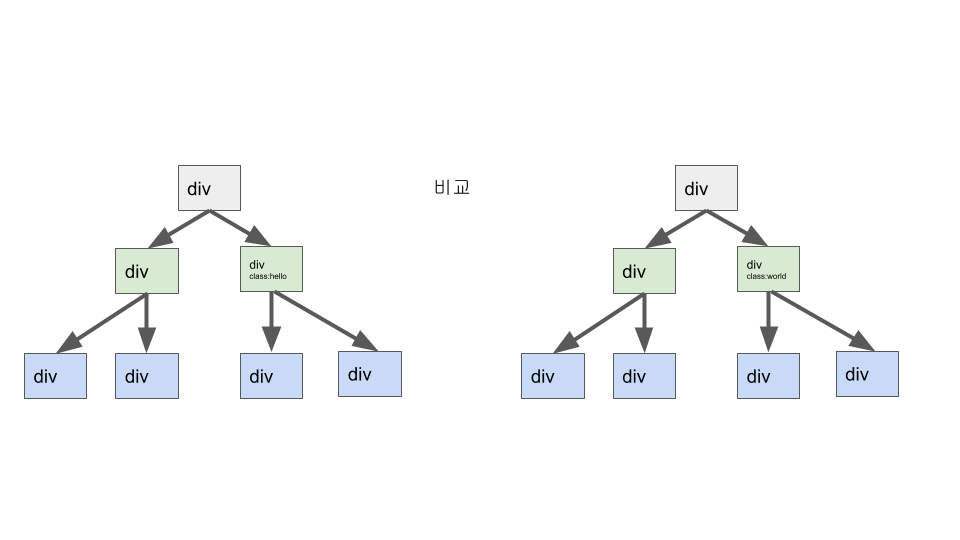
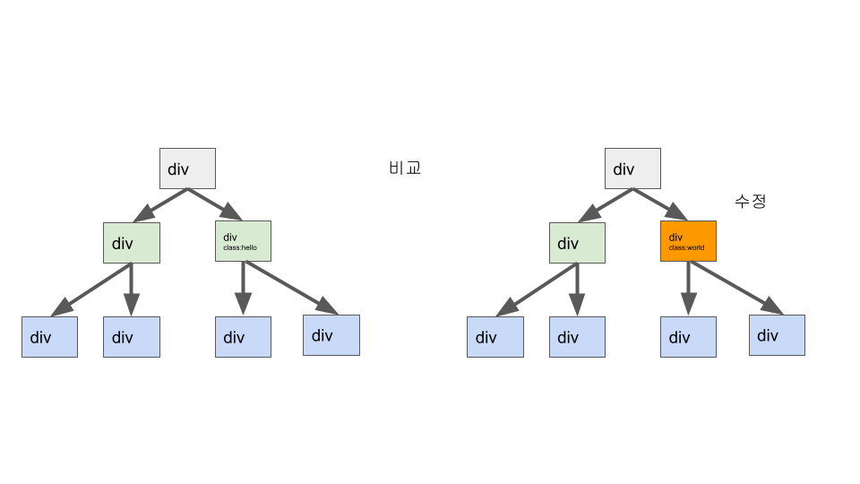
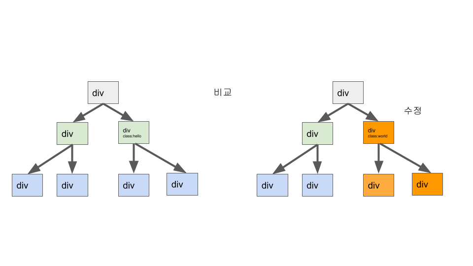
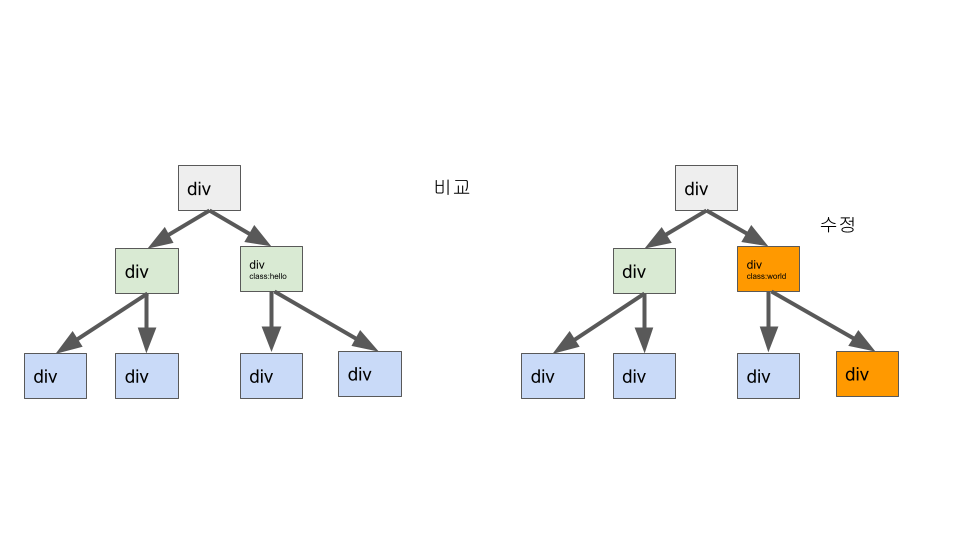
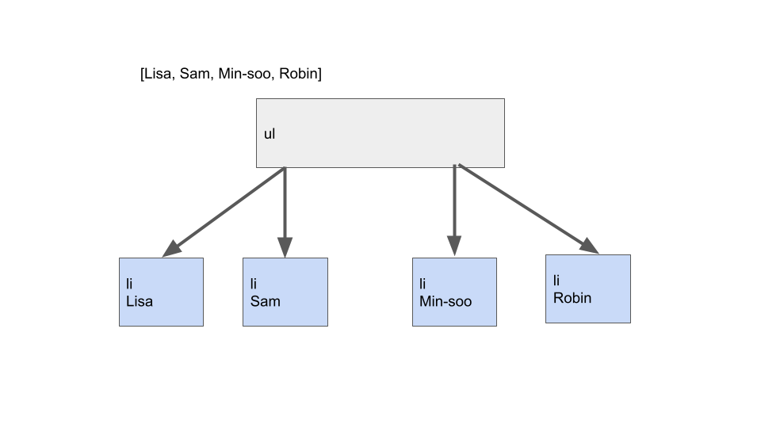
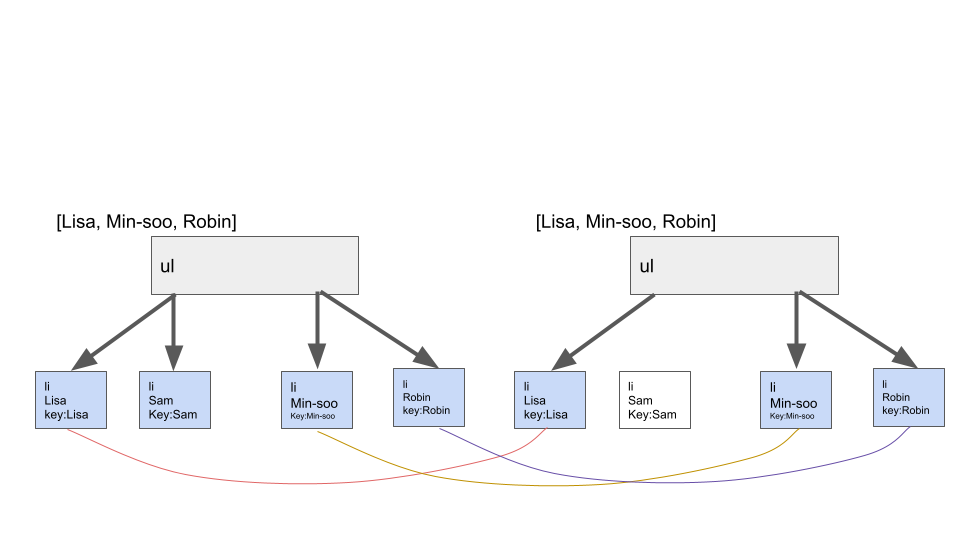
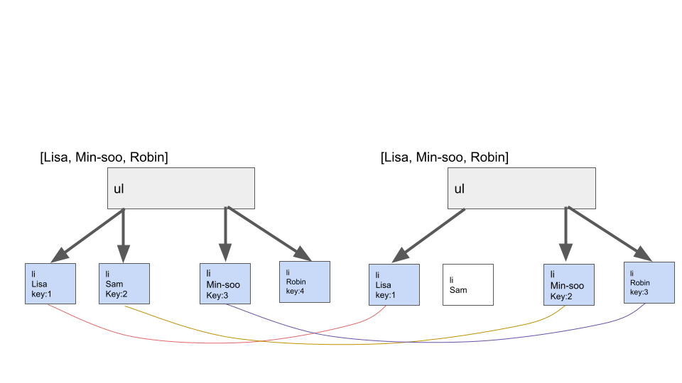

리액트는 기본적으로 Object.is를 통해서 props나 state를 비교한 뒤 변경될 경우 리렌더링을 하게 됩니다.

하지만 정말로 그게 다일까요? 컴포넌트가 변경될 경우 리소스를 덜 잡아먹는 방법이 있지 않을까요? 물론 존재합니다. 그 부분을 재조정(reconciliation)이라고 하며 이번 기회에 재조정에 대해서 다뤄보겠습니다.

## 리액트의 컴포넌트 처리

리액트는 기본적으로 휴리스틱 알고리즘을 사용합니다. 휴리스틱 알고리즘은 굳이 탐색하지 않아도 될 부분은 탐색하지 않는 알고리즘 방법으로 쉽게 말해 바꿀 필요가 있는 컴포넌트만 살펴보는 형식이죠.
이 방법을 이용함으로써 변경되지 않은 컴포넌트는 살펴보지 않기 때문에 추가적인 렌더링을 일차적으로 막을 수 있습니다.

### element 태그가 변경될 경우



그림으로 그려봤습니다. 보시다시피 3단으로 된 리액트 구조가 있다고 생각해봅시다.



그러던 중 한 div가 a로 변경되었습니다. 이런 경우 하위 div는 바뀐 것이 없는데 상단 div만 a태그로 바뀐 상태입니다.



그런 경우 하단의 블록 뿐만 아니라 전체적인 트리가 새로 생성이 된다는 뜻입니다.

### element 태그가 그대로인 경우

그렇다면 같은 element를 비교할 경우는 어떻게 진행할까요?



만들어둔 다음 트리는 변경 전과 변경 후를 그림으로 나타낸 것입니다. 다음을 보면 class가 hello에서 world로 변경된 것을 확인 할 수 있습니다.



이런 경우 리액트는 해당 요소를 새로 만드는 것이 아닌 기존 element와 변경 후 element를 비교한 후 다른 부분만 수정을 해주게 됩니다.



그 후, 재귀적인 방법을 사용하여 하위 컴포넌트를 전부 같은 방식으로 비교할 것입니다.(앞서 말한대로 element가 변경되는 경우가 있을 경우 tree가 재생성 될 수도 있습니다.)

물론 모든 하위 component를 살펴봐야한다는 점에서 꼭 좋다고는 말을 하지는 못하겠지만, 앞서 새로 tree를 만드는 것보다는 더 경제적인 방법입니다.

### 보다 경제적인 react를 위해

하지만 여기서 더 향상시킬 수 있는 방법이 있을 것입니다.



분명 위와 같은 방식으로 변경되지 않을 하위 component를 휴리스틱 알고리즘의 방식대로 살펴보지 않고 그냥 넘어가는 방법이 있을 것입니다. 이에 대해서 이야기해보겠습니다.

#### 1. shouldComponentUpdate

먼저 클래스 에서 사용할 shouldComponentUpdate입니다.

shouldComponentUpdate는 현제 state, props와 변경될 state, props를 비교할 수 있는 생명주기입니다.

```
  shouldComponentUpdate(newxProps, nextState, nextContext) {
    if (this.state.counter !== nextState.counter) {
      console.log("SCU는 true임"); // 렌더링 시작
      return true;
    }
    console.log("SCU는 false임"); // 렌더링 건너뛰기
    return false;
  }
```

위의 경우 state 중, counter을 flag로 둬 컴포넌트를 리렌더링 할지 아니면 그냥 넘어갈지를 정할 수 있습니다.

#### 2. React.memo

```
hook에서는 React.memo를 통해 해당 부분을 해결 할 수 있습니다.

function SomeComp({prop1, prop2}) {
    return(
        ..
    )

}
React.memo(SomeComp, (props, nextProps)=> {
    if(props.prop1 === nextProps.prop1) {
        // don't re-render/update
        return true;
    }
})
```

React.memo도 shouldComponentUpdate와 같이 렌더링을 할지 안할지를 정할 수 있게 됩니다. 기본적으로 비교 함수를 매개변수로 넣지 않으면 props의 변경 후에 리렌더링이 시작되지만 만약 콜백함수가 있다면 비교 후 return 값에 따라 렌더링 유무를 정합니다.

`React.memo는 props 변화에만 영향을 줍니다. React.memo로 감싸진 함수 컴포넌트 구현에 useState, useReducer 또는 useContext 훅을 사용한다면, 여전히 state나 context가 변할 때 다시 렌더링됩니다.`-리액트 공식 문서

하지만 이 부분도 완벽한 것은 아닙니다. React.memo는 props만 걸러줄 뿐 setState와 useContext를 이용한 상태관리를 할 경우 렌더링이 다시 일어나게 됩니다.

### element가 같으며 형제 요소가 여럿 있을 경우, Key



사실 이 부분 때문에 reconciliation에 대해서 조사한 사람이 여럿 있을 것입니다. 형제 요소가 여럿 있는 있는 경우는 어떻게 비교할까요? 대표적으로 li 태그를 여러개 만들 때 해당 상황을 볼 수 있을 것입니다.
위의 예시는 아마 다 눈치채셨겠지만 배열에 있는 이름을 바탕으로 부모요소와 자식 요소를 만든 경우입니다. 이제 이 컴포넌트에 변화를 줘보겠습니다.



배열에서 Sam이 지워졌습니다. 이제 리액트는 Sam 컴포넌트를 삭제할 것입니다. Sam 컴포넌트를 지우면서 하위 컴포넌트들이 리렌더링 될 것입니다. 이 과정에서 tree를 새로 생성하는 것 보다는 이미 있는 요소를 재활용하는 것이 경제적일 것입니다.
이것을 가능하게 하는 것이 key 입니다.



key의 고유값을 지정해주겠습니다. react는 key를 참고하여 기존 component와 변경될 component를 비교하기 수월해집니다. 이런 이유 때문에 key를 지정해줄 필요가 있습니다.

하지만 그렇다고 key를 막 지어주면 안됩니다. index를 이용해서 순서대로 숫자를 넣는 경우가 대표적인 오류입니다. 예시를 들어보겠습니다.


인덱스를 사용하면 생기는 문제입니다. 그림으로 보니 직관적으로 알 수 있죠? key의 값을 고유한 compoment의 값으로 두지 않을 경우 위와 같이 잘못된 비교를 할 수도 있습니다.

### 결론

메모이제이션을 쓸 수 있도록 노력합시다!

key 값은 고유한 값으로!

---

https://stackoverflow.com/questions/54551949/react-hooks-how-do-i-implement-shouldcomponentupdate

https://ko.reactjs.org/docs/hooks-faq.html#how-do-i-implement-shouldcomponentupdate

https://ko.reactjs.org/docs/reconciliation.html
