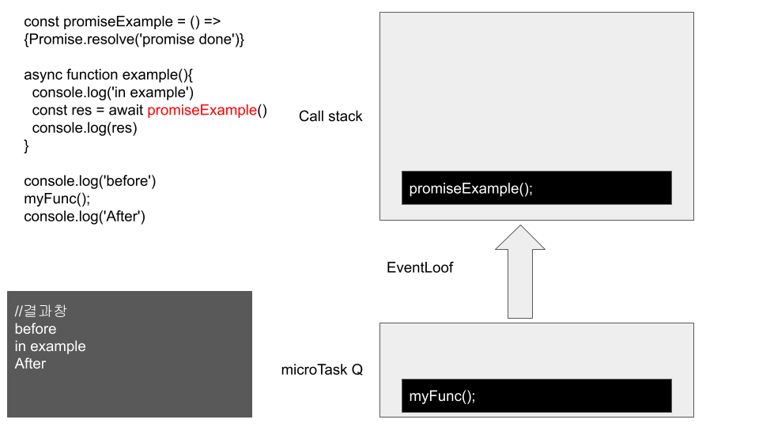

이번 시간에는 Async-Await의 이벤트 루프를 확인하겠습니다.
그림으로 대체할게요.

```
const promiseExample = () => Promise.resolve('promise done')

console.log("start")
aync function example(){
  console.log('in example')
  const res = await promiseExample()
  console.log(res)
}

console.log('before')
example();
console.log('After')
```

위의 함수를 예시로 들어보겠습니다


먼저 동기적으로 console.log('before')가 실행됩니다.


example가 호출되면서 내부 console.log('in example')가 실행됩니다.


await를 만나면서 async는 잠시 멈추고 추후 promise객체가 끝난 후 microTask에 추가됩니다.
단, 그림은 간략하게 설명하기 위해서 위처럼 나타냈을 뿐 실질적으로는
web API에서 promise는 promise 객체 내부 비동기 처리가 완료된 후에 microTask에 추가됩니다.


console.log('after')가 실행됩니다.



promise가 실행됩니다.


async가 마저 실행됩니다.

---

https://dev.to/lydiahallie/javascript-visualized-promises-async-await-5gke
