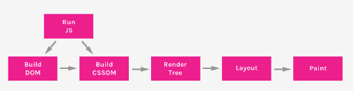
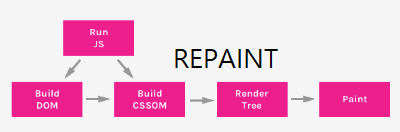
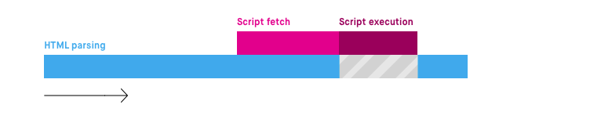
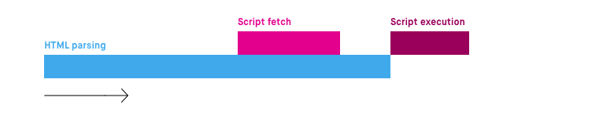

## 브라우징 렌더링 최적화에 대해서

최신 웹 사이트에서는 웹사이트의 속도를 높이고 빠르게 유지할 수 있는 작업이 매우 중요합니다.
빠르고 좋은 웹사이트는 사용자 유지와 경험적인 부분에서 긍정적인 효과를 보여줍니다.

앞서 설명했던 CRP를 간략하게 정리하면서 브라우저 렌더링을 최소화하는 방법을 이야기 합시다.

## 렌더링 과정 순서

#### 1.DOM, CSSOM 생성

HTML의 기본 정보와 JS를 통해 추가 혹은 변경된 HTML의 노드를 이용하여 DOM을 만들고 css정보를 이용하여 CSSOM을 만든다.

#### 2.Render tree 생성

DOM과 CSSOM를 이용하여 각 노드에 어떤 css를 적용할지 정한다.

#### 3.layout 생성

요소들이 페이지에서 배치되는 위치, 방법, 각 요소의 너비, 높이, 서로 관련된 위치를 결정한다.

#### 4.paint 적용

배치된 노드들에 색상을 칠한다.

#### 5.Composit

여러 Layer로 나눠진 픽셀들을 최종적으로 우리가 볼 수 있도록 병합한다. 기존의 layout과 paint와는 달리 GPU를 이용하여 더 빠르게 진행될 수 있습니다.

#

---

### 렌더링 최적화 1 - reflow, repaint 최소화

만약 JS와 같은 추가적인 코드로 인하여 DOM과 CSS가 변경되는 경우가 있습니다.
이 때 CSS나 HTML의 노드가 변경되어 Layout의 속성이 변경되게 된다면 이를 reflow라고 합니다.
반면 CSS가 변경되었음에도 Layout이 변경되지 않고 색상만 병경되어 Paint만 일어나는 경우를 repaint라고 합니다.

reflow 과정 순서
JS -> DOM, CSSOM 재생성 -> layout 재생성 -> paint -> Composite 과정을 가집니다.
position, width, height, left, top, border, margin, padding, text-align 등 위치와 크기를 정하는 경우 이에 속합니다.

노드의 구체적인 수치를 알아와야하는 경우 Layout 생성이 되어야 그 정확한 수치를 알 수 있기 때문에 호출할 때마다 reflow가 일어나는 강제 동기 레이아웃이 일어난다. 호출이 필요한 경우 최소한으로 사용하여 재활용하는 방식으로 이용할 필요가 있다. 그러지 않으면 호출이 너무 많아져 레이아웃 스레싱이 일어나게 되어 브라우저 렌더링에 장애를 가지게 됩니다.

repaint 과정 순서

JS -> DOM, CSSOM 재생성 -> paint -> Composit 의 과정으로 reflow보다는 간단한 가정을 거칩니다.
background, box-shadow, color, visibility 등 색상과 관련된 경우 이에 속합니다.

composit 과정 순서

JS -> DOM, CSSOM 재생성 -> Composit 의 과정으로 DOM과 CSSOM에 변경을 주는 요소 중 가장 가볍습니다.

transform, opacity, cursor, orphans, perspective 등이 이에 해당됩니다.

애니매이션을 사용할 경우 transform을 이용하는 것이 가장 적은 리소스를 사용합니다.

### 렌더링 최적화 2 - async, defer

HTML 파싱은 기본적으로 script를 만나는 경우 기존의 HTML 파싱을 멈추고 script 내부 JS를 다운로드 후 실행이 완료된 후에 HTML 파싱을 재진행합니다.
이를 보완하기 위해서 사용할 수 있는 것이 async와 defer입니다.

#### async

async를 script에 적용하게 된다면 기존의 순서가

HTML 파싱 -> 스크립트 다운(HTML 파싱 중지) -> 스크립트 실행 및 완료 -> HTML 파싱 재개

라고 한다면 HTML 파싱과 스크립트 다운을 동시에 진행이 가능하게 됩니다.

HTML 파싱 -> 스크립트 다운, HTML 파싱 -> 스크립트 실행 및 완료(HTML 파싱 중지) -> HTML 파싱 재개

즉, 스크립트 다운 시간동안 HTML 파싱이 진행되어서 그만큼의 시간을 절약할 수 있습니다.

#### defer

defer의 경우 순서가

HTML 파싱 -> 스크립트 다운, HTML 파싱 -> 스크립트 다운 완료, HTML 파싱 -> HTML 파싱 완료 -> 스크립트 실행

의 과정을 가지게 되는데 async와 마찬가지로 스크립트 다운하는 동안 HTML 파싱할 시간을 벌 수 있습니다.

#### async vs defer

async는 HTML 파싱이 완료되지 전에 실행되므로 DOM에 종속되어 있는 JS일 경우 사용하면 안됩니다.
async는 HTML 다운로드가 완료된 시점에서 코드가 실행되므로 순서를 지정할 수 없습니다.

defer은 HTML 파싱이 완료되지 후에 실행되므로 DOM에 종속되어 있는 JS여도 사용 가능합니다.
defer은 HTML 파싱이 완료된 시점에서 코드가 실행되므로 순서를 지정할 수 있습니다.

### 렌더링 최적화 3 - 리소스 우선순위 정하기.

#### preload

브라우저가 해당 리소스를 반드시 먼저 가져오게 합니다. font와 같이 렌더링에 반드시 필요한 리소스를 먼저 가져와 렌더링 속도를 높일 수 있습니다.

#### preconnect

미디어와 같이 미리 리소스를 가져올 연결을 해야할 때 미리 연결을 하여 더 빠른 렌더링을 돕습니다.
주소는 알지만 정확한 경로를 할 수 없을 경우 미리 리소스를 요청하여 그 시간을 줄일 수 있습니다.

#### prefetch

미래에 사용될 것으로 예상되는 리소스를 정하여 가져올 순위를 뒤로 미뤄 렌더링에 중요한 리소스를 먼저 받아올 수 있도록 지정할 수 있습니다.

## 브라우저 렌더링 과정을 나타내는 지표

최적화된 렌더링을 나타내는 지표에 무엇이 있으며 이를 개선하기 위해서는 무엇을 해야할까요?

### 최적화된 렌더링을 나타내는 지표 1 - LCP

Largest Contentful Paint

브라우저에서 가장 큰 콘텐츠 요소가 나타날 때의 시간을 뜻합니다.

일반적으로 2.5초 이내에 LCP가 렌더링 되는 것이 좋습니다.

주로 고려해야하는 요소로는 IMG, SVG, VIDEO, 배경 이미지가 있는 URL, 텍스트를 다수 포함한 블록 수준의 요소 등이 있습니다.

웹페이지는 단계적으로 로드되는 경우가 많으며 그에 따라서 페이지의 최대 요소가 변경 될 수도 있습니다.
LCP는 LCP를 나타내는 지표인 PerformanceEntry로 그 값이 정해지는데 기존 LCP보다 더 큰
콘텐츠가 변경되면 새로운 PerformanceEntry가 적용된다. DOM에 더 큰 새로운 요소가 생기는
경우도 새로운 PerformanceEntry가 적용되며 반대로 기존의 큰 요소가 사라진다면 사라진 가장
큰 요소가 최대 콘텐츠풀 요소로 유지됩니다.

LCP 분석을 위해서는 가장 마지막에 확인된 PerformanceEntry만 분석하면 됩니다.

쉽게 설명하면 가장 이목을 끌 요소가 얼마나 빠르게 나타나는지에 대한 지표입니다.

LCP가 일어나는 이유와 해결법은 다음과 같습니다.

1. 느린 응답시간

해결 방법

서버 최적화

사용자를 가까운 CDN(콘텐츠 전송 네트워크)으로 라우팅

자산 캐시

HTML 페이지 캐시 우선 제공(preload)

조기에 타사 연결 구축(preconnect 이용)

서명된 교환(SXG) 사용

2. 렌더링 차단 JS 및 CSS

CSS 축소, 중요하지 않은 CSS 지연(preload와 onload 속성을 이용), 중요 CSS 즉시 처리(head에 style 태그를 적용하여 즉시 처리),
JS 차단 시간 단축(preload), 사용하지 않는 JS 지연(prefetch)

3. 느린 리소스 로드 시간

중요한 리소스 미리 로드, 이미지 최적화, 텍스트 파일 압축, 적응형 게재, 자산 캐시

4. 클라이언트 측 렌더링

서버측 렌더링 사용, 사전 렌더링 사용, JS 최소화 및 사용하지 않는 JS 지연

### FID

First Contentful Paint(최초 콘텐츠풀 페인트)는 모든 콘텐츠가 페이지에 렌더링되는지를 나타내는 지표입니다.
첫 요소들이 확인되는 시간으로 각 요소들의 상호작용과 응답성과 같은 부분은 고려하지 않습니다.

FID는 실제 사용자 상호 작용에서 측정되는 지표이기 때문에 실험적으로 확인할 수가 없습니다.
단, FID를 개선할 수 있는 방법은 있는데 total blocking time(JS에서 각 작업의 50ms가 넘어갈 때의 시간들의 합을 말한다.)을 개선시키는 것입니다.

FID를 개선시킬 수 있는 방법은 다음과 같습니다.

긴 작업 세분화

상호 작용을 위한 페이지 최적화

웹 작업자 사용

JS 실행시간 단축

즉, JS 연산 시간을 최소한으로 줄이면 FID 지표가 높아집니다.

### CLS

Cumulative Lay Shift(누적 레이아웃 이동)
CLS는 렌더링 된 이후 0.5초 이내에 렌더링 되지 않아 전체적인 콘텐츠가 이동하는 불안정성을 말합니다.

CLS가 일어나는 이유는 다음과 같습니다.

1. 크기가 정해지지 않은 이미지
2. 크기가 정해지지 않은 광고, 임베드, iframe
3. 동적으로 주입된 콘텐츠
4. FOIT/FOUT을 유발하는 웹 글꼴
5. DOM을 업데이트하기 전에 네트워크 응답을 대기하는 작업

미리 공간을 준비하거나 리소스를 미리 다운받아 CLS를 최소화 할 수 있습니다.

### TTI

TTI는 Time to Interactive를 뜻하며 사용자가 사이트에 접근하고 상호작용을 할 수 있는 때까지의 시간을 의미합니다. 즉, js와 같은 리소스들을 얼마나 빠르게 처리하는지가 중요합니다. 이를 개선하기 위해서는
tree shaking이나 코드스플리팅, preload등을 이용해 개선시킬 수 있습니다.

### TBT

Total Blocking Time은 FCP 이후 TTI 까지의 시간을 의미합니다. 이는 TTI와 FCP를 완화시키면 같이 개선될 것입니다.

---

이 부분은 추후 프로젝트를 진행하면서 고려한 것과 고려하지 않은 것의 차이를 비교해볼 필요가 있을것 같습니다.

[참조1](https://im-designloper.tistory.com/100)

[참조2](https://beomy.tistory.com/93)

[참조3](https://web.dev/i18n/ko/lcp/)

[참조4](https://ui.toast.com/weekly-pick/ko_202012101720)

[참조5](https://web.dev/i18n/ko/optimize-fid/)

[참조6](https://web.dev/i18n/ko/optimize-cls/)

[참조7](https://velog.io/@takeknowledge/script-%ED%83%9C%EA%B7%B8%EB%8A%94-%EC%96%B4%EB%94%94%EC%97%90-%EC%9C%84%EC%B9%98%ED%95%B4%EC%95%BC-%ED%95%A0%EA%B9%8C%EC%9A%94)

[참조8](https://velog.io/@wooogie/%ED%94%84%EB%A1%A0%ED%8A%B8%EC%97%94%EB%93%9C%EB%8A%94-%EC%84%B1%EB%8A%A5-%EA%B0%9C%EC%84%A0%EC%9D%84-%EC%9C%84%ED%95%B4-%EB%AC%B4%EC%97%87%EC%9D%84-%ED%95%B4%EC%95%BC-%ED%95%A0%EA%B9%8C)
