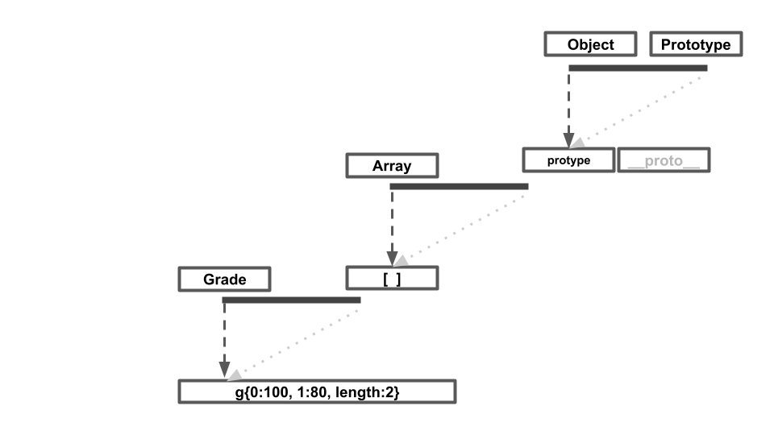

## 자바스크립트의 클래스

자바스크립트는 프로토타입 기반 언어이기 떄문에 클래스의 개념이 존재하지 않습니다.
하지만 프로토타입을 일반적인 의미에서의 클래스 관점에서 접근해보면
비슷하게 해석이 가능합니다.

생성자함수 Array를 new 연산자와 함꼐 호출하면 인스턴스가 생성되는데 prototype 객체 내부
요소들만 인스턴스에 상속됩니다.

인스턴스에 상속되는지 아닌지에 따라서 스태틱 메소드와 프로토타입 메소드로 나뉩니다.
스태틱 메소드는 해당 객체에 프로퍼티로써 새로 추가된 메소드이며 프로토타입 메소드는
해당 객체의 프로토타입으로 추가된 메소드로 해당 객체를 proto로 참조하는
인스턴스도 사용할 수 있습니다.

예제를 통해 클래스 관점에서 바라본 프로토타입 시스템을 좀 더 살펴봅시다.

```
var Rectangle = function(width, height) {
  this.width = width;
  this.height = height;
};
Rectangle.prototype.getArea = function() {
  return this.width * this.height;
};
Rectangle.isRectangle = function(instance) {
  return (
    instance instanceof Rectangle && instance.width > 0 && instance.height > 0
  );
};

var rect1 = new Rectangle(3, 4);
console.log(rect1.getArea()); // 12 (O)
console.log(rect1.isRectangle(rect1)); // Error (X) 스태틱 메서드이기때문에 rec1에서 참조 불가능
console.log(Rectangle.isRectangle(rect1)); // true
```

isRectangle의 경우 프로토타입 메서드가 아닌 스태틱 메서드이기 때문에 인스턴스에서
접근할 수 없게 됩니다. 결국 rect1.isRectangle(rect1)에 에러가 생기게 됩니다.

## 클래스 상속

```
var Grade = function() {
  var args = Array.prototype.slice.call(arguments);
  for (var i = 0; i < args.length; i++) {
    this[i] = args[i];
  }
  this.length = args.length;
};

Grade.prototype = [];
var g = new Grade(100, 80);

g.push(90);
console.log(g); // Grade { 0: 100, 1: 80, 2: 90, length: 3 }

delete g.length;
g.push(70);
console.log(g); // Grade { 0: 70, 1: 80, 2: 90, length: 1 }
```



위의 예제에서 첫 g.push는 정상적으로 작동했지만 두번쨰 push는 3번 배열에 값을 추가하는 것이 아닌
0번 배열을 재할당했습니다.

이렇게 되는 이유가 무엇일까요?

앞서 Array.push의 메소드의 성질을 살펴보면 해당 배열(객체)의 length의 값을 확인하고 해당 위치에
프로퍼티를 새로 추가하고 length를 1++ 하는 것입니다.
하지만 저희는 **delete g.length** 를 통해서 length를 지우게 됩니다. 여기서 문제입니다. 이제 Array.push()는 어떻게 작동할까요?

그 해답은 프로토타입 체이닝을 통해서 위로 올라가게 되는 것입니다.

JS 엔진은 g가 아닌 그 상위 프로토타입인 Grade에 갈 것입니다. 그리고 Grade의 prototype은 빈 배열임을
발견할 것입니다. g.**proto**(Grade.prototype)가 빈 배열이라는 뜻은 length:0 이라는
속성이 있다는 뜻이 되고 push 명령에 따라서 자바스크립트 엔진은 0 위치에
새로운 요소를 push를 하게 됩니다.

```
...
Grade.prototype = [a,b,c,d];
var g = new Grade(100, 80);

g.push(90);
console.log(g); // Grade { 0: 100, 1: 80, 2: 90, length: 3 }

delete g.length;
g.push(70);
console.log(g); // Grade { 0: 100, 1: 80, 4: 70, length: 1 }
```

만약 Grade의 프로토타입 배열의 크기가 0이 아닌 4라고 하면 4번 인덱스에 값이 추가될 것입니다. 이처럼 클래스에 있는 값이 인스턴스의 동작에 영향을 주게 되는 것은 좋지 못한 현상입니다.

```
var Rectangle = function(width, height) {
  this.width = width;
  this.height = height;
};
Rectangle.prototype.getArea = function() {
  return this.width * this.height;
};
var rect = new Rectangle(3, 4);
console.log(rect.getArea()); // 12

var Square = function(width) {
  Rectangle.call(this, width, width);
};
Square.prototype = new Rectangle();

var sq = new Square(5);
console.log(sq.getArea()); // 25
```

다음 예제입니다. 처음에는 직사강형을 만드는 생성자인 rectangle을 만들 생각이었지만
square를 만들면서 rectangle을 재활용 할 수 있을 것 같습니다.
위와 같이 시도해보니 잘 적용된다는 것을 알 수 있습니다.

하지만 여기에는 큰 문제가 있습니다. 바로 sq의 proto가 여전히 rectangle을 보고 있기 때문입니다.
만약 square의 프로토타입에 rectangle과 겹치는 이름의 메소드가 추가되게 된다면 프로토타입 체이닝에 의해서
엉뚱한 결과를 나타낼 수도 있습니다.

다음 문제를 해결해봅시다

### 클래스가 구체적인 데이터를 지니지 않게 하는 방법

가장 쉬운 방법으로는 프로퍼티를 일일이 지우고 프로퍼티를 추가할 수 없게 하는 것입니다.

```
var extendClass1 = function(SuperClass, SubClass, subMethods) {
  SubClass.prototype = new SuperClass();
  for (var prop in SubClass.prototype) { // 스태틱 메소드에 존재하면 프로토타입 메소드 지움
    if (SubClass.prototype.hasOwnProperty(prop)) {
      delete SubClass.prototype[prop];
    }
  }
  if (subMethods) {
    for (var method in subMethods) {
      SubClass.prototype[method] = subMethods[method];
    }
  }
  Object.freeze(SubClass.prototype);
  return SubClass;
};

var Rectangle = function(width, height) {
  this.width = width;
  this.height = height;
};
Rectangle.prototype.getArea = function() {
  return this.width * this.height;
};
var Square = extendClass1(Rectangle, function(width) {
  Rectangle.call(this, width, width);
});
var sq = new Square(5);
console.log(sq.getArea()); // 25

```

위의 함수는 상위 클래스와 하위클래스, 하위 클래스에 추가할 메서드들을 받아
내용을 정리하고 freeze 하는 함수입니다.

```


```

---
