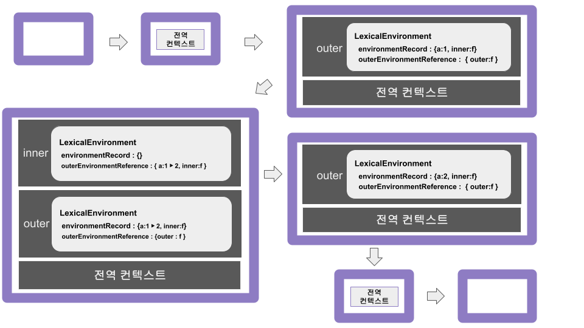
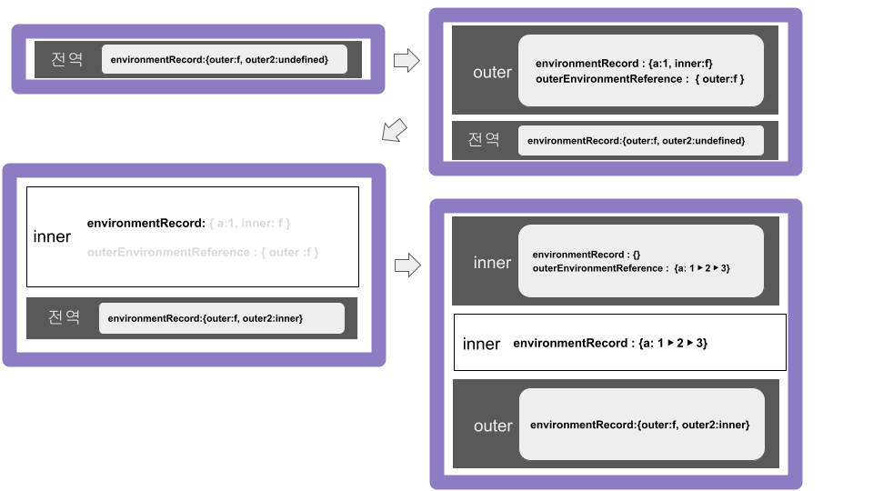

## 클로저란?

> 클로저는 내부 컨텍스트에서 외부 컨텍스트로 접근을 할 수 있게 하는 함수입니다.

MDN 공식 문서에서는 클로저는 함수와 그 함수가 선언될 당시의 lexicalenvironment의 상호관계에 따른 현상이라고 합니다.
앞서 쓴 실행 컨텍스트에서 다룬 lexicalEnvironment가 상위 실행 컨텍스트인 outerEnvironmentReference와 내부 식별자의 정보를 가진
environmentRecord로 이루어진다고 말했습니다.

알기 쉽게 예제로 설명해보겠습니다.

```
var outer = function () {
  var a = 1;
  var inner = function () {
    console.log(++a)
  };
  return inner();
};
outer();
```



위의 예제에서 outer 함수에서 변수 a를 선언했고 outer의 내부 함수인 inner 함수에서 a 값을 1 증가한 후 출력합니다.
inner 함수 내부에서는 a를 선언하지 않기 때문에 해당 값은 inner함수의 outerEnvironmentReference에 지정된 상위컨텍스트인 outer함수의
LexicalEnvironment에 접근해서 a를 다시 찾습니다. outer()의 실행 컨텍스트가 완료되면
outer 실행에서 생성된 식별자 a와 inner에 접근할 방법이 없어지게 됩니다.

추후 함수에서 사용될 일이 없는 식별자의 값은 가비지 컬렉터에 의해서 자동적으로 지워집니다.

다음 예제입니다.

```
var outer = function () {
  var a = 1;
  var inner = function () {
    return ++a;
  };
  return inner();
};
var outer2 = outer();
console.log(outer2); // 2
```

이번에도 inner 함수 내부에서 외부 변수인 a를 사용했습니다. 위의 경우에도 식별자 a에 대한 정보가 가비지 컬렉터에 의해서 수거되게 됩니다.

```
var outer = function () {
  var a = 1;
  var inner = function () {
    return ++a;
  };
  return inner;
};
var outer2 = outer();
console.log(outer2()); // 2
console.log(outer2()); // 3
```



이번에는 위의 두 예제와는 다르게 return 값을 함수의 실행 결과가 아닌 함수 자체를 반환했습니다.
이렇게 되면 outer2 변수는 outer의 inner을 참조하게 됩니다. 그리고 inner은 outer의 내부 함수 실행 컨텍스트이기 떄문에 outer의 a에 대한
값을 lexicalEnvironment에 담고 있게 됩니다.

즉 outer2에 outer에 대한 정보가 담겨있기 떄문에 가비지 컬렉터는 변수 a의 값을 삭제하지 않고
outer2를 호출할 때마다 변경되는 a의 값을 참조할 수 있게 되는 것입니다.

클로저의 다른 의미로 이미 유효범위가 끝난 외부 함수의 변수를 참조할 수 있는 함수를 말하기도 합니다.

## 클로저와 메모리 관리

클로저를 사용하다보면 메모리를 미처 지우지 않아 메모리가 낭비되는 메모리 누수가 생길 수도 있습니다.
하지만 클로저에 대해서 확실하게 이해하게 된다면 결국은 의도적으로 남긴 메모리만 남을 것입니다.

(1) return에 의한 클로저의 메모리 해제

```
var outer = (function() {
  var a = 1;
  var inner = function() {
    return ++a;
  };
  return inner;
})();
console.log(outer());
console.log(outer());
outer = null; // outer 식별자의 inner 함수 참조를 끊음
```

(2) setInterval에 의한 클로저의 메모리 해제

```
(function() {
  var a = 0;
  var intervalId = null;
  var inner = function() {
    if (++a >= 10) {
      clearInterval(intervalId);
      inner = null; // inner 식별자의 함수 참조를 끊음
    }
    console.log(a);
  };
  intervalId = setInterval(inner, 1000);
})();
```

(3) eventListener에 의한 클로저의 메모리 해제

```
(function() {
  var count = 0;
  var button = document.createElement('button');
  button.innerText = 'click';

  var clickHandler = function() {
    console.log(++count, 'times clicked');
    if (count >= 10) {
      button.removeEventListener('click', clickHandler);
      clickHandler = null; // clickHandler 식별자의 함수 참조를 끊음
    }
  };
  button.addEventListener('click', clickHandler);
  document.body.appendChild(button);
})();
```

## 클로저의 활용 사례

클로저의 의미와 작동 원리를 어느정도 이해했으니 실제로 언제 사용할 수 있을지 예시를 들어보겠습니다.

### 콜백 함수 내부에서 외부 데이터를 사용하고자 할 때

```
var fruits = ['apple', 'banana', 'peach'];
var $ul = document.createElement('ul'); // (공통 코드)

fruits.forEach(function(fruit) {  // (A)
  var $li = document.createElement('li');
  $li.innerText = fruit;
  $li.addEventListener('click', function() {  // (B)
    alert('your choice is ' + fruit);
  });
  $ul.appendChild($li);
});
document.body.appendChild($ul);
```

위 함수에서 fruit의 각 변수마나 li를 생성하고 각 li의 리스너에 콜백 함수가 실행하게 됩니다.
A는 딱히 외부 변수를 참조하지 않지만 B 함수의 경우 A 함수의 fruit를 참조하게 되어 클로저가 생성됩니다.
위의 함수를 좀 더 보기 좋게 고쳐보겠습니다.

```
var fruits = ['apple', 'banana', 'peach'];
var $ul = document.createElement('ul');

var alertFruit = function(fruit) {
  alert('your choice is ' + fruit);
};
fruits.forEach(function(fruit) {
  var $li = document.createElement('li');
  $li.innerText = fruit;
  $li.addEventListener('click', alertFruit); /// C [object MouseEvent]
  $ul.appendChild($li);
});
document.body.appendChild($ul);
alertFruit(fruits[1]);
```

위의 방식대로 고치면 `alertFruit(fruits[1]);` 에서는 정상 작동하지만
C 부분에서는 잘 작동하지 않을 것입니다. 이는 addEventListener의 콜백 함수를 호출 할 떄
별다른 처리가 없으면 첫번쨰 인자에 이벤트 객체를 주입하기 떄문입니다. 다시 고쳐보겠습니다.
즉, 'mouseEvent'가 fruit에 대입된 것입니다.

```
var fruits = ['apple', 'banana', 'peach'];
var $ul = document.createElement('ul');

var alertFruit = function(fruit) {
  alert('your choice is ' + fruit);
};
fruits.forEach(function(fruit) {
  var $li = document.createElement('li');
  $li.innerText = fruit;
  $li.addEventListener('click', alertFruit.bind(null, fruit));
  $ul.appendChild($li);
});
document.body.appendChild($ul);
```

bind를 이용해서 해당 이슈를 해결할 수 있습니다. 하지만 이렇게 사용하면 이벤트
객체가 인자로 넘어오는 순서가 바뀌는 것과 함수 내부에서의 this가 원래의 그것과 달라지는 점을 생각해야합니다.
더 좋은 방법으로 고쳐보겠습니다.

```
var fruits = ['apple', 'banana', 'peach'];
var $ul = document.createElement('ul');

var alertFruitBuilder = function(fruit) {
  return function() {
    alert('your choice is ' + fruit); ///A
  };
};
fruits.forEach(function(fruit) {
  var $li = document.createElement('li');
  $li.innerText = fruit;
  $li.addEventListener('click', alertFruitBuilder(fruit)); ///B
  $ul.appendChild($li);
});
document.body.appendChild($ul);
```

4번째 줄에서 alertFruit 함수 대신 alertFruitBuilder이라는 이름의 함수를 작성했습니다.
기존의 방식은 그 동작을 동작시키는 함수인데에 반해 이 경우 동작시키는 함수를 반환하고
해당 함수에 넣을 매개변수를 정해줄 수 있습니다. 다음 방법을 이용하면 B에 이벤트 리스너에
삽입될 A 함수가 fruit를 참조 할 수 있게 됩니다.

### 접근 권한 제어(정보 은닉)

정보은닉은 어떤 모듈의 내부 로직의 노출을 최소화해서 모듈간의 결합도를 낮추고 유연성을
높이고자 하는 현대 프로그래밍 언어의 중요한 개념 중 하나입니다. 흔히 접근 권한에는
public(외부 접근 가능), private(내부에서만 사용 가능), protected의 세 종류가 있습니다.

자바스크립트는 기본적으로 변수 자체에 이러한 접근 권한을 직접 부여하도록 설계돼 있지 않습니다.
하지만 클로저를 이용하면 public한 값과 private한 값을 구분이 기능합니다. 앞서 봤던 함수를 다시 살펴봅시다.

```
var outer = function() {
  var a = 1;
  var inner = function() {
    return ++a;
  };
  return inner;
};
var outer2 = outer();
console.log(outer2()); // 2
console.log(outer2()); // 3
```

저희는 위의 선언된 a에 outer2()를 통해서만 접근이 가능합니다.
식별자의 값을 임의로 변경시키지 못하게 막을 수 있습니다.

### 부분 적용 함수

부분 적용 함수란 n개의 인자를 받는 함수에 미리 m개의 인자를 넘겨 기억시켰다가 나중에 n-m 개의 인자를 넘기면
비로소 원래 함수의 실행 결과를 얻을 수 있게 하는 함수입니다. this를
바인딩해야한다는 점을 제외하면 bind 메서드의 실행 결과가 바로 부분 적용 함수입니다.

```
var add = function() {
  var result = 0;
  for (var i = 0; i < arguments.length; i++) {
    result += arguments[i];
  }
  return result;
};
var addPartial = add.bind(null, 1, 2, 3, 4, 5);
console.log(addPartial(6, 7, 8, 9, 10)); // 55
```

위처럼 bind 메서드만으로 5개의 인자를 고정시키고 추후 5개의 인자를 argument로 받는
함수를 만들었습니다. 하지만 이 경우 this 값이 null로 고정있기 때문에 메서드에서는
사용하기 어렵습니다. 고로 this에 관여하지 않는 별도의 부분
적용 함수가 있다면 좋을 것입니다.

```
var partial = function() {
  var originalPartialArgs = arguments; //이 argument와
  var func = originalPartialArgs[0];
  if (typeof func !== 'function') {
    throw new Error('첫 번째 인자가 함수가 아닙니다.');
  }
  return function() {
    var partialArgs = Array.prototype.slice.call(originalPartialArgs, 1); //
    var restArgs = Array.prototype.slice.call(arguments); // 이 argument는 다릅니다.
    return func.apply(this, partialArgs.concat(restArgs));
  };
};

var add = function() {
  var result = 0;
  for (var i = 0; i < arguments.length; i++) {
    result += arguments[i];
  }
  return result;
};
var addPartial = partial(add, 1, 2, 3, 4, 5);
console.log(addPartial(6, 7, 8, 9, 10)); // 55

var dog = {
  name: '강아지',
  greet: partial(function(prefix, suffix) {
    return prefix + this.name + suffix;
  }, '왈왈, '),
};
dog.greet('입니다!'); // 왈왈, 강아지입니다.
```

다음 예시입니다.
첫 인자로 적용할 함수를, 두번쨰 인자부터는 미리 적용할 인자들을 전달하고
반환할 함수에서는 나머지 인자들을 추가적으로 받는 코드입니다.
실행 시점의 this를 그대로 반영함으로써 this에는 아무런 영향을 주지도 않습니다.

#### 디바운스

```
var debounce = function(eventName, func, wait) {
  var timeoutId = null;
  return function(event) {
    var self = this;
    console.log(eventName, 'event 발생');
    clearTimeout(timeoutId);
    timeoutId = setTimeout(func.bind(self, event), wait);
  };
};

var moveHandler = function(e) {
  console.log('move event 처리');
};
var wheelHandler = function(e) {
  console.log('wheel event 처리');
};
document.body.addEventListener('mousemove', debounce('move', moveHandler, 500));
document.body.addEventListener('mousewheel',debounce('wheel', wheelHandler, 700));
```

---
