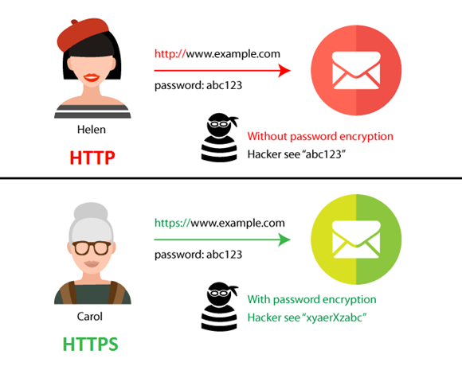

## 프로토콜이란?

 통신 프로토콜 또는 통신 규약은 컴퓨터나 원거리 통신 장비 사이에서 메시지를 주고 받는 양식과 규칙 체계다.

 프로토콜의 기본 요소

 구문(Syntax) : 전송하고자 하는 데이터의 형식, 부호화, 신호레벨 등을 규정

 의미(Semantics) : 두 기기 간의 효율적이고 정확한 정보 전송을 위한 협조 사항과 오류 관리를 위한 제어 정보를 규정

 시간(Timing) : 두 기기 간의 통신 속도, 메시지의 순서 제어 등을 규정

---

 사람을 대입해서 생각해보면 한국어와 영어를 할 수 있는 철수와 중국어와 영어를 할 수 있는 메이린이 이야기를 할 때

 1. 영어라는 형식을 맞춘 - Syntax(구문)

 2. 영어를 비교적 못하는 메이린을 위해 충분히 알아들을 수 있도록 느리게 - Timing(시간)

 3. 말하고자하는 바를 확실하게 - Sementics(의미)

 등으로 간단하게 예시를 들어본다.

---

### 프로토콜의 기능

  단편화(Fragmentation), 재합성(Assembly)

  단편화 : 송신 측에서는 긴 데이터 블록을 손쉽게 전송할 수 있도록 크기가 똑같은 작은 블록으로 나누어 전송
  재합성 : 수신 측에서 쪼개진 작은 데이터 블록을 재합성하여 원래의 메시지로 복원하는 기능

  캡슐화(Encapsulation)

  각 프로토콜에 적합한 데이터 블록을 만들려고 데이터에 정보를 추가하는 것
  플래그, 주소, 제어 정보, 오류 검출 부호 등을 부착하는 기능 

  연결제어(Connection Control)

  비연결 데이터 전송(데이터그램)과 연결 위주 데이터 전송(가상회선)을 위한 통신로를 개설·유지·종결하는 기능

  흐름제어(Flow Control)

  데이터양이나 통신속도 등이 수신 측의 처리 능력을 초과하지 않도록 조정하는 기능

  오류제어(Error Control)

  데이터 전송 중 발생할 수 있는 오류나 착오 등을 검출하고 정정하는 기능

  순서결정(Sequencing)

  연결 위주의 데이터를 전송할 때 송신 측이 보내는 데이터 단위 순서대로 수신 측에 전달하는 기능

  주소설정(Addressing)

  발생지, 목적지 등의 주소를 명기하여 데이터를 정확하게 전달하는 기능

  동기화(Synchronization)

  두 통신 객체의 상태(시작, 종류, 검사 등)를 일치시키는 기능

  다중화(Multiplexing)

  하나의 통신로를 여러 개로 나누거나 회선 여러 개를 하나의 통신로로 변환시켜 다수의 가입자가 동시에 사할 수 있도록 하는 기능

  전송 서비스(Transmission Service)

  통신 객체를 사용하기 쉽도록 별도로 추가 서비스(패리티 검사, 보안도, 서비스 등급, 우선순위 등)를 제공하는 기능

---

### HTTP : Hyper Text Transfer Protocol

HTTP(HyperText Transfer Protocol)는 인터넷 상에서 정보를 주고받을 수 있는 프로토콜이다.

HTTP는 HTML(HyperText Markup Language)을 주고받을 때 주로 사용됩니다.

80포트를 기본적으로 사용하고 있기 때문에 HTTP 통신을 하면 주소의 80번 포트로 요청을 보내게 됩니다.

HTTP는 Method, Pathm Version, Headers, Body 등으로 구성됩니다.

---

### HTTPS

HTTPS(HyperText Transfer Protocol Security) : 이름에서 볼 수 있듯이 HTTP의 보안을 추가한 버전이다. SSL/TLS 보안과정을 거친 방식으로 443포트를 이용합니다.

HTTP는 기본적으로 정보를 TEXT를 통해서 주고받는데 이 과정에서 정보를 유출시킬 수 있습니다. 이를 방지하기 위해서 HTTPS가 추가되었습니다.

---

프로토콜과 통신 네트워크 분야는 추후 추가 작성 할 예정입니다.

---

[참조1](https://ko.wikipedia.org/wiki/%ED%86%B5%EC%8B%A0_%ED%94%84%EB%A1%9C%ED%86%A0%EC%BD%9C)

[참조2](https://computer-science-student.tistory.com/377)

[참조3](https://mangkyu.tistory.com/98)

[참조4](https://rachel-kwak.github.io/2021/03/08/HTTPS.html)

[참조5](https://velog.io/@gotaek/HTTPS%EB%9E%80)