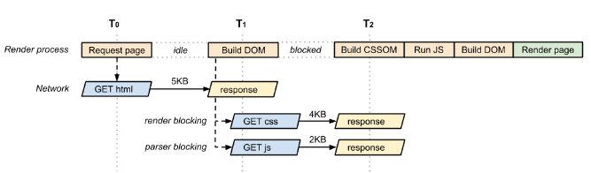
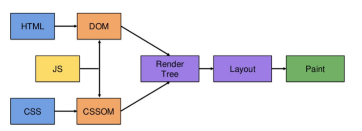

** 1차 수정 완료

### CRP 개요

CRP(Critical Rendering Path)는 브라우저가 HTML, CSS, JS를 화면에 픽셀로 변화하는 일련의 단계를 말하며 이를 처적화시키면 렌더링 성능을 향상시킬 수 있습니다.
CRP는 DOM, CSSOM, 렌더트리, 레이아웃, 페인트, composit의 과정을 가집니다.





브라우저의 렌더링 과정을 간단하게 소개하면

1 - HTML을 파싱하여 DOM을 만듭니다. 단, HTML 파싱 중 JS로 인하여 DOM이 변경될 수 있기 때문에 스크립트 태그를 발견하면 HTML 파싱을 잠시 멈춘 후 JS를 실행하거나, HTML 파싱을 완료 후 JS를 실행하는 방법 둘 중 하나를 선택하여 DOM을 완성합니다.

**단, async와 defer을 통해 보다 최적화시킬 수도 있기는 합니다. 이 부분은 추후 다루겠습니다.

2 - CSS의 정보를 담은 CSSOM을 생성합니다. HTML과 다르게 CSSOM은 CSS 정보가 모두 확인된 후에 CSSOM이 생성되기 시작합니다. CSS 특성상 나중에 선언된 특징으로 앞서 선언된 특징이 덮어질 수도 있기 때문입니다.

예)

```
.box{color: blue}
.box{color: red}
```

3 - 브라우저 엔진은 위에서 만들어진 DOM과 CSSOM을 결합하여 Render tree를 생성합니다.

4 - 레이아웃 과정을 통해 요소들의 크기, 위치 등을 정합니다.

5 - 정해진 위치의 요소들을 어떻게 칠할지를 정합니다.

6 - transform, opacity등의 속성을 composit과정을 통해 처리합니다.

의 과정을 거칩니다.

CRP의 최적화는 렌더링의 시간을 개선시킵니다. CRP를 이해하면 reflow, repaint를 개선하고 버벅거림을 방지할 수 있습니다.


## CRP은 무엇인가?
 

### Document Object Model (DOM)

CRP의 첫번째 단계인 DOM 생성입니다. DOM은 HTML의 요소들을 담고 있는 정보 덩어리라고 생각하시면 될 것 같습니다.
DOM 구성은 점진적으로 증가합니다. HTML응답 -> 토큰 -> 노드 -> DOM tree로의 변환 과정을 거칩니다.


#### DOM 토큰 
DOM 노드의 정보


#### DOM 노드 
시작태그 토큰을 시작으로 끝 태그 토큰으로 끝납니다.
HTML 요소에 대한 모두 연관성 있는 정보들을 가지고 있습니다.

노드들은 토큰의 위계서열을 기반으로 DOM tree 안에서 연결됩니다.
만약 또 다른 시작태그와 끝 태그 묶음이 한 세트 시작태그와 끝 태그 사이에 있다면 DOM tree의 위계서열을 정의하는 방법으로 노드 안에 노드를 가집니다.

MDN에 적힌대로 요약하니 말이 무슨 말인지 잘 와닫지 않을 것입니다.
하지만 HTML의 기본 구조를 알고 있을 저희에게 사실은 매우 쉬운 이야기입니다.

```
<div class="box1">
  <div class="box2">
    Hello World
  </div>
</div>
```

위의 설명은 모든 태그들이 시작(div)과 끝(/div)이 있다는 말을 하는 것을 말하고 각 요소(box2)는 다른 요소 안에 있어(box1) 위계질서가 생긴다는 말입니다.

많은 수의 노드는 CRP과정에서 많은 이벤트를 발생시킵니다. 적은 수는 상관 없지만 너무 많은 노드는 피해야합니다!


### CSS Object Model (CSSOM)

DOM은 페이지의 컨텐츠를 포함하고 CSSOM은 DOM을 스타일링 하기 위한 페이지의 모든 스타일 정보를 포함합니다.
CSSOM은 DOM과 달리 점진적으로 증가하지 않습니다.

CSS의 원 뜻인 Cascading Style Sheets에서 Cascading답게 CSS 규칙은 토큰을 노드로 변환할 때 아래로 상속됩니다. 하지만 CSS는 다른 하위 CSS에 의해서 기존 규칙이 덮어져 변경될 수 있습니다. 
CSSOM은 위의 이유로 CSS를 분석할 때 build 되지만 변경될 추후 변경될 수도 있기 때문에 완전 분석 전 까지 렌더링에 사용되지 않습니다. 브라우저는 모든 CSS를 처리하고 수신할 때까지 페이지의 렌더링을 방지합니다.

CSSOM을 칭하는 선택자가 덜 구체적일 수록 그 속도가 빠릅니다. (상위 DOM으로 거슬러 올라가기 때문) 
사실상 큰 의미가 있지는 않는다고 합니다.(워낙 빠릅니다.)
ex) .foo{} 비교적 빠름 > .bar .foo {} 비교적 느림 

이 부분은 css의 속성 중 추후 나오는 선언에 기존의 선언이 덮어져버리는 것을 대비하여 CSS의 경우 HTML과 같이
한 부분씩 쌓아가는 것이 아니라 css 분석이 완료되면 비로서 CSSOM을 만든다는 말입니다.


### Render tree

Render tree는 콘텐츠와 스타일을 모두 사용합니다. DOM과 CSSOM 트리는 렌더트리에 결합됩니다.
Render tree를 구성하기 위해 브라우저는 DOM 트리의 root에서 시작해 모든 노드를 확인 후 어떤 css를 적용시킬지 정합니다.

단, 렌더트리는 보여지는 콘텐츠만 적용합니다. head 영역과 display: none이 적용되어 있는 경우 해당 요소는 하위 요소에 포함시키지 않습니다.
즉, 사용하지 않을 요소에게 display:none을 적용하여 리소스를 아낄 수도 있습니다.


#  
#  

### Layout

렌더 트리가 생성된 후 단계가 실행됩니다. 레이아웃 단계는 요소들이 페이지에서 배치되는 위치, 방법, 각 요소의 너비, 높이, 서로 관련된 위치를 결정합니다.
body의 넓이는 뷰포트에 따라서 달라지므로 디바이스의 크기는 레이아웃에 영향을 미치게 됩니다.

``` 
<meta name="Viewport" content="width=device-witdh">
```

메타태그가 없을 경우 일반적인 브라우저의 기본값인 960px을 사용하게 됩니다.
즉, 디바이스가 회전하거나 창 크기가 변하는 경우 레이아웃이 발생합니다.

레이아웃은 DOM에 영향을 받는데 박스 모델 업데이트, 노드 추가와 같은 작업을 할 경우 render tree가 수정되면서 레이아웃이 발생합니다.
레이아웃 이벤트를 줄이기 위해서는 업데이트를 한번에 하여 레이아웃의 발생 빈도를 줄이고 애니매이션을 줄여야합니다.

이 부분은 추후 reflow를 다루면서 이야기 하겠습니다.


#  
#  

### Paint

렌터트리 생성 -> 레이아웃 -> Paint(픽셀 그리기)

브라우저는 최소 영역만을 다시 그리도록 최적화 되어있어 영향을 받는 부분만 다시 그리게 됩니다.
그리는 시간은 렌더 트리에 적용되는 업데이트가 무엇이었는지에 따라서 정해집니다.

paint가 일어나더라도 layout 과정은 일어나지 않을 수도 있습니다. 이를 repaint라고 합니다.

---
---

[참조1](https://developer.mozilla.org/ko/docs/Web/Performance/Critical_rendering_path)
[참조2](https://developer.mozilla.org/en-US/docs/Learn/Performance/CSS)
[참조3](https://im-designloper.tistory.com/100)
[참조4](https://velog.io/@broccoliindb/%EB%A9%B4%EC%A0%91%EC%A7%88%EB%AC%B8-CRP)