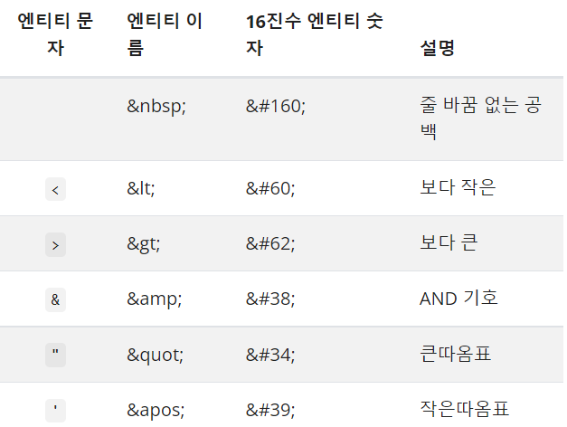

## XSS란?

XSS(Cross Site Script)는 유저가 웹 페이지를 이용할 때 올바르지 않은 스크립트로 실행되는 취약점 또는 공격방법을 이야기합니다.

### Stored XSS

Stored XSS는 XSS의 한 종류로 이름의 Stored에서 알 수 있듯이 무언가 저장된 정보를 이용합니다.

상황을 하나 가정해보겠습니다. 해커가 사람이 많이 사용하는 게시판에 글을 올립니다. 그리고 그 게시판은 HTML이 사용 가능합니다.

```
<div>
 이 글은 해킹 글입니다.
  <script>해킹 코드, 쿠키를 알려주세요</script>
</div>
```

위의 글을 게시물로 올리게 되면 script 태그가 실행되면서 해킹 스크립트가 실행될 것입니다.

다행히도 innerHTML에서의 script 코드는 HTML5에서는 사용하지 못하도록 막아뒀습니다. 하지만 안심할 수는 없습니다.

```

```

스크립트 코드가 아닌 위와 같은 방식을 사용할 수도 있기 때문입니다.

위와 같이 운영중인 웹 어플리케이션의 DB에 취약 해킹 코드를 삽입하여 강제적으로 클라이언트가 사용하게 하는 것이 Stored XSS입니다.

### Reflected XSS

Reflected XSS는 Stored 방식과 다르게 서버의 DB를 손대지 않습니다.

예시를 들어보겠습니다.

클라이언트가 웹 서핑을 하던 도중 해당 링크를 찾게 됩니다.

```
♚♚이장훈의☆자료정리♚♚블로그$$방문시☜☜주는건 없음※ ♜즉시이동:https://www.jh-blog-js.com/
```

해당 링크를 보고 흥미가 생겨 링크 태그를 클릭하니 사실 그 링크는

```
www.normalSite.com?q=hello<script>해킹 코드</script>
```

normalSite라는 검색 및 여러 포털을 담당하는 사이트로 링크 태그가 되어 있는 가짜 링크였습니다. 이제 링크 태그에서 검색 결과를 나타낼 것입니다. 이제 사이트 검색창에는

```
hello<script>해킹코드</script> 검색결과
```

라는 창이 뜨게 될 것입니다. 그리고 여기서 script 태그가 실행되지 않도록 보안처리를 하지 않는다면 Reflected Xss가 일어나게 됩니다.

### 보안처리를 하기 위해서는?

#### 1. XSS Filter처리

 대체 코드에서 문제가 될 수도 있는 부분을 전부 엔티티(Entity)로 Filter하면 됩니다.



#### 2. httpOnly 사용하기

쿠키 속성 중 JS를 통해 쿠키를 접근하지 못하도록 하는 httpOnly를 이용하면 쿠키의 경우 보안 처리가 가능합니다. 단, 이는 쿠키에서만 사용할 뿐 LocalStorage에서는 해당되지 않습니다.

## CSRF란?

사이트 간 요청 위조(Cross-site Request Forgery)는 XSS처럼 특유의 스크립트를 통해 정보를 탈취하는 것이 아닌 웹 페이지 특유의 API를 이용하는 방식입니다.

예를들면 아이디의 비밀번호를 변경하는 URI가 www.example.com/password/change라고 가정합시다.

해당 사이트는 비밀번호를 변경할 때 쿠키를 이용하여 쿠키 정보를 얻은 후 사용자를 확인하고 그에 대한 비밀번호를 바꾼다고 합시다.

그리고 여러분은 웹 서핑을 하던 도중 어떤 사이트를 발견합니다.


```
♚♚이장훈의☆자료정리♚♚블로그$$방문시☜☜주는건 없음※ ♜즉시이동:https://www.jh-blog-js.com/
```

해당 글에 흥미가 생겨 링크를 눌러봤으나 해당 링크 부분은 링크가 아닌 특정 주소로 post하는 일종의 해킹 웹 페이지였습니다.

이제 해킹 웹 페이지로 인해서 정보가 전송될 것입니다.

```
POST /password/change HTTP/1.1
Host: www.example.com

{
  ID:`여러분의 브라우저에 저장되어 있던 웹 쿠키 ID`,
  Password:`1234`
}
```

www.example.com/change로 요청된 POST 메소드는 여러분의 ID의 비밀번호를 1234로 변경하게 되었고 여러분의 ID는 해킹되었습니다.

스크립트 자체를 실행시키는 XSS와는 다르게 특정 API를 이용하기 위해 형식을 맞춰야 하는 것처럼 정해진 방법을 이용해서 해킹을 해야한다는 차이점이 있습니다.

### CSRF 방지 방법

#### 1. 토큰 이용

웹 페이지에 정상적인 방법으로 접근시 서버에서 정상적인 방법으로 접근했다는 것을 확인할 수 있는 token을 부여합니다. 그리고 비밀번호 변경같은 일종의 요청이 있을 경우 token을 확인 후 해당 요청이 정상적인 방법인지 확인합니다.

#### 2. referer 사용

http 헤더의 한 종류인 referer은 해당 Url이 전송되기 전에 어떤 도메인에서 전송되었는지를 확인할 수 있습니다. 확인된 도메인이 정상적이지 않으면 작동하지 않도록 합니다.

---


[참조](https://mangkyu.tistory.com/102)

[참조](https://velog.io/@josworks27/XSS-%EA%B0%9C%EB%85%90)

[참조](https://www.youtube.com/watch?v=bSGqBoZd8WM)

[참조](https://brownbears.tistory.com/251)

[참조](https://doctorson0309.tistory.com/605)

