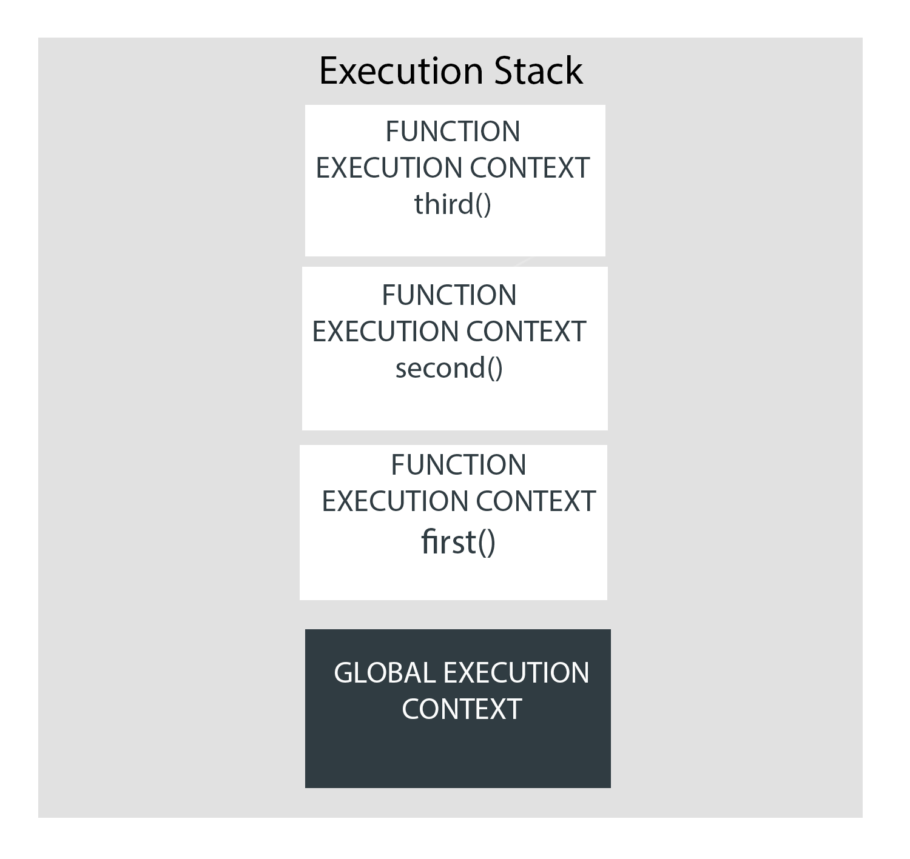

자바스크립트는 여러 환경에서 실행될 수 있지만 대부분 웹 브라우저에서 실행될 것입니다.
자바스크립트가 실행되기까지는 여러 프로세스가 보이지 않는 곳에서 진행되고 있습니다.
이번에는 이 부분에 대해서 다뤄보겠습니다.

시작하기 전 단어 몇개를 설명하고 가겠습니다.

### Parser

Parser 혹은 Syntax Parser은 코드를 한줄 한줄 읽어주는 프로그램입니다. 파서는 코드가 프로그래밍 언어에 의해 어떻게 정의되었고 어떤 일을 할 것인지 예상하는 역할을 합니다.

### JS 엔진

 자바스크립트 엔진은 단순히 자바스크립트 소스코드를 받고 기계언어로 컴파일을 합니다.
자바스크립트 엔진은 보통 웹 브라우저 제작자에 의해서 발전되는데 대표적인 예로 V8, SpiderMonkey, Chakra 등이 있습니다.

### Function Declarations 함수 선언식

```
function doSomething() { //here "doSomething" is the function's name statements;} 
```

### Function Expressions 함수 표현식

```
var someValue = function doSomething() { //here "doSomething" is the function's name statements;} 
```

이제 시작하겠습니다.

---

## 자바스크립트 코드는 어떻게 실행될까?

모두가 알다시피 브라우저나 컴퓨터는 고급 언어를 이해하지 못합니다. 고로 저희는 고급 언어를 컴퓨터가 알아들을 수 있는 기계언어로 변환해야합니다.

HTML을 읽을 때 만약 브라우저가 `<script>` 태그나 onClick과 같은 속성을 통해 JS 코드를 만나면 JS 엔진으로 코드를 보냅니다.

브라우저의 자바스크립트 엔진은 JS 코드를 변경하고 실행하기 위한 Execution Context라는 환경을 만듭니다.

Execution Context는 최근에 실행된 코드와 코드를 실행하기 위한 모든 것들을 포함하고 있습니다.

Execution Context가 실행되는 동안 특정 코드는 파서에 의해서 파싱됩니다. 변수와 함수는 메모리에 저장되고, 실행가능한 바이트 코드가 생성됩니다. 그리고 코드가 실행됩니다.

JS에서 Execution Context에는 2 종류가 있습니다.

> Global Execution Context(GEC)

> Function Execution Context(FEC)

## Global Execution Context (GEC)

JS 엔진이 스크립트 파일을 받으면 먼저 default 실행 Context를 만듭니다. 이는 GEC로 알려져 있습니다.

GEC는 기본 실행 콘텍스트로 함수 안에 있지 않은 모든 JS 코드를 실행시킵니다.

모든 JS 파일에는 1개의 GEC가 존재할 수 있습니다.

## Function Execution Conetext (FEC)

Function이 언급되면 JS 엔진은 다른 종류의 실행 컨텍스트를 생성합니다. 이를 FEC라고 부릅니다.
FEC는 GEC 안에서 함수 안에 있는 소스코드를 평가하고 실행시키는 역할을 합니다.

함수가 불러질 때마다 각각의 FEC가 생성되기 때문에 스크립트 런타임에 2개 이상의 FEC가 존재할 수도 있습니다.

## 실행 컨텍스트는 어떻게 생성될까?

저희는 실행 컨텍스트가 뭔지, 어떤 종류가 있는지를 알았습니다. 이제 어떻게 생성되는지를 살펴봅시다.

실행 컨텍스트를 생성할 때는 2개의 단계가 있습니다.

> 1. Creation Phase

> 2. Execution Phase

### Creation Phase 생성 단계

생성 단계에서는 실행 컨텍스트는 먼저 Execution Context Object(ECO)와 연결됩니다. ECO는 실행 콘텍스트가 런타임 도중 사용하는 다수의 중요한 데이터를 저장하고 있습니다.

ECO의 properties가 정의되고 설정되는 동안 생성 단계에서는 3가지의 단계가 일어납니다. 

1. Creation of the Variable Object (VO)

2. Creation of the Scope Chain

3. Setting the value of the *this* keyword

각자 자세히 살펴보겠습니다.

### 생성 단계 : Creation of the Variable Object(VO)

VO는 실행 컨텍스트 내부에서 생성된 객체같은 공간입니다. VO는 실행 컨텍스트 내부에서 정의된 변수와 함수 선언을 저장합니다.

GEC에서 `var` 키워드로 변수가 선언되면 VO에 각 변수를 point하는 property가 추가되고 property는 'undefined'로 설정됩니다.

함수 선언은 함수를 point하는 properties가 VO에 추가되고 그 프로퍼티가 메모리에 저장됩니다.
이것은 모든 함수선언이 코드가 실행되기 전에 VO안에서 저장되고 
접근할 수 있게 만들어지는 것을 말합니다.
(변수와는 달리 `undefined로` 초기화는 하지 않습니다.)

FEC는 한편 VO를 생성하지 않습니다. FEC는 argument object라고 불리는 배열같은 객체를 만듭니다. argument object는 함수에 전달되어야할 모든 인자를 가지고 있습니다.

이렇게 변수와 함수를 코드 실행 전에 메모리에 저장하는 것을 `Hoisting`이라고 합니다.

## 자바스크립트에서 호이스팅이란?

함수와 변수 선언은 JS 내부에서 끌어올려집니다.(hoisted) 이것은 소스코드가 실행되기 이전에 메모리에 변수와 함수를 저장하고 사용할 수 있게 함을 말합니다.

### 함수 호이스팅

한 예시를 들어보겠습니다.

```
function addTwo (a,b){
  console.log(a + b);
}

addTwo(1,4)//5
```

함수가 코드 상단에서 선언됐고 나중에 함수를 언급할 경우 문제 없이 실행이 가능합니다.


```
addTwo(1,4)//5


function addTwo (a,b){
  console.log(a + b);
}
```

하지만 함수가 선언되지 않았을 때도 함수를 언급하면 함수를 문제 없이 사용할 수 있습니다.

JS에서는 함수 호이스팅 덕에 함수가 선언되기 전에 함수를 사용할 수 있습니다.

### 변수 호이스팅

`var` 로 선언된 변수는 가장 최근 실행 컨텍스트의 메모리의 VO에 `undefined`로 초기화 된 후 저장됩니다.
함수와는 다르게 `undefined`로 초기화된 탓에 변수 선언 전에 해당 변수를 언급하면 undefined로 출력됩니다.

```
console.log(example) // undefined

var example = 'example'
```

### 호이스팅의 영역 규칙

호이스팅은 함수 선언에서만 작용하고 함수 표현식에서는 작용하지 않습니다. 예시를 들어보겠습니다.

```
addTwo(1,4)//addTwo is not a function

var addTwo = function(a,b){
  console.log(a + b);
}
```

함수 선언식과는 다르게 함수 표현식에서는 함수 호이스팅이 작동하지 않습니다.
그 이유는 `var` 로 선언된 addTwo 가 변수 호이스팅으로 인하여 `undefined`로 초기화 된 상태이기 때문입니다.

변수 호이스팅은 `let`과 `const`에서 초기화를 하지 않습니다. let과 const로 선언한 변수를 선언 전에 언급하면
`ReferrenceError`가 나타납니다.

즉, let과 const도 호이스팅이 일어나지만 `undefined`로 초기화하지 않아 ReferrenceError가 나타나게 됩니다.

### 생성 단계: Creation of the Scope Chain

실행 컨텍스트 1단계인 VO 생성 후 2단계인 스코프 체인이 생성됩니다.

JS에서 스코프는 선언된 변수나 함수가 접근 가능한 구역을 정하는 일종의 장치입니다. 이 장치의 범위를 정하는 것을 스코핑이라고 합니다.

```
var outer = () => {
  var outerVal = 5;
  var inner = () => {
    var innerVal = 50;
    console.log(outerVal)
  }
  inner();// 5
  console.log(innerVal)//ReferenceError: innerVal is not defined
}
  outer();
```

함수가 다른 함수 내부에서 선언되었을 경우 내부 함수는 외부 함수의 정보를 이용할 수 있지만 외부 함수는 내부 함수의 정보를 이용할 수 없습니다.
이런 상황을 lexical scoping이라고 합니다.

외부 함수는 내부 함수에 접근할 수 없습니다. 반면 내부 함수는 외부 함수에 접근할 수 있죠 이러한 스코프의 개념을 클로저(closures)라고 합니다.

```
function outerCount() {
  let num = 0;

  return function () {// inner 함수
    return num++;
  }
}
let counter = outerCount();

console.log(counter());//0
console.log(counter());//1
console.log(counter());//2
```

클로저를 이용한 또 다른 예제입니다. 위의 outerCount의 return값인 inner 함수를 통해 outerCount의 num을 참조하여
사용이 가능합니다. 이런 방법을 사용하면 num의 값은 내부 함수로만 제어가 가능하게됩니다. 즉, 은닉화가 가능한 것이죠.

![scope]](./scope.png)

그림을 보면 각 함수가 생성한 VO는 내부에서 외부의 값이 사용 가능하지만 외부에서는 사용할 수 없음을 쉽게 나타냈습니다.

### 생성 단계: Setting The Value of The "this" Keyword

마지막 단계는 `this`의 값을 설정하는 것입니다. JS의 this 키워드는 실행 컨텍스트가 어디에 속하는지를 스코프에 알려줍니다.

스코프 체인이 생성된 후에 JS 엔진에 의해 this가 초기 설정됩니다.

GEC에서의 this는 window라고도 불리는 global 객체를 칭합니다.

```
var occupation = "Frontend Developer"; 

function addOne(x) { 
    console.log(x + 1) 
}

//----- 둘은 같은 코드 -----//

window.occupation = "Frontend Developer"; 
window.addOne = (x) => { 
console.log(x + 1)
};
```

FEC에서의 this는 정의된 환경을 칭하게 됩니다.

```
var msg = "I will rule the world!"; 

function printMsg() { 
    console.log(this.msg); 
} 

printMsg(); // "I will rule the world!"
```
위의 경우 함수 printMsg()가 GEC에서 정의되었기 때문에 printMsg에서 선언된
this는 GEC를 칭하게 됩니다.

```
var msg = "I will rule the world!"; 
const Victor = {
    msg: "Victor will rule the world!", 
    printMsg() { console.log(this.msg) }, 
}; 

Victor.printMsg();// "Victor will rule the world!"
```

위의 코드의 경우 printMsg가 선언된 곳은 global 객체가 아니라 일반 객체에서 선언되었기 때문에
this.msg는 global 객체의 msg가 아닌 Victor에 할당될 일반 객체 내부의 msg를 칭하게 됩니다.

this를 만드는 과정이 끝나게 되면 생성 단계가 완료되고 Execution Phase가 시작됩니다.

### Execution Phase 실행 단계

실행 단계는 코드가 시작하는 실질적인 시작입니다. 
이 단계 전까지 VO는 undefined로 초기화 되어 있는 변수들을 가지고 있습니다. 만약 코드가 이 상태에서 실행된다면
undefined의 값들로 코드를 실행할 수 없기 때문에 에러가 날 것입니다.

JS 엔진은 코드를 한번 더 읽고 VO를 실제 값으로 업데이트를 해줍니다. 그 후 코드는 파서에 의해 파싱하고 실행 가능한 바이트 코드로 변경된 뒤 전달되어 마침내 실행됩니다.

### JS 실행 스택

JS는 콜스텍이라고 불리는 실행 스택을 통해서 작동합니다. JS는 싱글 스레드 언어입니다. 즉, 한번에 한가지의 일을 할 수 있다는 말입니다.
JS에서 이벤트나 함수등이 실행되면 실행 컨텍스트가 생성되어 콜스택에 하나씩 쌓이게되는데 이를 실행 스택이라고 합니다.

JS가 브라우저에 로드되면 콜 스택 가장 아래 전역 컨텍스트가 생성됩니다. JS 엔진은 함수가 사용되는 곳을 찾은 후 각 함수가 사용되면 FEC를 생성하게 됩니다. 그리고 가장 최근에 생성된 실행 콘텍스트 위에 새로 쌓이게 됩니다.

```
var name = "Victor";

function first() {
  var a = "Hi!";
  second();
  console.log(`${a} ${name}`);
}

function second() {
  var b = "Hey!";
  third();
  console.log(`${b} ${name}`);
}

function third() {
  var c = "Hello!";
  console.log(`${c} ${name}`);
}

first();
```

위의 코드를 예시로 설명해보겠습니다.



먼저 script가 실행되면 GEC가 생성됩니다. JS 엔진은 first()를 찾은후 first()의 FEC를 생성합니다.
그러면 GEC위에 first의 FEC가 실행 스택에 쌓이게 됩니다. 순서대로 GEC - FEC(first) - FEC(second) - FEC(third)로 가장 최근에 언급된 함수가
실행 스택 가장 맨 위에 쌓이게 되는 LIFO 형태를 띄게 된 후 코드가 실행됩니다.


---

[참조](https://www.freecodecamp.org/news/execution-context-how-javascript-works-behind-the-scenes/)