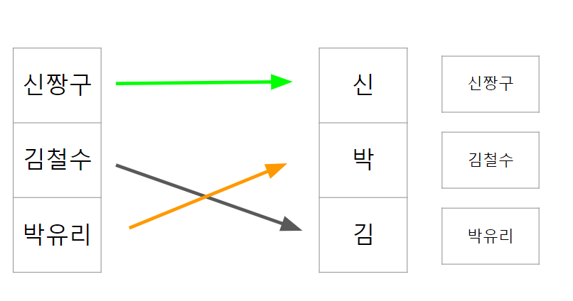
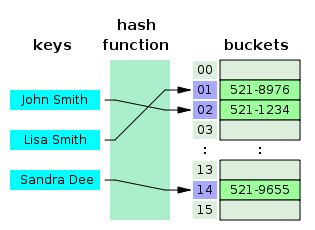
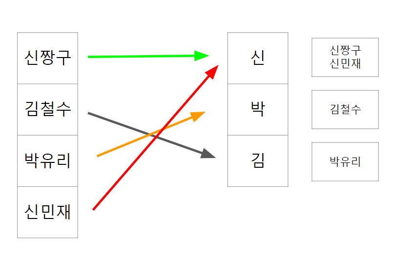
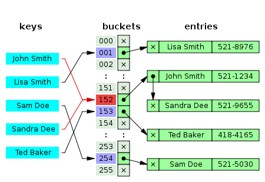
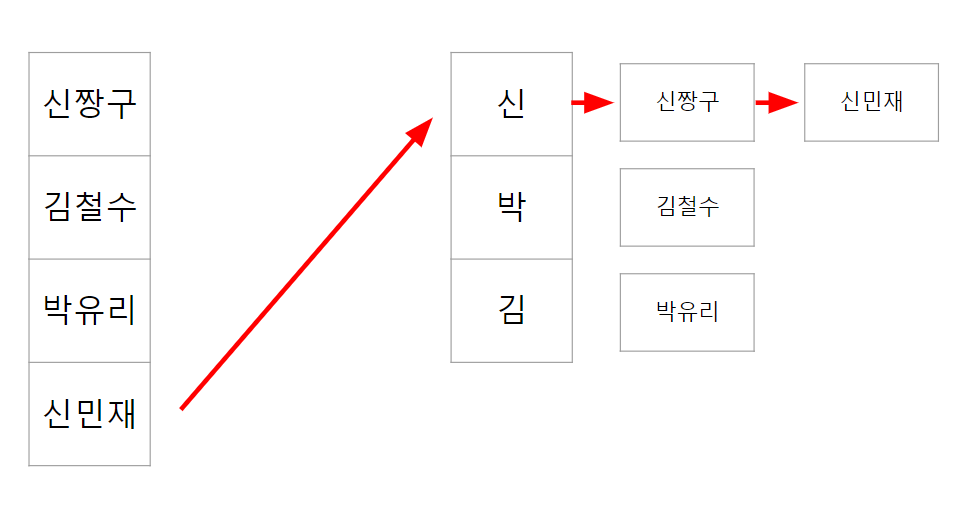

## 해시(Hash)란?

해시는 데이터를 다루는 기법 중 하나로 검색과 저장을 빠르게 하는 자료구조입니다.

해시는 데이터를 저장할 때 Key-Value 형태로 데이터가 존재하고 Key 값이 배열의 인덱스로 저장되기 때문에 검색과 저장이 빠르게 일어나게 됩니다.

## 해시 테이블이란?

위의 해시를 이용하여 자료를 정리한 일종의 자료구조를 해시 테이블이라고 합니다.

예를 들어보겠습니다.

위의 그림의 3명을 성을 이용해서 분류를 하겠습니다. 신짱구, 김철수, 박유리는 각각 성에 대한 정보를 따 Key와 Value로 저장됩니다. 지금이야 3명이니까 굳이 필요해보이지 않겠지만 이러한 정보가 수백 수천이 섞여있다면 해시테이블을 이용해 원하는 정보를 찾기 원활할 것입니다.

하지만 같은 key 값을 가지게 되는 hash가 생긴다면 어떻게할까요?

위의 그림에서 신민재와 신짱구는 같은 bukket에 저장이 되어야합니다. 이렇게 같은 해시값이 나오는 경우를 충돌(collision이라고 합니다.)

이러한 상황을 해결하기 위해서 사용하는 대표적인 예시가 분리 연결법입니다.

분리연결법(seperate chaining)은 동일한 버킷에 저장되어야하는 데이터에 체인을 걸어 찾는 데이터가 나올 때까지 계속 체인을 따라가는 방식입니다.

만약 신민재의 위치를 찾고 싶다면 신 -> 신짱구 -> 신민재 의 과정을 거치게 됩니다.

### 해시 함수란?

이렇게 해시를 분류해주는 함수를 해시 함수라고 합니다. 만약 해시 함수가 제대로 작동하지 못하면 O(n)까지 해시 테이블의 관계 복잡도가 오를 수도 있습니다.

위의 이름을 예시로 들면 신씨 성을 가진 사람이 1만명이 있고 박씨 성을 가진 사람이 1명이 있을 경우 신짱구의 정보를 얻으려면 최대 1만번의 탐색을하는 거의 n번에 가까운 탐색을 할 것이지만 박유리를 찾기 위해서는 한번만 탐색을 하면 됩니다.

이러한 상황을 방지하기 위해서 좋은 해시함수를 이용해서 해시 테이블을 만들 필요가 있습니다.

---

[참조](https://mangkyu.tistory.com/102)