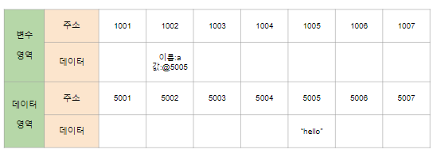
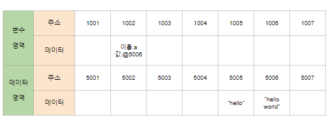
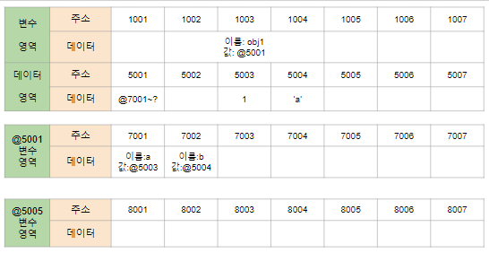
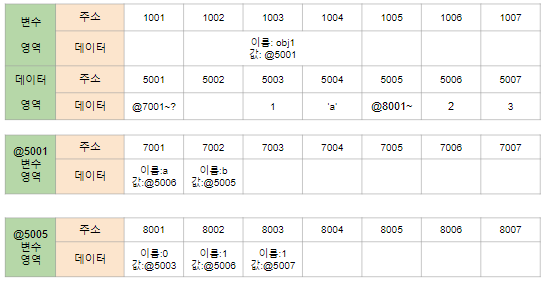
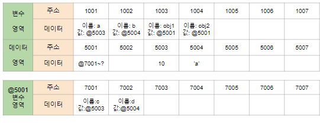
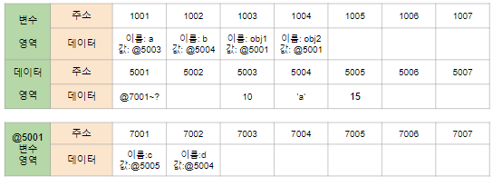

## 시작

JS를 공부하신 분들은 변수를 선언하고 사용해 보셨을겁니다. 하지만 변수가 어떻게 저장되어 있는지를 말하면 아리송합니다. 이에 대해 짚고 넘어가겠습니다.

```
var a = "hello"

console.log(a)//hello
```



우선 위와 같은 선언문을 예시로 들겠습니다. JS는 변수를 선언하면 변수는 변수 영역에 저장하고 그 변수의 데이터는 데이터 영역에 저장하게 됩니다.

위에서 console.log를 실행하기 위해서는 

1. 변수 a를 변수 영역에서 탐색
2. 변수 a의 데이터의 주소 @5005로 이동
3. @5005의 데이터 확인

의 과정을 거치게 되겠지요.

그냥 변수 영역에 데이터를 저장하면 될 것인데 왜 이렇게 복잡하게 했을까요?

//그건 옛날 컴퓨터의 능력 때문이었습니다. 지금이야 컴퓨터가 많이 발전하여 가벼운 업무 정도는 휙휙 넘기겠지만 옛날에는 그러지 못했습니다. 메모리와 데이터 변환을 더 효율적인 방법이 필요했고 위와 같은 방법을 사용한거지요.

이는 메모리를 더 쉽게 관리하기 위해서였습니다. 이 덕분에 저희들이 JS에서는 자료형을 선언하지 않아도 되는겁니다.

예를 들겠습니다. 숫자형 데이터는 8바이트의 공간이 필요합니다. 하지만 저희가 숫자형보다 더 큰 메모리를 가진 데이터를 숫자형이 저장되어 있는 변수에 할당한다면 변수 영역은 늘어날 수 밖에 없을겁니다.
만약 여기서 변수 주변에 데이터들이 저장되어 있는 상태면 변수형 메모리의 공간을 늘리기 쉽지 않을겁니다. 
반면 데이터 영역에서 참조해오는 방식을 사용하면 적당한 공간을 찾은 후 데이터를 저장만 하고 참조만 하면 될 뿐이기 때문에 메모리 관리가 쉽습니다.



```
var a = "hello"
a="hello world"

console.log(a)//hello world

```

하지만 이러한 JS의 형식 때문에 알아야 하는 것이 있습니다.

### 불변값

불변값은 이름만 보면 const, 즉 상수와 같다고 생각할 수도 있는데 이는 잘못된 접근입니다. 불변값 또한 변수이므로 그 데이터가 변경될 수도 있습니다. 하지만 이는 변수 단계에서 참조해올 데이터 영역의 값만 변할 뿐 데이터 영역의 값은 변하지 않습니다. 기본형 데이터들은 전부 불변 값입니다.

### 가변값


기본형 데이터 즉, 불변값과 가변값의 차이는 '객체의 변수 영역'이 별도로 존재한다는 것입니다. 위의 그림을 보면 알 수 있듯이 객체가 별도로 부여한 영역은 변수 영역일 뿐 데이터 영역은 기존의 메모리 공간을 그대로 활용하고 있습니다. 하지만 가변형 데이터에는 얼마든지 그 값을 추가할 수가 하거나 변경할 수가 있습니다. 이 부분을 가변형이라고 합니다. 예제로 살펴보겠습니다.


```
var obj1= {
  a:1,
  b:`a`
}
/// 그림 재할당 전
obj1.b = [1,2,3]
obj1.a = 2
/// 그림 재할당 후
```




우선 obj의 요소에 재할당을 하기 전의 모습입니다.
변수 obj1은 여러개의 프로퍼티로 이뤄진 데이터 그룹으로 객체 @5001의 변수 그룹에 저장합니다.
결국은 불변형 데이터들이 데이터 영역에 저장되지만 @5001이 참조하는 변수의 값이 변할 수 있다는 점에서 가변형임을 보여줍니다.




그러면 위의 그림에 재할당을 하면 어떤 상황이 생기는 지에 대해서 알아봅시다.

1. obj1 -> @5001 -> @7002의 값을 참조 한 후 @7002에 새로 대입할 데이터를 @ 5005에 저장합니다.

2. @5003에 저장된 정보는 여러개의 프로퍼티를 가진 배열로 배열의 변수영역이 추가로 필요합니다. @8001, @8002, @8003에 각 배열의 array 정보를 따 0,1,2의 이름을 가진 변수영역 데이터를 추가합니다.

3. @800x에 있는 배열의 데이터가 데이터 영역에 존재하는지 확인합니다. @8001의 데이터 0은 이미 @5003에 저장되어 있지만 @8002와 @8003의 데이터 2,3은 데이터 영역에 저장되어 있지 않기 때문에 @5006과 @5007데 데이터 2,3을 추가합니다.

4. obj1.a = 2가 할당됨에 따라서 @7001의 변수형 데이터가 참조할 데이터 2가 저장된 @5006을 @7001의 값으로 변환합니다.

데이터 추가의 경우 더 이상 사용하지 않을 데이터를 파기하고 그 곳에 데이터를 생성할 수도 있습니다.

### 변수 복사

```
var a = 10;
var b = a;

var obj1 = {c:10, d : 'a'}
var obj2 = obj1
```






위와 같은 과정을 거친다고 하면 그림과 같은 결과가 나올겁니다.

```
var a = 10;
var b = a;

var obj1 = {c:10, d : 'a'}
var obj2 = obj1

obj1.c = 15

obj2.c == obj1.c // true
obj2.c == a //false
```

위의 함수처럼 객체에 할당된 값을 변경할 경우 obj1과 obj2는 같은 주소값을 참고하고 있기 때문에 obj1의 프로퍼티가 변경되더라도 obj2의 프로퍼티가 변하게 됩니다.

### 불변 객체

객체를 =을 통해서 복사할 경우 원하지 않는 경우에도 객체 프로퍼티가 변경될 수도 있다는 문제점이 생길 수도 있다는 것을 저희는 알게 되었습니다.

그렇다면 객체 obj1을 원형으로 두고 obj2를 변경할 수 있는 방법은 무엇일까요? 그것은 바로 데이터 영역의 값을 직접적으로 할당한 새로운 객체를 만드는 것입니다.

```
var obj1 = {
  name: "sam",
  gender: "male"
};

var obj2 = {
  name: obj1.name,
  gender: obj1.gender
}

obj2.name = "john"

obj1.name == obj2.name // false
```

위처럼 변수의 데이터 값 주소를 참조하는 객체를 새로 만들게 되면 원형 데이터 obj1을 보존할 수 있게 됩니다.

각 객체들을 저장하는 것이 너무 번거로우니까 함수를 이용해서 소스를 만들면

```
var obj1 = {
  name: "sam",
  gender: "male"
};

var copyObject = function(target){
  if(typeof target != Object){return 0;}
    var result = {};
  for(var prop in target){
    result[prop] = target[prop];
  }
  return result;
};

obj2 = copyObject(obj1)
obj2.name = "john"
console.log(obj2.name == obj1.name )//false
```
처럼 나타낼 수도 있습니다.

하지만 여기서 문제점이 있습니다. 만약 obj1 내부에 가변형 데이터가 들어가면 어떻게 될까요? 당연히 obj1 내부 프로퍼티의 가변형 데이터를 다른 곳에서 변경하면 가변형 데이터 내부 변수의 값이 변할 수도 있습니다.

위와 같은 방식을 얕은 복사라고 합니다.

반대로 깊은 복사라는 것이 존재하면 위와 같은 문제점을 해결할 수 있는거겠죠?

깊은 복사를 해결하는 방법은 재귀함수를 이용하여 얕은 복사 중 가변형 데이터를 찾게되면 그 가변형 데이터에 얕은 복사를 하는 것입니다. 얕은 복사가 반복되다보면 깊은 복사가 되어 다른 곳에 영향을 받지 않는 독립적인 객체가 될 수 있습니다.

```

var copyObjectDeep = function(target){
  var result = {};
  if(typeof target === 'object' && target !== null){
    for(var prop in target){
      result[prop] = copyObjectDeep(target[prop]); // 객체일 경우 객체 내부 데이터로 진입
    }
  } else {
    result = target; // 각 데이터의 데이터 영역에서의 값 반환
  }
  return result;
};

var obj={
  a : 1,
  b : {
    c:null,
    d: [1,2]
  }
};

var obj2 = copyObjectDeep(obj)

obj2.a = 3;

console.log(obj.a,obj2.a)

```

위와 같은 방식으로 깊은 복사를 완료할 수 있었습니다.

---
