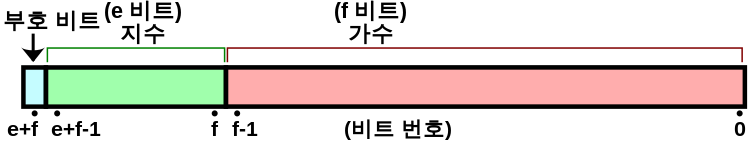
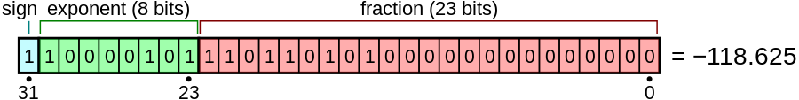

```
console.log(0.1 + 0.2 === 0.3);
```

위 코드를 js에서 실행시키면 false가 될 것입니다.

그 이유를 살피자면 JS에서 double형의 자료형은 IEEE754에 의거한 방법으로 정의되기 때문입니다.



위 그림과 같이 IEEE는 부호, 지수부, 가수로 총 3가지의 부분으로 나뉩니다.
각 부호, 지수부, 가수는 1, 11, 52개의 비트를 가지며 총 64개의 비트로 이루어져 있습니다.

double형의 저장방법은 다음과 같습니다. -118.625를 예시로 들겠습니다.

1. 먼저 부호가 음수이므로 음수의 비트가 1이 됩니다.

2. -118.625의 절대값을 이진법으로 나타내면 1110110.101이 됩니다.

3. 다음을 정리하면 1.110110101 * 2^6 에서 정수 부분인 1을 지수 부분의 1로 두고
값을 대입합니다.

4. 지수가 2^6으로 6이고 지수부분을 나타내기 위해 IEEE 법칙에 따라 127을 더합니다.
6 + 127 = 133으로 10000101의 값을 지수로 가지게 됩니다.

완성된 비트는 다음과 같습니다.



저희는 결국 Double형을 이진법을 이용해서 저장하기 때문에 0.1, 0.2, 0.3과 같은
이진법로 나타낼 수 없는 함수의 경우 가수부분이 가득 차게 되면 반올림을 하게 됩니다.

그 과정에서 작은 오차가 발생하게 되는데 결국 0.1 + 0.2의 값이 0.3과 완전히 같지는 않은 상황이 생기게 됩니다.


---

[참조](https://man-wol.tistory.com/entry/01-02-03-false)