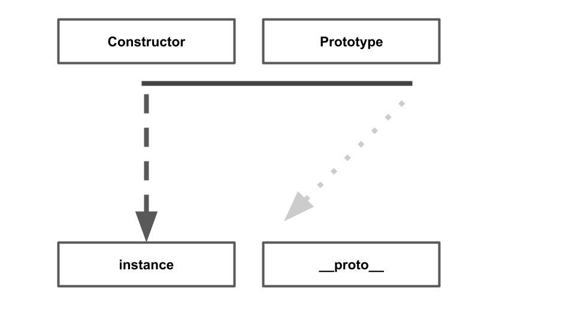
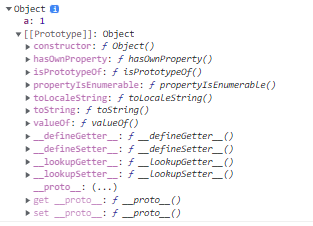

자바스크립트는 프로토타입 기반 언어입니다. 클래스 기반 언어에서는 상속을 사용하지만
프로토 타입 기반 언어에서는 어떤 객체를 원형으로 삼고 이를 복제함으로써 상속과 비슷한 효과를 얻습니다.
유명한 언어들의 대부분이 클래스 기반인 것을 생각하면 프로토타입은 꽤나 독특한 개념입니다.

## 프로토 타입의 개념 이해

### constructor, protytype, instance

```
var instance = new Constructor();
```



위의 소스 코드를 그림으로 나타낸 것입니다. 그림에서 윗변(실선)의 왼쪽 꼭지점에는
COnstructor을, 오른쪽 꼭짓점에는 COnstructor.prototype이라는 프로퍼티를 위치시켰습니다.
왼쪽 꼭지점으로부터 아래를 향한 화살표 중간에 new가 있고 화살표 종점에는 instance가 있습니다.
점으로부터 재각선 아래로 향하는 화살표의 종점에는 instance.**proto**이라는 프로퍼티를 위치시켰습니다.

흐름은 다음과 같습니다

> 1. 어떤 생성자 함수를 new 연산자와 함께 호출

> 2. Constructor에서 정의된 내용을 바탕으로 새로운 인스턴스 생성

> 3. instance에 자동으로 **proto** 부여

> 4. 이 프로퍼티는 COnstructor의 prototype을 참조

**proto** 가 핵심입니다. prototype은 객체입니다 이를 참조하는 **proto**도 객체입니다.
prototype 내부에는 인스턴스가 사용할 메서드를 저장합니다. 이러면 인스턴스에서도 숨겨진 프로퍼티인 **proto**를 통해 이 메서드를 접근할 수가 있습니다.

```
var Person = function(name) {
  this._name = name;
};
Person.prototype.getName = function() {
  return this._name;
};
```

위의 예시를 예로 들어보겠습니다.
person이라는 생성자 함수의 prototype에 getName이라는 메서드를 추가했습니다.
이제 person의 인스턴스는 **proto** 프로퍼티를 통해 getName을 호출 할 수 있습니다.
왜냐하면 instance의 **proto**가 COnstructor의 prototype 프로퍼티를 참조하고 있기 때문입니다.

```
var suzi = new Person('Suzi');
suzi.__proto__.getName(); // undefined
Person.prototype === suzi.__proto__ //true
```

메서드의 호출 결과로 undefined가 나온 점을 확인해봅시다. Suzi라는 값이 나오지 않는 것 보다는
에러가 발생하지 않았다는 점이 우선입니다. 어떤 변수를 실행할 때 undefined가 나왔다는 것은
호출할 수 있는 함수임을 의미합니다. 만약 그러지 않았다면 typeError가 발생했을 것입니다.
그런데 값이 에러가 아닌 다른 값이 나왔기 때문에 getName이 실제로 실행됐음을 알 수 있습니다.

다음으로는 어떤 값을 return하는지에 대해 살펴봅시다. getName은 this.name을 반환합니다.
그렇다면 this에 원래의 의도와 다른 값이 할당 된 것이 아닌가를 먼저 의심해봅시다.

어떤 함수를 메서드로서 호출할 때는 메서드명 바로 앞의 객체가 곧 this가 된다고 했습니다.
곧 Suzi.**proto**.getName()은 getName 함수 내부의 this는 Suzi거나 Suzi.**proto**일 것입니다.
해당 객체 내부에는 name 프로퍼티가 없으므로 찾고자하는 식별자가 정의되어않아 Error가 아닌 undefined가 반환된 것입니다.
그렇다면 Suzi에 \_name을 추가해봅시다.

```
var suzi = new Person('Suzi');
suzi.__proto__._name = 'Suzi';
suzi.__proto__.getName(); // Suzi
```

예상대로 Suzi가 잘 출력됩니다. 하지만 매번 **proto**를 적으면서 추가하기에는 너무 비효율적입니다. 이럴 때는 **proto**를 지우면 됩니다.

```
var suzi = new Person('Suzi');
suzi.getName(); // Suzi
```

**proto**를 빼면 this는 instance가 되는게 맞지만 이대로 메서드가 호출되고 원하는 값이 나오는 것은 좀 이상합니다. 그 이유는 바로 **proto**가
생략 가능한 프로퍼티이기 때문입니다. 원래부터 생략 가능하도록 정의되어 있습니다. 그리고 자바스크립트의 전체 구조는 이 정의를 바탕으로 구성되었다고
해도 무방합니다.

혹시 몰라 한번 더 정리하면 suzi안에 Suzi의 데이터가 들어있어서 suzi.**proto**.getName을 사용하면
getName을 this로 지칭하여 Suzi를 찾을 수 없지만 suzi.getName()을 사용하면 suzi 안의 Suzi를 참조할 수 있게 되는 것입니다.

함수의 prototype에 어떤 메서드나 프로퍼티가 있다면 인스턴스에서도
마치 자신의 것처럼 해당 메서드나 프로퍼티를 이용할 수 있게 됩니다.

### constructor 프로퍼티

생성자 함수의 프로퍼티인 prototype 객체 내부에는 constructor라느 프로퍼티가 있습니다.
인스턴스의 **proto** 객체 내부에도 마찬가지입니다.
이 프로퍼티는 원래의 생성자 함수를 참조합니다. 자신을 참조하는
프로퍼티를 굳이 왜만들까 싶지만
이 역시 인스턴스와의 관계에서 매우 중요합니다.

```
//다음의 값은 모두 같은 값입니다.
[Constructor]
[instance].__proto__.constructor
[instance].constructor
Object.getPrototypeof([instance]).constructor
[Constructor]. prototype.constructor
```

```
//다음 값들은 모두 prototype에 접근 가능합니다.
[Constructor].prototype
[instance].__proto__
[instance]
Object.getPrototypeof([instance])
```

## 프로토타입 체인

### 메서드 오버라이드

prototype 객체를 참조하는 **proto**를 생략하면 인스턴스는 prototype에
정의된 프로퍼티나 메서드를 자신의 것처럼 사용할 수 있다고 했습니다.
만약 인스턴스가 동일한 이름의 프로퍼티 또는 메서드를 가지면 어떻게 될까요?

```
var Person = function(name) {
  this._name = name;
};
Person.prototype.getName = function() {
  return this._name;
};

var iu = new Person('지금');

iu.getName = function () {
  return '바로' + this.name;
};

console.log(iu.getName());
```

iu.**proto**.getName이 아닌 iu 객체에 있는 getName이 호출됩니다.
이 현상을 메서드 오버라이드라고 합니다.
이 현상은 원본이 있는 상태에서 다른 대상을 덮어씌운다고 생각하면 편합니다.

JS 엔진은 클로저와 비슷하게 우선 자신의 프로퍼티를 검색하고 **proto**의
정보를 검색하는 식으로 한단계씩 상위 프로토타입에서 해당 프로퍼티를 찾게 됩니다.
그렇다면 메서드 오버라이딩이 되어 있는 상태에서 어떻게 원 프로토타입의 getName()에 접근할까요?

```
console.log(iu.__proto__.getName.call(iu));
```

로 접근할 수 있습니다.

### 프로토타입 체인

프로토 타입 체인을 설명하기 전에 객체의 내부 구조를 봅시다.

```
console.dir({a : 1})
```



첫줄을 통해 프로퍼티 a의 값이 보이고 `__proto__` 값에는
constructor인 Object의 메소드들이 보입니다.

배열의 리터널을 찾아보면 배열의 **proto**인 Object의 **proto**가 존재합니다.
그 이유가 무엇일까요?

그것은 배열의 **proto**가 객체로 이뤄져있기 떄문에 Object.prototype에 연결되기 떄문입니다.

```
var arr = [1,2];
arr.__proto__.push(3);
arr.__proto__.__proto__.hasOwnProperty.call(arr,2);
arr.hasOwnProperty(2);
```

위에서 말한 프로토타입 체인을 통해 다음과 같은 참조도 가능하게 됩니다.
배열에서 object의 메소드를 사용할 수 있게 된 것입니다.

---
