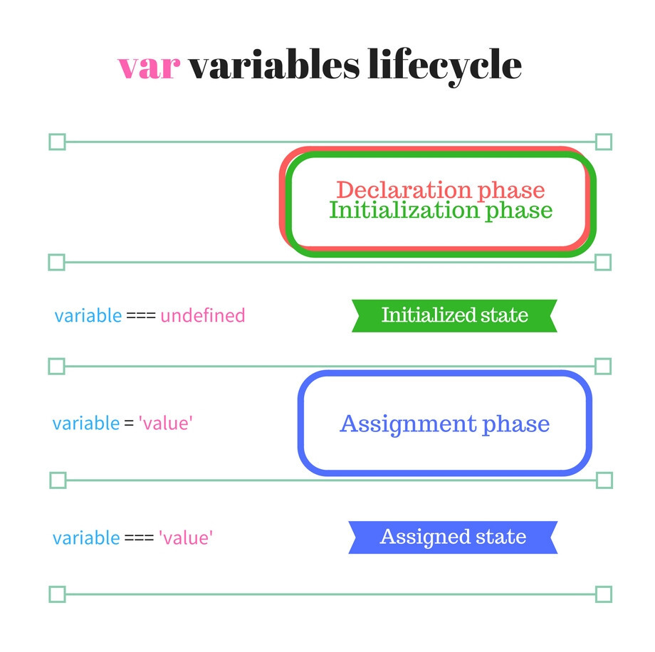
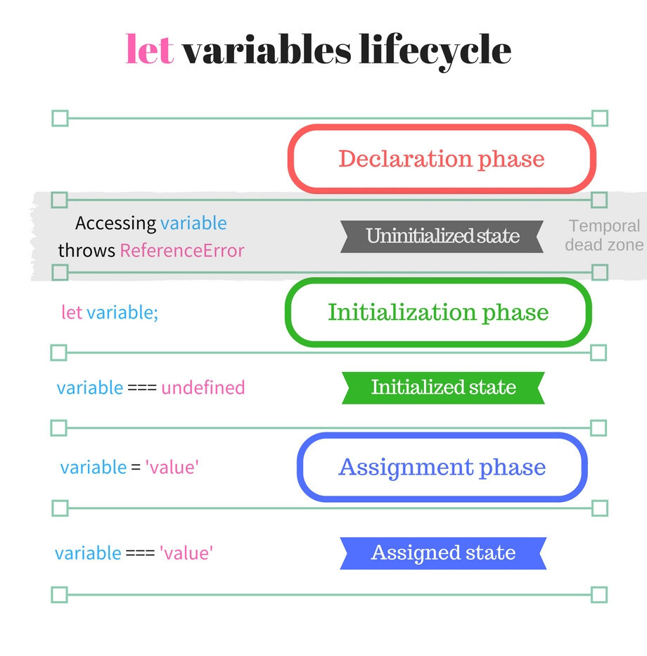
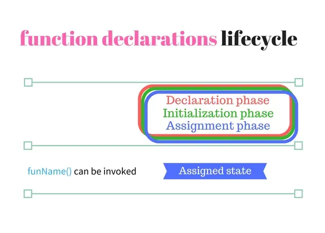

변수와 상수를 선언하는 방법은 크게 3가지로 let, var, const가 있습니다. 각 차이첨을 살펴보겠습니다.

### var

```
console.log(x) // undefined
var x = 1
console.log(x) // 1
```  

### let

```
console.log(x) // Uncaught ReferenceError : Cannot access 'x' before initialization
let x = 1
```
### const

```
console.log(x) // Uncaught ReferenceError : Cannot access 'x' before initialization
const x = 1
```


변수가 초기화된 후에 1이 나오는 것은 알겠지만 var은 undefined가 나오는데 let과 const는 왜 변수 선언 자체가 안됐다는 에러가 나올까요?

이것은 함수 호이스팅 때문입니다.

### 호이스팅(hoisting)

호이스팅은 변수와 함수의 메모리 공간을 선언 전 미리 할당하는 것을 이야기 합니다. 쉽게 말하면 자바스크립트가 작동하기 전에 변수나 함수가 있다는 것을 알려주는 것이지요.

var, let, const, function, class는 모두 호이스팅이 일어납니다.

var의 경우 var의 정보가 존재한다고 미리 알려주고 var이 있기는 한데 뭔지는 모르는 상태라는 뜻으로 defalut를
 undefined 처리합니다.

반면 let과 const도 호이스팅이 일어나는데 undefined를 default로 정하지 않습니다. 이 때문에 let과 const 선언 전 읽거나 쓰게 되면 ReferenceError가 나타납니다.


let 변수는 초기화하기 전에는 읽거나 쓸 수 없습니다. 초기화 전에 접근을 시도하면 ReferenceError가 발생합니다. 변수 스코프의 맨 위에서 변수의 초기화 완료 시점까지의 변수는 "시간상 사각지대"(Temporal Dead Zone, TDZ)에 들어간 변수라고 표현합니다. - mozilla

## TDZ

TDZ에 대해서 좀 더 자세하게 설명해보겠습니다.

변수는 기본적으로 3개의 단계로 나뉘게 됩니다.


1. 선언 단계(Declaration phase) : 변수를 실행 컨텍스트의 변수 객체에 등록하는 단계를 의미합니다. 이 변수 객체는 스코프가 참조하는 대상이 됩니다.

2. 초기화 단계(Initialization phase) : 실행 컨텍스트에 존재 하는 변수 객체에 선언 단계의 변수를 위한 메모리를 만드는 단계 입니다. 이 단계에서 할당된 메모리에는 undefined로 초기화 됩니다.

3. 할당 단계(Assignment phase) : 사용자가 undefined로 초기화된 메모리의 다른 값을 할당하는 단계 입니다. 

앞서 말했듯이 var과 let과 const는 서로 다른 라이프사이클을 가지고 있습니다.



Var의 경우 초기화와 선언이 동시에 이뤄지기 때문에 TDZ가 존재하지 않습니다.



반면 const와 let의 경우 초기화가 되지 않았기 때문에 TDZ가 존재하게 됩니다.

함수의 라이프 사이클은 다음과 같습니다.



---

[참조](https://noogoonaa.tistory.com/78)