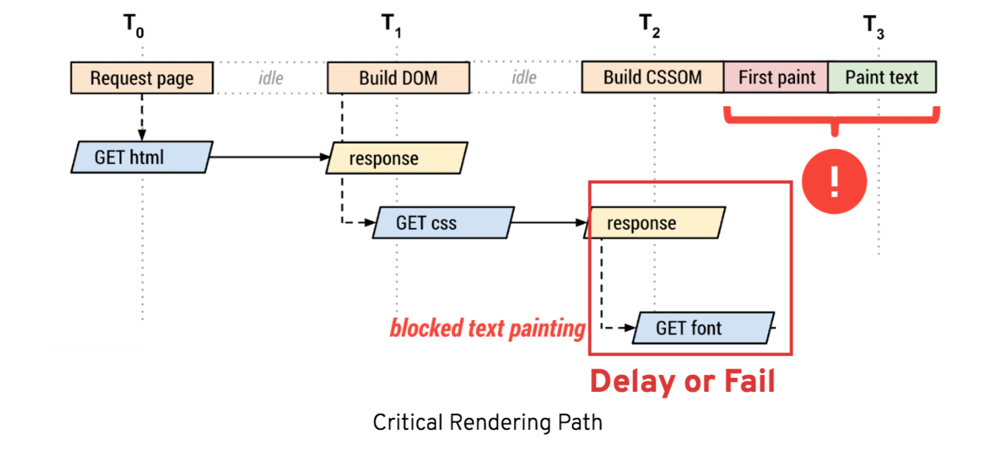
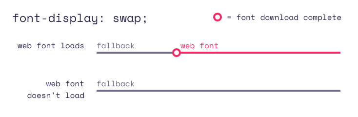
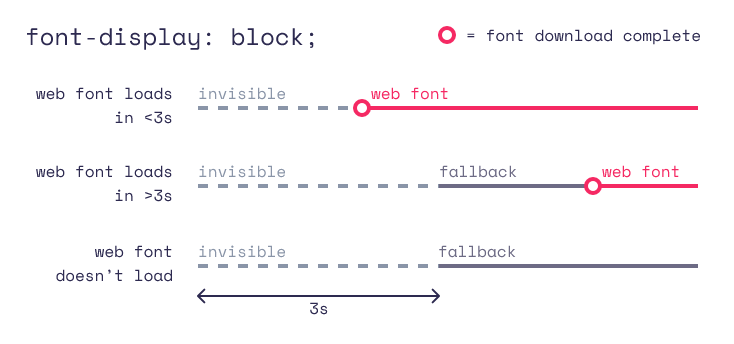
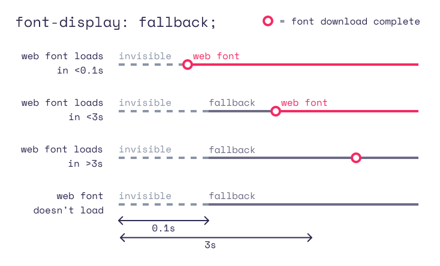
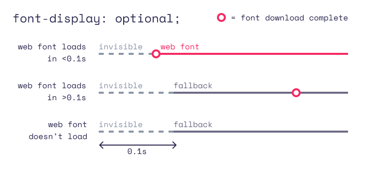
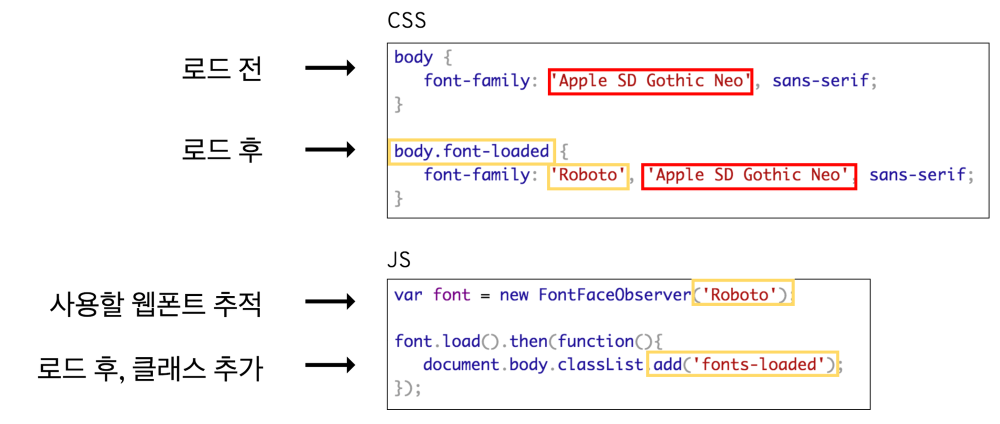

## 웹폰트란?

웹 폰트는 로컬의 폰트 설치 상황에 상관없이 웹에서 항상 원하는 타이포그래피를 사용할 수 있게 하는 기술입니다.
대표적인 예시로는 구글폰트와 같이 추가적인 글꼴을 따로 다운받지 않고 로드할 수 있도록 하는 것을 말합니다.

웹폰트는 기본적으로 @font-face 규칙을 이용합니다.


font-family를 이용하여 폰트 이름을 설정하고 src를 이용하여 폰트 파일의 경로를 지정하는 형식입니다.

웹 폰트를 이용하여 손쉬운 글꼴 사용이 가능해졌지만 이로 인해 생기는 문제점이 생겼습니다.

### 웹 폰트의 문제점

1. FOIT(Flash of Invisible Text)

브라우저가 웹 글꼴을 다운로드 하기 전에 텍스트가 보이지 않는 현상을 말합니다.

2. FOUT(Flash of Unstyled Tex)

스타일이 지정되지 않은 대체 글꼴을 렌더링합니다.


둘 다 이상적인 상황은 아니지만 웹 글꼴을 사용할 경우 웹 사이트를 처음 방문할 때 이 중 한 문제가 발생할 수도 있습니다.

### 웹 폰트의 문제점 원인




앞서 설명한 CRP 과정에서 CSSOM을 만드는 것을 모두 기억하시길 바랍니다. 웹 폰트의 경우 CSSOM을 만들면서 적용되는 것이 아닌 Layout과 Paint 과정과 동시에 진행됩니다.
폰트의 꼴이 변경되기 떄문에 repaint 과정이 생기고 글꼴로 인한 레이아웃이 변경되면 reflow도 일어날 수도 있습니다.

Cumulative Lay Shift(누적 레이아웃 이동)을 방지하기 위해서라도 웹폰트의 최적화는 필요한 과정입니다.

### font-display의 속성

#### swap




웹 글꼴이 로드될 때까지 대체 텍스트를 표시하도록 합니다. 대체 텍스트에서 원래 텍스트로 변경될 때 레이아웃의 변경이 있을 수도 있습니다.

#### block




3초동안 FOIT 방식을 이용하다가 3초 후에도 글꼴이 로드되지 않으면 FOUT 방식으로 변경됩니다.

#### fallback




FOIT 방식을 이용하던 도중 글꼴이 로드 된다 해도 일정 시간 이상 내에 로드되지 않으면 대체 글꼴을 유지합니다.

#### optional




초반 매우 짧은 시간 내에 글꼴이 로드되지 않은 경우 대체 글꼴을 사용합니다. fallback에 비해 초반 시간이 매우 짧습니다.


### 웹폰트

#### preload를 이용한 FOIT, FOUT 방지

link 속성 중 preload를 이용하여 폰트를 미리 로드하여 FOIT, FOUT를 방지할 수 있습니다.

```
<link rel="preload" href="/typefesse.woff2" as="font" type="font/woff2" crossorigin>
```

사용자가 처음 인지하는 글꼴의 경우 다음을 적용하는 것이 효과적입니다.

#### unicode-range 속성 이용하기


unicode-range 속성은 사용될 폰트에 설정된 유니코드 범위에서 벗어나는 글자가 있을 경우 폰트 다운로드 하는것을 미리 막아 다운로드를 하지 않는 방식입니다.

#### Font Style Matcher 이용하기



사용하려는 폰트와 형식과 꼴이 기본 폰트 중 가장 비슷한 형식을 고릅니다. Font Face Observer 라이브러리를 이용하면 폰트 로드 전 후를 판단 후 글꼴을 바꿀 수도 있습니다.

#### 그 외

위의 방법 외에도 적은 용량의 폰트 형식 사용하기, 서브셋 폰트(필요 없을 폰트를 잘라낸 간략한 정보를 담은 폰트) 사용하기 등이 있습니다.

---
[참조1](https://devs.vercel.app/webfont-foit-fout#85539328820c483bbf28753517d86d85)

[참조2](https://d2.naver.com/helloworld/4969726)

[참조3](https://web.dev/optimize-webfont-loading/)