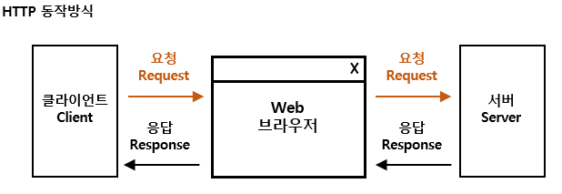
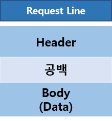
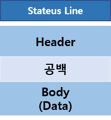

##HTTP API

HTTP 통신은 URL을 통해 HTML과 같은 정보를 주고받는 일종의 통신 규약이다. 흔히 웹페이지에 대한 정보를 주고 받는데 주로 쓰인다.

깊이 들어가면 네트워크에 대해서 들어가야하기 때문에 이 부분은 추후 설명하고 이번에는 간단하게 하고 넘어갈 예정이다.

URI - 프로토콜 + 도메인 + uri 

ex)https://github.com/posth2071/repository 

HTTP 통신은 크게 line, header, body로 이루어져 있다. 

line에는 캐시 정보, 요청방식, 요청에 대한 결과등이 저장되어 있다.

Header에는 body의 데이터 타입, 클라이언트 정보 등이 들어가 있다.

body는 통신을 통해 얻을 data에 대한 정보를 주로 가지고 있다.

##REST API

위의 http의 line에서 요청방식을 method라고도 부르는데
http API상에서 method을 따라 서버와 통신을 하면서 데이터를 관리하는 것을
REST API라고 하며
이를 기반으로 만들어진 시스템을 RESTful API라고 한다.

method에는 여러가지가 있지만 주로 쓰이는 것은 5가지다.

POST : 데이터를 새로 저장할 때 사용된다.

GET : 기존 데이터를 받아올 때 사용된다.

PUT : 기존 데이터를 완전히 다른 데이터로 변경할 때 사용한다.

PATCH : 기존 데이터에서 일부분을 수정할 때 사용된다.

DELETE : 기존 데이터를 삭제할 때 사용된다.

예) GET)http://example.com/post/randomidnum -> 데이터 받아옴
예) POST)http://example.com/post/randomidnum -> 데이터 새로 갱신

같은 HTTP API를 이용하여 같은 주소에 요청을 넣었지만 method가 다르게 되면 서버에서 처리하는 방법이 달라진다.

브라우저에서 별도의 형식을 넣지 않으면 보통은 get 요청을 하게 된다.

---

[참조1](https://jaejong.tistory.com/40)
