## 시작

컴퓨터는 어떻게 통신을 할까요?

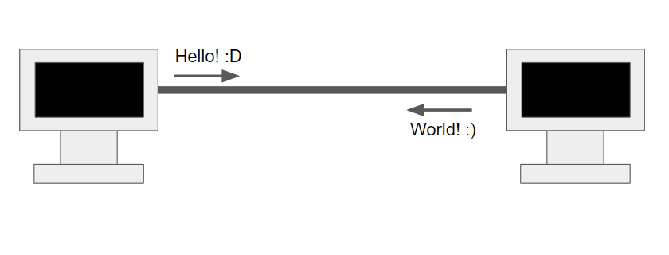

당연하게도 초기의 컴퓨터는 인터넷이 존재하지않아 서로 유선으로 연결하여 데이터를 주고 받았습니다.

하지만 인터넷이 등장하면서 무선이 아닌 컴퓨터끼리 유선으로 연결되어 있지 않아도 통신이 가능해졌습니다.

이런 인터넷이 우리나라와 세계적으로 유통되기 까지 재미있게도 한국 사람인 전길남 교수님의 공로가 매우 큰데 글이 너무 길어질 것 같아 각자 찾아보시기 바랍니다.(재미있습니다.)

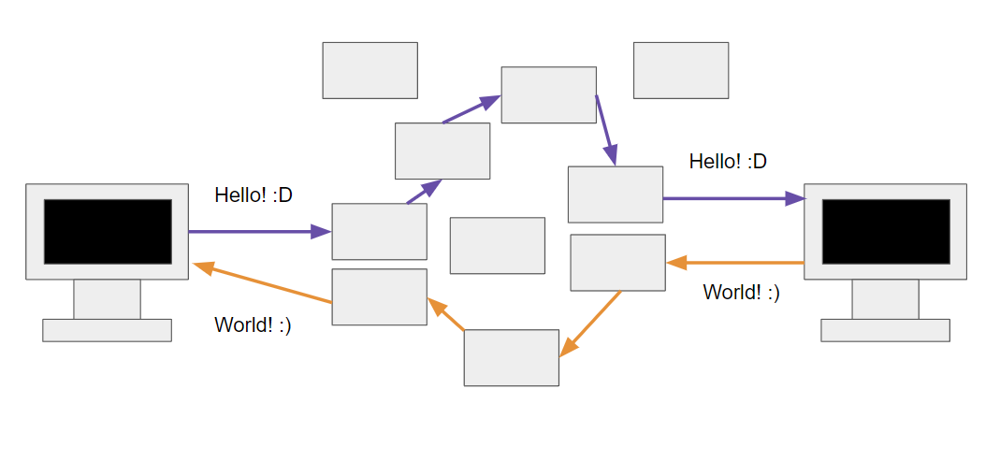

인터넷은 통신망이라는 이야기는 한번씩은 들어 보셨을겁니다. 인터넷은 서로간의 컴퓨터가 알아서 통신하는 것이 아닌 옛날 전화국이 전화를 전화원이 이어주는 것처럼 인터넷 또한 컴퓨터와 컴퓨터 사이에 수많은 노드들이 있어 여러 서버를 거쳐 클라이언트와 서버 사이에 통신을 하게 됩니다.

그렇다면 의문점이 생길겁니다. 이렇게나 많은 서버를 거치는데 과연 저희의 컴퓨터와 중간 서버 노드들은 어떻게 도착지와 출발지를 알고 정보를 전달할까요?

## IP

서버와 클라리언트간의 통신을 위해서 필요한 규칙 중 하나가 IP입니다. 컴퓨터는 인터넷으로 통신을 할 때 지정된 IP 주소에 데이터를 패킷이라는 통신 단위로 데이터를 전달합니다.

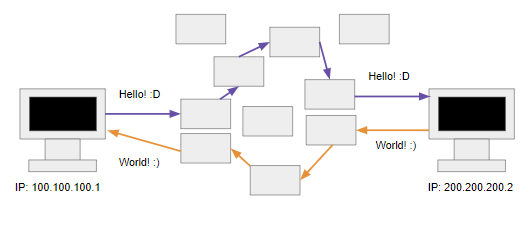

패킷에는 출발 IP 주소, 목적지 IP 주소 등이 들어있습니다.

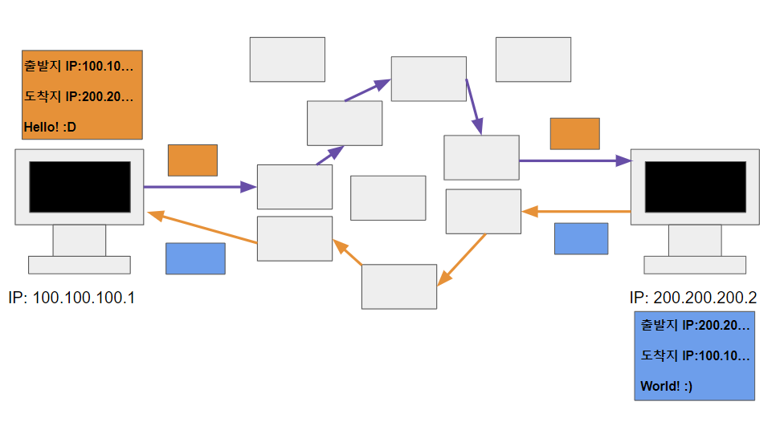

서버 혹은 클라이언트가 인터넷 통신망(노드)끼리 목적지를 찾아 도착지로 패킷을 전달합니다.

### IP 프로토콜의 한계

IP 프로토콜을 이용하여 목적지와 출발지를 알고 상호간의 교류가 가능해졌지만 IP 통신의 문제점이 없는 것은 아니었습니다.

#### 1. 비연결성

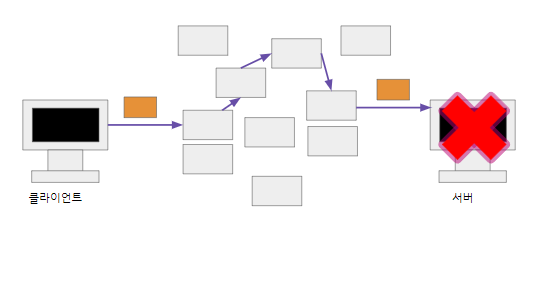

IP 프로토콜은 데이터를 일단 보내는 것으로 통신을 하기 때문에 서버가 서비스를 제공하지 못하는 경우에도 클라이언트는 패킷을 전송하게 됩니다.

#### 2-a. 비신뢰성 - 중간에 패킷이 사라지면?

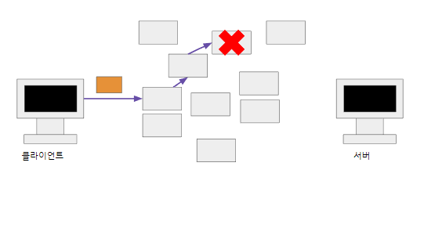

인터넷 중간 노드가 사라져서 데이터가 유실될 수도 있습니다. 대표적인 예시로 상어가 구글 인터넷 통신망을 손상시켜서 인터넷 연결에 문제가 생긴 경우도 있었지요.

#### 2-a. 비신뢰성 - 패킷이 순서대로 안오면?

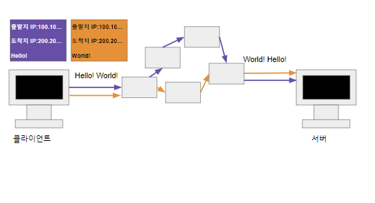

보통 인터넷 송신이 1500byte가 넘어가면 끊어서 데이터를 송신하는데 송신된 각 데이터가 다른 인터넷 노드로 송신되어 서버로 도착해야 할 순서가 다르게 될 수도 있습니다.

#### 3. 프로그램 구분: 같은 IP를 사용하는 서버에서 통신하는 둘 이상일 수도 있습니다. 게임과 노래를 동시에 동작시키고 있는데 각 데이터는 어디에 사용되어야할까요?

이를 해결하기 위해서 만들어 진 것이 TCP 입니다.

## TCP

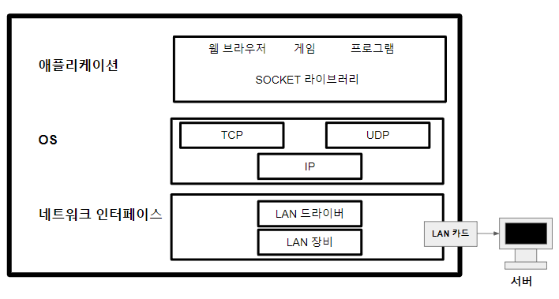

TCP 통신에 대해 설명하기 앞서 인터넷 프로토콜의 전체 구조를 설명하면 인터넷 프로토콜은 크게 4개의 계층으로 나뉘어집니다.

애플리케이션 계층 - HTTP, FTP

전송 계층 - TCP, UDP

인터넷 계층 - IP

네트워크 인터페이스 계층

이제 애플리케이션 단계에서 Hello, world!라는 메시지를 전달할 때 그 절차를 살펴보겠습니다.

1. 프로그램이 Hello,world! 메시지 생성 후 SOCKET 라이브러리를 통해 전달(애플리케이션 단계)

2. TCP 정보 생성, 메시지 데이터를 포함(전송 단계)

3. IP 패킷 생성, TCP 데이터 포함(인터넷 단계)

4. 서버 도착, 정보처리(네트워크 단계)

전에 설명했던 IP 처리에서 패킷 안에 전송 데이터와 정보를 담는다고 말했었습니다. 여기서 전송 데이터 안에 TCP 정보가 담겨 있습니다.

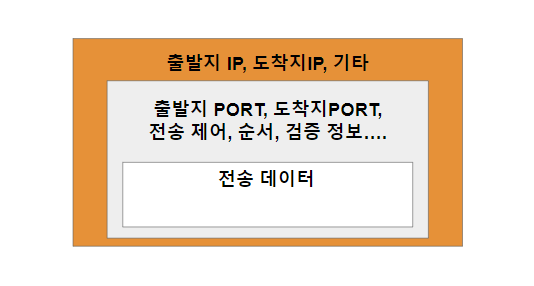

패킷 안에는 출발지 포트, 목적지 포트, 전송 제어, 순서, 검증정보 등이 들어 있게 됩니다.

### TCP의 특징

#### 1. 연결지향 - TCP 3 way handshake (가상 연결)

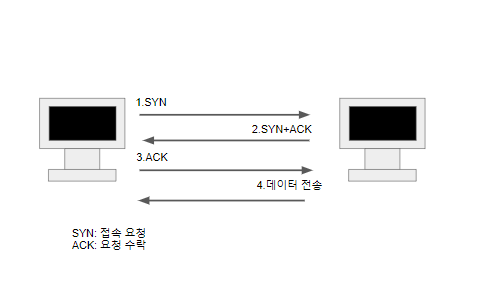

TCP 통신은 데이터를 주고 받기 전 서버가 작동하는지 확인하는 과정을 거칩니다. 이를 3 way hadshake 과정이라고 합니다. 이를 통해서 IP 통신의 문제점 중 하나인 서버의 서비스 가능 유무를 확인할 수 있습니다.

3번의 ACK 과정에서 클라이언트 측 데이터를 함께 전송할 수도 있습니다.

#### 2. 데이터 전달 보증

TCP 통신은 데이터를 전송하면 데이터 수신 여부를 알려줘야하기 때문에 데이터 수신 상태를 확인할 수 있습니다.

#### 3. 데이터 순서 보장

TCP 통신은 TCP 정보 내부에 데이터 전달 순서가 있어 패킷의 순서가 꼬였을 경우 꼬인 패킷부터 패킷을 재 전송하도록 서버 혹은 클라이언트에서 알릴 수 있습니다.

#### 4. 무엇을 위한 데이터인지 확인 가능

위의 패킷 데이터 정보를 보면 데이터의 PORT가 정해져 있는 것을 볼 수 있습니다. 저희 컴퓨터가 데이터를 송수신 할 때 포트를 정하게 되는데 각 애플리케이션의 포트를 정하게 되면 각 애플리케이션에 필요한 정보들이 정해져 데이터들이 어떤 애플리케이션을 위한 정보인지를 확인 할 수 있습니다.

포트의 경우 0~65535까지 할당이 가능하고 0~1023 포트의 경우 자주 쓰이는 포트이기 때문에 애플리케이션을 실핼할 때 최대한 피하는 것이 좋습니다. 대표적인 예시로 HTTP는 80번 포트를, HTTPS는 443 포트를 사용하고 있습니다.

## DNS란?

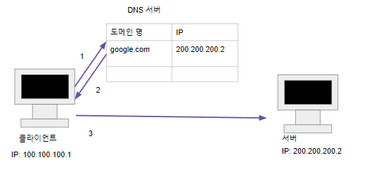

DNS는 Domain Name System로 일종의 전화번호부와 같습니다. 저희가 각 서버들의 IP를 기억하기에는 너무 어렵습니다. 하지만 도메인을 사 둔 경우 브라우저에 저희가 해당 사이트의 도메인을 입력하면 DNS 서버를 경유하여 해당 IP를 찾은 후 접속할 수 있게 됩니다.

---
