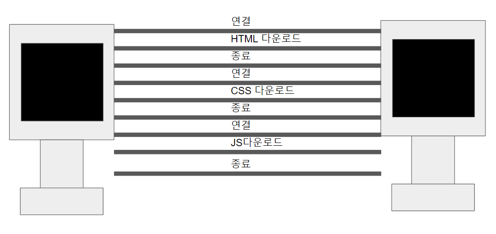
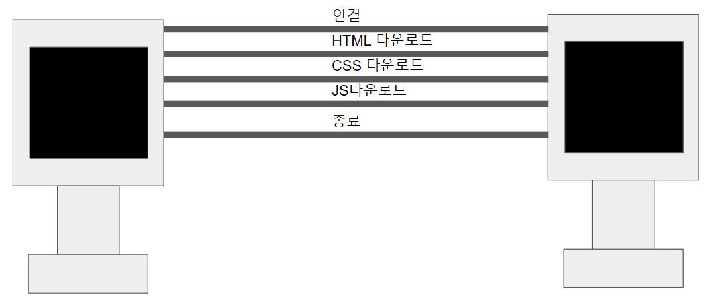
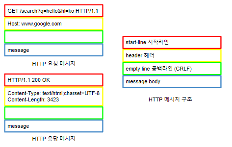

## 시작

 HTTP는 HTML, TEXT 뿐만 아니라 이미지, 영상, 파일 등 거의 모든 형태의 것들을 전송할 수 있습니다. 현재 통신은 HTTP의 시대라고 해도 과장이 아닐겁니다.

### HTTP 특징

#### 1. 클라이언트 서버 구조

HTTP 통신은 클라이언트에서 서버로 요청을 보내고 서버의 응답을 받는 클라이언트 서버 구조를 가지고 있습니다.

#### 2. 무상태 프로토콜(Stateless)

서버가 클라이언트의 상태를 보존하지 않는 것을 말합니다.

예를 들어 보겠습니다.

```
예시 1 - stateful의 경우

제임스가 노트북을 사기 위해서 가게에 갔다.

제임스: 이 노트북 얼마인가요?
점원: 100만원입니다.

제임스: 2개 사겠습니다.
점원: 200만원입니다. 신용카드와 현금 중 어떤 걸로 구매 하시나요?

제임스: 신용카드로 사겠습니다.
점원: 200만원 결제하겠습니다.
```

점원은 제임스가 하는 말을 모두 기억하고 이를 통해 대화를 이어나갔습니다.

```
예시 2 - stateless의 경우

제임스가 노트북을 사기 위해서 가게에 갔다.

제임스: 이 노트북 얼마인가요?
점원: 100만원입니다.

제임스: 2개 사겠습니다.
점원: 무엇을 2개 사시나요?

제임스: 신용카드로 사겠습니다.
점원: 무엇을 몇개 신용카드로 사시나요?

```

점원은 제임스가 하는 말을 하나도 이해하지 못했습니다! 이를 해결하기 위해서는 제임스가 추가적인 정보를 줘야합니다.

```
예시 3 - stateless의 경우

제임스가 노트북을 사기 위해서 가게에 갔다.

제임스: 이 노트북 얼마인가요?
점원: 100만원입니다.

제임스: 이 노트북을 2개 사겠습니다.
점원: 200만원입니다. 신용카드와 현금 중 어떤걸로 구매하시나요?

제임스: 이 노트북을 2개 신용카드로 사겠습니다.
점원: 결재 완료되었습니다.

```

stateful에 비해서 stateless는 점원에게 더 많은 정보를 제공해야하는 문제점이 있습니다. 하지만 이는 꼭 나쁘게만 작용하지 않는다. 예를들면 점원이 이야기를 하는 도중에 일이 생겨 다른 점원으로 바뀐 경우 위와 같은 과정을 거치지 않고 한번에 제임스가 점원에게 정보를 제공하여 일을 끝마칠 수 있습니다.

이제 제임스를 클라이언트로 점원을 서버라고 생각해봅시다. stateful의 경우 한 점원이 일을 끝마쳐야 하기 때문에 항상 같은 서버가 유지합니다. 하지만 stateless는 다른 서버로 바뀌어도 되기 때문에 무한정 서버의 증설이 가능합니다!

#### 3. 비연결성

앞서 설명한 TCP 통신에서 3 handshake과정에서 우리는 HTTP 통신에서 서버와 클라이언트 측에서 연결이 되어 있어야 하는 것을 말했던 것을 기억하실겁니다. HTTP 통신은 매우 짧은 시간동안 작동하는 통신입니다. 반면, 저희가 브라우저의 기능을 사용하면서 내내 HTTP 통신을 할 필요는 없을겁니다. 대표적으로 홈페이지 렌더링이나 서버에 데이터를 저장할 때 정도에 사용하겠죠. HTTP 통신을 하지 않는 시간에는 클라이언트와 서버간의 연결을 끊어버립니다.

이러한 특성을 비연결성이라고 하는데 이 특성 덕분에 한 서버가 여러개의 클라이언트와 통신이 가능하게 됩니다. 적은 서버로 많은 서비스를 제공할 수 있는 것이죠.

하지만 HTTP의 초기 모델에서 이러한 특성 때문에 생긴 문제도 있었습니다.

예를들어 홈페이지 렌더링을 위해서 HTML, CSS, JS를 다운로드 하는 경우가 있다고 합시다.




연결-HTML다운-종료-연결-CSS다운-종료-연결-JS다운-종료

당장 저희가 보더라도 연결과 종료가 불필요하게 많은 것입니다. 하지만 HTTP가 발전함에 따라서




연결-HTML다운,CSS다운,JS다운-종료

현재는 위와 같은 구조를 띄고 있다고 합니다. 아직도 HTTP는 계속 발전하고 있다고 합니다.

## HTTP 메시지




HTTP 통신을 위한 HTTP 통신 정보를 담은 HTTP 통신 메시지는 위와 같은 구조를 하고 있습니다.

### 시작라인(요청 메시지)

#### HTTP 메서드

GET, POST, PUT, DELETE등 서버가 수행해야 할 동작을 이야기 합니다.

#### 요청 메시지 - 요청 대상

쿼리와 경로를 담고 있습니다.

#### HTTP Version

HTTP 버전을 담고 있습니다.

### 시작라인(응답 메세지)

#### HTTP 버전

HTTP/1.1

#### HTTP 상태 코드

200: 성공

304: 캐시 이용

400: 클라이언트 오류

등

이유 문구: 사람이 이해할 수 있을 짧은 코드 설명의 글

등을 포함합니다.

### 헤더

헤더는 HTTP 전송에 필요한 모든 부가정보를 담고 있습니다.

메시지 바디의 내용, 메시지 바디의 크기, 압축, 인증, 요청 클라이언트(브라우저) 정보, 서버 애플리케이션 정보, 캐시 관리 정보뿐만 아니라
 저희가 임의의 헤더를 추가할 수도 있습니다.

 헤더에 대해서는 추후 다루겠습니다.

### 메시지 바디

실제 전송할 데이터 정보입니다.

HTML 문서, 이미지, 영상, JSON 등등 byte로 표현할 수 있는 모든 데이터 전송 가능합니다.

---


[참고1](https://www.inflearn.com/course/http-%EC%9B%B9-%EB%84%A4%ED%8A%B8%EC%9B%8C%ED%81%AC/dashboard)