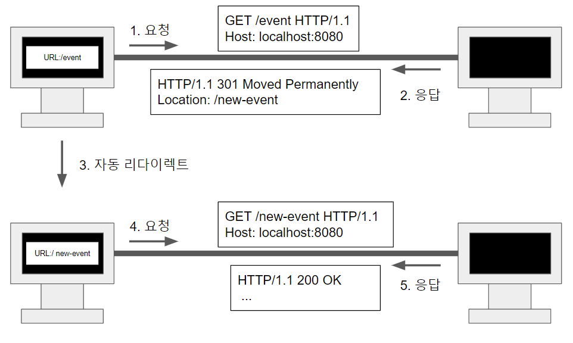
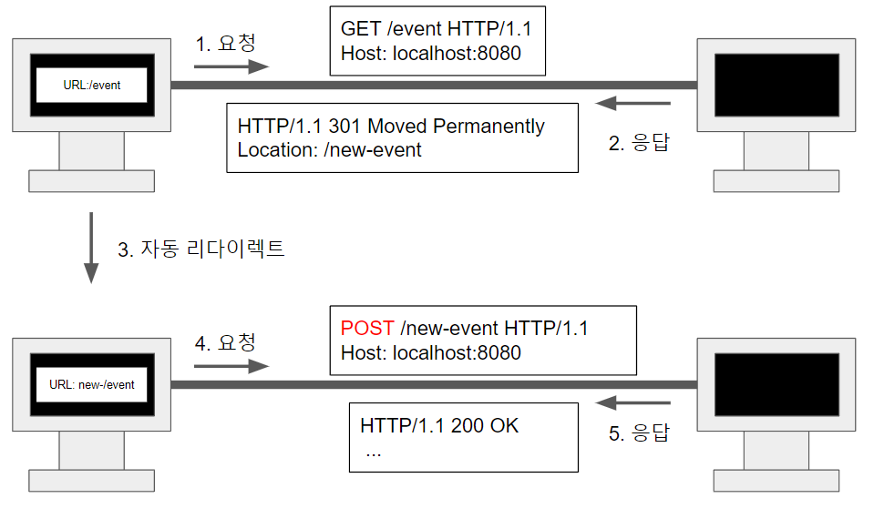
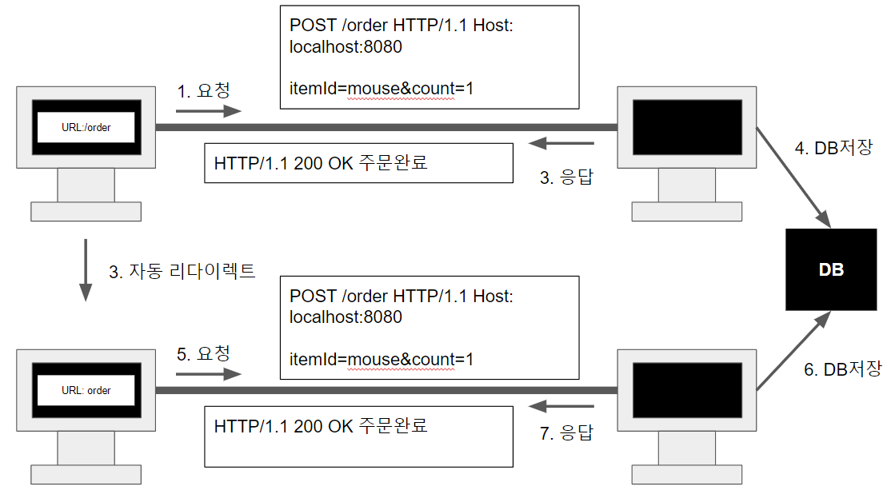
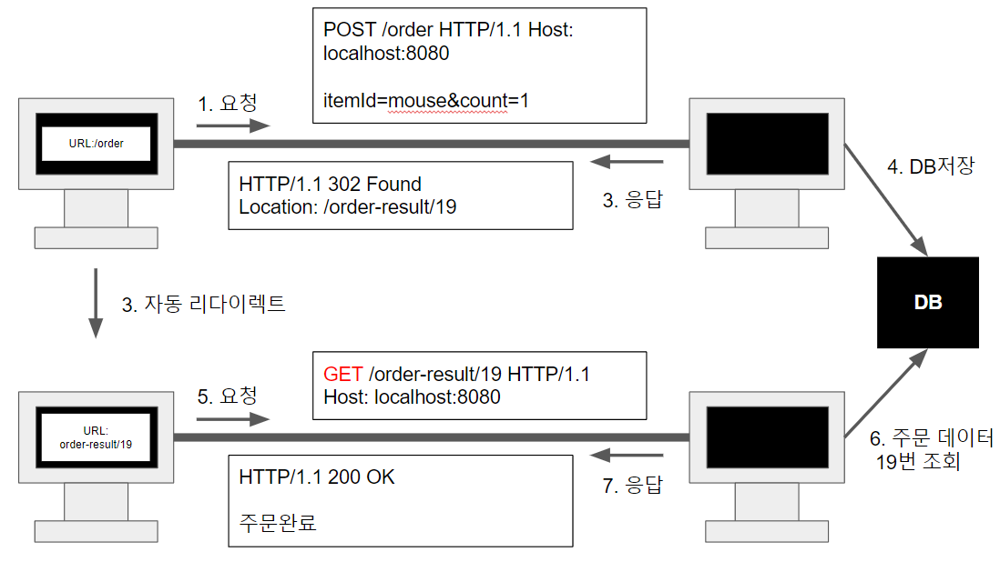

## 시작

모드 웹 개발이나 서버 개발을 하면서 404, 503, 200등 여러 상태 코드를 본 적이 있을겁니다. 이에 대해 알아봅시다!

### 1xx

요청이 수신되어 처리중이라는 상태 코드입니다. 잘 사용되지는 않습니다.

### 2xx - 성공 코드

#### 200 OK

요청이 성공되어 리소스를 전송하는 코드입니다.

#### 201 Created

요청에 성공하여 리소스가 추가되는 코드입니다. POST로 게시글을 쓸 때 받을 수 있는 응답입니다.

#### 202 Accepted

잘 사용되지는 않지만 요청이 접수되었고 처리가 되지 않음을 알립니다. 예를 들면 1시간 후에 프로세스 요청 처리 예정일 때 사용하겠네요.

#### 204 No Content

서버에 요청을 성공적으로 수행했지만 굳이 응답에 데이터를 보낼 필요가 없을 경우입니다. 편집기의 저장 버튼을 하면 저희의 글이 잘 저장됐는지가 중요하지 그에 대한 응답 데이터는 필요 없을 것입니다. 대표적인 예시가 되겠네요.

### 3xx - 리다이렉션

3xx 코드는 서버와 통신은 잘 됐지만 클라이언트에서 추가적인 작업을 해야할 때를 말합니다.

리다이렉션의 큰 틀로는 영구 리다이렉션, 일시 리다이렉션, 특수 리다이렉션이 있습니다.

#### 영구 리다이렉션

리소스의 URI가 영구적으로 이동한 경우입니다.

#### 영구 리다이렉션 - 301

현재 URL이 더 이상 서비스되지 않거나 경우 새로운 URL로 요청해야하는 것을 알려 새로 연결하도록 합니다.

예를 들어 저희가 설문조사를 하게 됐다고 가정합시다. 설문조사에 대한 답을 /event에 POST 메서드를 이용해서 제출했는데 
/event는 더 이상 사용되지 않는 URL일 경우 301을 사용할 수 있습니다.

이 경우 새로운 설문조사 페이지인 
/new-event로 GET 메소드가 요청되어 새로운 창이
 열리게 되고 기존에 작성한 데이터는 사라질 겁니다.

#### 영구 리다이렉션 - 308

리다이렉트시 요청 메서드와 본문 유지(처음 POST를 보내면 리다이렉트도 POST 유지)

308은 301과 비슷하지만 GET을 통해 새로운 창을 여는 것이 아닌 기존의
 데이터를 새로운 설문조사 주소인 new-event로
  POST 메소드를 이용하여 전송하게 됩니다.

하지만 서버의 처리 URL이 바뀌게 된다면 처리할
 데이터도 바뀌기 때문에 잘 사용하지는 않습니다.

#### 일시적 리다이렉션

리소스의 URI가 일시적으로 변경되는 경우 사용됩니다.

POST로 주문 후에 웹 브라우저를 새로고침하면 주문이 다시 요청이 되어 중복 주문이 될 수도 있습니다.

POST를 할 경우 주문 결화 화면으로 GET 메서드로 리다이렉트를 하게 하여 새로고침을 하더라도 GET으로 조회가 되도록 하는 방법을 이용해서 이를 방지할 수 있습니다. 이를 PRG: POST/Redirect/GET 방법이라고도 합니다.

위의 그림의 경우 새로 고침을 하더라도 5번부터 반복할 것입니다.

#### 302 FOUND 

리다이렉트 요청 메서드가 대부분 GET으로 변하고(다른 메서드도 가능합니다.), 본문이 제거될 수 있습니다. 301과 비슷합니다

#### 307 Temporary Redirect

리다이렉트시 요청 메서드와 본문을 유지합니다. 요청 메서드가 병경되지 않습니다.

GET -> GET

POST -> POST

#### 303 See Other

리다이렉트 요청 메서드가 무조건 GET으로 변합니다.

---

대부분의 경우 302로 처리한다고 합니다.

자동 리다이렉션을 사용할 경우 GET이 아닌 메소드를 사용하는 것이 아니면 302로 전부 처리해도 문제 없다고 합니다.

---

#### 기타 리다이렉션

304 Not Modified

클라이언트가 한번 사용햇던 리소스를 다시 다운받는 것보다 저장한 후 추후 이용하는 것을 캐시라고 하는데 304 응답을 받을 경우 캐시를 재사용할 수 있도록 합니다.

캐시의 경우 7번째 글에서 다루도록 하겠습니다.

### 4XX 클라이언트 오류

클라이언트의 요청에 잘못된 문법(api 사용 형식 이상)등 서버가 아닌 클라이언트의 문제가 있을 때의 상태 메세지입니다.

#### 400

클라이언트가 잘못된 요청을 할 경우, 파라미터나 API 스펙을 준수하지 않을 경우입니다.

#### 401 Unauthorized 

인증되지 않은 경우로 WWW-Authenticate 헤더를 통해 인증 방법을 서버에서 설명할 수 있습니다.

#### 403 Forbidden

서버가 요청을 이해했지만 승인을 거부한 경우입니다.

#### 404 NOT Found

요청 리소스가 서버에 없는 경우입니다. 혹은 권한이 부족한 리소스에 접근할 때 해당 리소스를 숨기고 싶을 때도 사용 가능합니다.

### 5XX 서버 에러

서버 에러입니다. 재시도하면 성공할 수도 있습니다.

#### 503 서비스 이용 불가

서버가 일시적인 과부하 또는 예정된 작업으로 잠시 요청을 처리할 수 없을 때입니다.

Retry-After 헤더 필드로 얼마 뒤에 복구되는지를 알릴 수도 있습니다.

---

---

[참고1](https://www.inflearn.com/course/http-%EC%9B%B9-%EB%84%A4%ED%8A%B8%EC%9B%8C%ED%81%AC/dashboard)