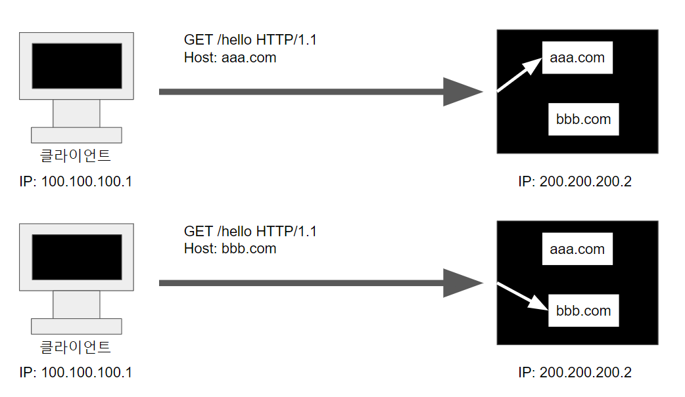

## 시작

---

HTTP 헤더에는 메시지 바디의 내용, 메시지 바디의 크기, 압축, 인증, 요청 클라이언트, 서버 정보, 캐시
관리 정보 등 많은 데이터가 들어갈 수 있습니다.

즉, 글에 대한 간략한 정보를 알 수 있도록 한 것이 HTTP 헤더입니다.

이제 이 부분에 대해서 다뤄보겠습니다.


## 표현 헤더

---

### Content-Type

표현 데이터의 형식을 설명합니다.

```
Content-Type: text/html; charset=utf-8 <div/>
Content-Type: multipart/form-data; boundary=something
```

미디어의 타입과 문자 인코딩 방식을 알려줍니다.


### Content-Encoding

표현 데이터를 압축하기 위해 사용합니다. 


```
Content-Encoding: gzip
Content-Encoding: compress
Content-Encoding: deflate
Content-Encoding: identity
Content-Encoding: br
```


데이터를 전달하는 곳에서 압축 후 인코딩 헤더 추가

데이터를 읽는 쪽에서 인코딩 헤더의 정보를 바탕으로 압축을 해제합니다.


### Content-Language

청중을 위한 언어를 설명하기 위해 사용되는데, 사용자가 선호하는 언어에 따라 사용자를 구분하도록 해줍니다

```
Content-Language: de-DE
Content-Language: en-US
Content-Language: de-DE, en-CA
```

### Content-Length

수신자에게 보내지는, 바이트 단위를 가지는 개체 본문의 크기를 나타냅니다.

```
Content-Length: <length>
```

Transfer-Encoding(전송 코딩)을 사용하면 Content-Length를 사용하면 안됩니다.

## 협상 헤더

클라이언트가 선호하는 표현 요청입니다.

예를 들어서 가능하다면 한국어로 gzip 타입으로 압축해서 보내주세요! 라고 서버에 요청을 보낼 수도 있습니다.

### Accept 

클라이언트가 선호하는 미디어 타입 전달합니다.

```
Accept: text/html, application/xhtml+xml,
```

### Accept-Charset

클라이언트가 이해할 수 있는 캐릭터셋이 무엇인지를 알려줍니다.

```
Accept-Charset: iso-8859-1
Accept-Charset: utf-8, iso-8859-1;q=0.5
Accept-Language: utf-8, iso-8859-1;q=0.5, *;q=0.1
```


### Accept-Encoding

보통 압축 알고리즘인, 클라이언트가 이해 가능한 컨텐츠 인코딩이 무엇인지를 알려줍니다

```
Accept-Encoding: gzip
Accept-Encoding: compress
Accept-Encoding: deflate
Accept-Encoding: br
Accept-Encoding: identity
Accept-Encoding: *
```


### Accept-Language

어떤 언어를 클라이언트가 이해할 수 있는지, 그리고 지역 설정 중 어떤 것이 더 선호되는지를 알려줍니다.

```
Accept-Language: de
Accept-Language: de-CH
Accept-Language: en-US,en;q=0.5
```

### 협상과 우선순위1

0~1의 값을 가지며 클수록 우선 순위를 가집니다.

```
Accept-Language: ko-KR,ko;q=0.9,en-US;q=0.8,en;q=0.7
```

헤더를 가지게 된다면 ko > en-US > en 순으로 부합하는 데이터를 줄 것입니다.

### 협상과 우선순위2

구체적인 것을 우선시합니다.

```
Accept: text/*, text/plain, text/plain;format=flowed, */*
```

1. text/plain;format=flowed

2. text/plain

3. text/*

4. /

1번의 정보가 제일 정확하기 때문에 위의 순서대로 리소스를 확인후 부합하는 리소스가 있으면 그에 대한 응답을 줄 것입니다.

## 전송 방식

전송에는 크게 4가지 방법이 있습니다.

### 1. 단순 전송

```
HTTP/1.1 200 OK
Content-Type: text/html;charset=UTF-8
Content-Length: 3423

<html>
 <body>...</body>
</html>
```

압축하지 않은 순수 값을 전송합니다.


### 2. 압축 전송

```
HTTP/1.1 200 OK
Content-Type: text/html;charset=UTF-8
Content-Encoding: gzip
Content-Length: 521

lkj123kljoiasudlkjaweioluywlnfdo912u34ljko98udjkl
```

압축된 응답을 전송합니다. 응답 방식이 헤더에 포함되어 있고 압축된 리소스가 바디에 포함되어 있습니다.

### 3. 분할 전송

```
HTTP/1.1 200 OK
Content-Type: text/plain
Transfer-Encoding: chunked

5
Hello
5
World
0
\r\n
```

리소스를 분할해서 응답합니다. 이 경우 각 분할된 리소스 앞에 리소스의 크기가 적혀있기 때문에 HTTP 헤더에 리소스 크기를 적으면 안됩니다.

즉, Content-length가 위에서 말했듯이 사용하면 안됩니다. 단, Transfer-Encoding: chunked을 적어줘야 합니다.

### 4. 범위 전송

```
HTTP/1.1 200 OK
Content-Type: text/plain
Content-Range: bytes 1001-2000 / 2000

qweqwe1l2iu3019u2oehj1987askjh3q98y
```

특정 범위에 대한 값이 전송됩니다.


## 일반 정보

---

### From

유저 에이전트의 이메일 정보입니다.

### Referer

현재 요청된 페이지의 이전 웹 페이지 주소입니다. Referer을 이용해서 유입 경로를 분석할 수 있습니다.

### User-Agent

클라이언트의 애플리케이션 정보 등을 담고 있습니다. 어떤 종류의 브라우저에서 장애가 발생하는지 파악이 가능합니다.

### Server

요청을 처리하는 오리진 서버의 소프트웨어 정보

### Date

메시지가 생성된 날짜


## 특별한 정보

---

### Host

서버의 도메인명과 서버가 리스닝하는 (부가적인) TCP 포트를 특정합니다. 

즉, 저희가 요청하려는 도메인을 뜻합니다.

```
GET /search?q=hello&hl=ko HTTP/1.1
Host: www.google.com
```

Host는 요청에서 사용하는 필수적인 헤더입니다.




하나의 서버가 여러 도메인을 처리해야 하거나 하나의 IP 주소에 여러 도메인이 적용되어 있을 때 필요한 정보입니다.

예를 들어 한 서버가 2개의 도메인을 서비스하고 있다고 가정합시다. aaa.com을 원하는 클라이언트에게는 aaa.com의 리소스를, bbb.com을 원하는 클라이언트에게는 bbb.com의 리소스를 주는 등, 클라이언트가 원하는 도메인에 대한 응답을 해줄 수 있습니다.

만약 Host 헤더가 존재하지가 없다면 서버는 어느 도메인으로 연결하고 싶은지 알 수가 없는 문제가 생길 수도 있기 때문에 Host 헤더는 필수 헤더가 되었습니다.

### Location: 페이지 리다이렉션

웹 브라우저는 3xx 응답의 결과에 Location 헤더가 있으면, Location 위치로 자동 이동합니다. 해당 설명은 전의 3xx 응답에서 했습니다.

201 (Created): Location 값은 요청에 의해 생성된 리소스 URI입니다. 즉, 게시판에 글을 쓴 경우 게시판으로 자동적으로 이동되는 경우를 말합니다.

3xx (Redirection): 3xx에서 Location 값은 요청을 자동으로 리다이렉션하기 위한 대상 리소스를 가리킵니다.

### Allow: 허용 가능한 HTTP 메서드

405 (Method Not Allowed)의 응답을 할 경우 어떤 요청이 가능한지 알려줍니다.

```
Allow: GET, HEAD, PUT
```

### Retry-After

서버에 문제가 있는 503(Service Unavailable) 응답이 있을 경우 유저 에이전트가 다음 요청을 하기까지 기다려야 하는 시간을 알려줄 수도 있습니다.

### 인증 Authorization

클라이언트 인증 정보를 서버에 전달하는 헤더입니다.

```
Authorization: Basic xxxxxxxxxxxxxxxx
```

### WWW-Authenticate

리소스에 접근이 실패할 경우 접근을 하기 위해서 필요한 인증 방법을 게시합니다. 401 응답과 함께 사용할 수 있습니다.

```
WWW-Authenticate: Newauth realm="apps", type=1,
 title="Login to \"apps\"", Basic realm="simple"
```

## 쿠키

### Set-Cookie

서버에서 클라리언트로 쿠키를 전달합니다.

### Cookie

클라이언트가 서버에서 받은 쿠키를 저장하고 HTTP 요청시 서버로 전달합니다.

### 쿠키를 사용하는 이유

클라이언트에서 서버에 특정 정보에 따라 변경된 리소스를 주는 URL이 있다고 가정합시다.

저희가 해당 URL에 요청을 하면 기본적으로 `반갑습니다. 손님!`이라는 응답을 주지만

user=홍길동 이라는 헤더를 전송하면 `반갑습니다. 홍길동님!`이라는 URL입니다.

HTTP 통신은 기본적으로 무상태 프로토콜이기 때문에 특정한 정보를 반복적으로 요청할 때 같은 정보를 받으려면 매 요청시마다 HTTP 헤더에 정보를 입력해야합니다.

위의 경우에는 user=홍길동을 반복적으로 요청해야할 것입니다.

대표적인 예시로 로그인 일주일간 로그인 유지, 이 창 일주일 동안 보지 않기 등이 있습니다.

쿠키를 사용할 때는 보안에 민감한 데이터는 저장하면 안되고 최소한의 정보를 사용하는 것이 좋습니다.


### 쿠키 - 생명주기

서버에서 사용자 브라우저에 쿠키를 전송하기 위해 사용됩니다.

```
Set-Cookie: expires=Sat, 26-Dec-2020 04:39:21 GMT
Set-Cookie: max-age=3600 (3600초)
```

Set 쿠키를 이용하여 쿠키의 유효 시간을 정할 수도 있습니다.

세션쿠키: 만료 날짜를 생략하면 브라우저 종료시 까지만 유지합니다.

영속쿠키: 만료 날짜를 입력하면 해당 날짜까지 유지합니다.

### 쿠키 - 도메인 Domain

```
Set-Cookie:domain=example.org
```

쿠키가 적용되어야 하는 호스트를 지정. 지정되어 있지 않으면 현재 문서 URI를 기준으로 적용됩니다만, 서브 도메인을 포함하지 않습니다. 이전의 설계와 달리, 도메인의 선두에 위치한 점들은 무시됩니다. 도메인이 지정되면, 서브도메인들은 항상 포함됩니다.

즉, 위의 쿠키를 예시를 들면 해당 쿠키를 입력하면

dev.example.org에서도 쿠키 사용이 가능하지만 쿠키 domain이 설정되지 않으면 

example.com에서만 사용 가능합니다.

### 쿠키 - 경로

Path

예) path=/home

쿠키 헤더를 보내기 전에 요청 된 리소스에 있어야하는 URL 경로를 나타냅니다.

일반적으로 path=/ 루트로 지정합니다.

예)

path=/home 지정

/home -> 가능

/home/level1 -> 가능

/home/level1/level2 -> 가능

/hello -> 불가능

### 쿠키 - 보안

Secure, HttpOnly, SameSite

#### Secure

쿠키는 http, https를 구분하지 않고 전송합니다. 하지만 Secure를 적용하면 https인 경우에만 전송합니다

#### HttpOnly

XSS 공격 방지를 위해 사용합니다. 자바스크립트에서 접근 불가(document.cookie)합니다.

#### SameSite

XSRF 공격 방지합니다. 요청 도메인과 쿠키에 설정된 도메인이 같은 경우만 쿠키 전송합니다.

---


[참고1](https://www.inflearn.com/course/http-%EC%9B%B9-%EB%84%A4%ED%8A%B8%EC%9B%8C%ED%81%AC/dashboard)

참고2 - MDN 공식 문서