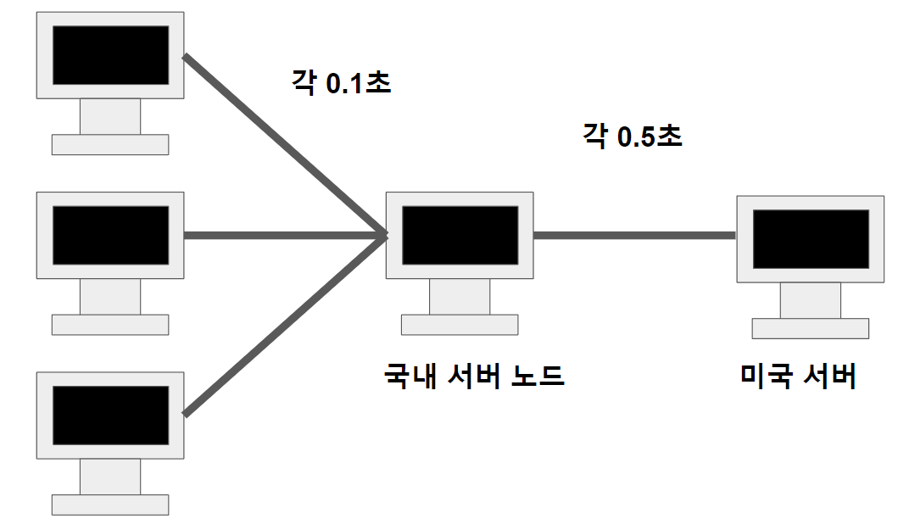

# 웹 캐시

## 캐시란?

웹 캐시에 대해서 이야기 하기 전에 캐시가 무엇인지 간략하게 이야기 해봅시다.

캐시의 위키 백과에서의 정리에 따르면 

캐시(cache, 문화어: 캐쉬, 고속완충기, 고속완충기억기)는 컴퓨터 과학에서 데이터나 값을 미리 복사해 놓는 임시 장소를 가리킨다. 캐시는 캐시의 접근 시간에 비해 원래 데이터를 접근하는 시간이 오래 걸리는 경우나 값을 다시 계산하는 시간을 절약하고 싶은 경우에 사용한다. 캐시에 데이터를 미리 복사해 놓으면 계산이나 접근 시간 없이 더 빠른 속도로 데이터에 접근할 수 있다.

라고 정의합니다.

보다 쉽고 간략하게 설명해보면 이미 사용한 적이 있거나 추후 사용될 가능성이 있을 데이터를 저장하는 공간입니다.
메모리에 직접적으로 접속하지 않고 그 전에 데이터를 얻을 수 있어 더 빠른 결과를 가집니다.
개인적으로는 척수반사 같은 느낌도 드네요 ㅎㅎ

솔직히 말해서 추상적이고 모호한 말입니다. 좀 더 확실하게 예시를 가져오면

```
  while(i < 10)
  {
    i++;
    A[i] = i
  }
```

라는 간단한 소스코드가 있다고 합시다.

여기서 while은 반복될 것이기 때문에 cache를 이미 사용했던 메모리를 여러번 사용할 것입니다.
즉, 캐시는 반복적으로 사용되는 데이터가 많을수록 높은 효율을 내는데 이를

#### 시간적 지역성

이라고 합니다.

반면, A[i]라는 배열을 저희는 위의 소스코드에서 여러번 참조를 합니다. 즉,
저희가 참조할 배열의 데이터의 주소는 한 곳에 모여있습니다. 반면, 전혀 다른 배열이나 변수를 참조하여
여러번 메모리에 접근하게 되면 효율성이 떨어집니다.
이렇게 참조하려는 데이터가 한 곳에 모여 있으면 효율성이 높아지는 것을

#### 공간적 지역성

이라고 합니다.


만약 저희가 원하는 데이터가 cache에 없다면 cache miss라고 하여 메모리에 접속해야합니다.

반면 cache에 저희가 원하는 데이터가 존재한다면 cache hit이라고 하여 메모리에 별도의 접속이 필요로 하지 않습니다.

그렇다면 캐시가 크면 데이터 처리가 빨라지니 좋은 것 아닌가요? 라고 하기에는 캐시가 커지면 그만큼 비용도 많이 든다고 합니다.

### 웹 캐시란?

웹 캐쉬란 client가 요청하는 html, image, js, css등과 같은 정적 데이터를
특정 위치에 복사본으로 저장(USING SPACE)하고, 이후 동일한
URL의 Resource요청은 다시 내려 받지 않고 내부에 저장한 파일을 사용하여
더 빠르게 서비스하기 위한 것입니다.

### 웹캐시의 종류?

#### 1. Browser Cashes

+ 브라우저 또는 HTTP 요청을 하는 Client Application에 의해 내부 디스크에 캐쉬(사용자 측에서 저장하는 캐시)
+ 캐시된 리소스를 따로 공유하지 않는 이상 개인 Application에 한정되는 캐시
+ 브라우저의 back 버튼 또는 이미 방문한 적이 있는 페이지에 재방문 하는 경우 용이하게 쓰임

#### 2. Proxy Cashes

+ Browser Cashes와 동일한 원리로 동작하며 Client나 Server가 아닌 네트워크 상에서 동작
+ 큰 회사나 IPS의 방화벽에 설치 되며 대기시간 & 트래픽 감소, 접근 정책 & 제한 우회, 사용률 기록등을 수행
+ 한정된 수의 클라이언트를 위해 무한 대의 웹 서버 컨텐츠를 캐시

#### 3. GateWay Cashes

+ 서버 앞 단에 설치되어 요청에 대한 캐시 및 효율적인 분배를 통해 가용성, 신뢰성, 성능등을 향상
+ Encryption, SSL acceleration, Load balancing, Server/ cache static content, Compression 등을 수행
+ 무한 대의 클라이언트들에게 한정된 수의 웹 서버 컨텐츠를 제공

여기서 Front 영역에서 주로 다뤄볼 내용은 Browser Cashes입니다.

## 캐시를 어떻게 컨트롤 할까?

브라우저 캐시는 한번 요청한 파일을 캐시로 이용합니다. 하지만 만약 캐시될 필요가 없는 내용이나 
캐시된 파일과 캐쉬된 내용에 변경이 되는 경우 어떻게 처리해야할까요? 이 경우 방법이 크게 2가지가 있습니다.

### 1. HTML Meta tags

```
<META HTTP-EQUIV="EXPIRES" CONTENT="Mon, 22 Jul 2002 11:12:01 GMT">
<META HTTP-EQUIV="CACHE-CONTROL" CONTENT="NO-CACHE">
```

첫번째 방법은 Meta 태그를 이용하는 방법입니다. 하지만 이 방볍은 과거의 몇몇 브라우저에서만
사용될 뿐 현재는 사용되지 않습니다.

### 2. HTTP header 사용

두번째 방법으로는 HTTP header을 이용하는 것입니다.

HTTP header에 들어갈 수 있는 속성으로는 Last-Modified, ETag, Expires, Cache-Control:max-age 등이 있습니다.

#### Last-Modified

MDN 문서에 따르면  응답은 HTTP 헤더에 서버가 알고있는 가장 마지막 수정된 날짜와 시각을 담고 있습니다. 이는 저장된 리소스가 이전과 같은지 유효성 검사자로 사용됩니다.

라고 정의되어 있습니다. ETag 덜 정확하지만 대비책으로 사용된다고 합니다.

```
Last-Modified: <day-name>, <day> <month> <year> <hour>:<minute>:<second> GMT
```


1. 클라이언트는 첫 서버로부터 받은 응답의 Header의 Last-Modified에 저장합니다.<div/>
2. 추후 같은 데이터를 재요청시 If-Modified-Since에 전에 저장한 Last-Modified의 값을 담아 서버에 전송합니다.<div/>
3. 서버는 If-Modified-Since에서의 값을 대조하여 유효한 캐시면 재사용, 유효하지 않을 경우면 데이터를 재전송하도록 합니다.<div/>

Last-Modified의 경우 문제점이 몇가지가 있는데

1. 데이터 형식이 정해져 있어 Client가 값을 변경할 수도 있다는 문제점<div/>
2. 데이터를 수정해서 날짜가 다르지만, 같은 데이터를 수정해서 데이터 결과가 똑같은 경우<div/>
3. 1초 미만(0.x초) 단위로 캐시 조정이 불가능<div/>

#### ETag

ETag는 특정 버전의 리소스를 식별하는 식별자입니다.
만약 웹 서버가 내용을 확인하고 변하지 않았을 경우, 웹 서버로 full 요청을 보내지 않아 효율적인 처리가 가능합니다.
반면, 내용이 변경되었을 경우 mid-air collisions이라고 불리는 리소스 간의 동시 다발적 수정 및 덮어쓰기 현상을 막는데 유용하게 사용됩니다.

위의 설명이 MDN에서의 설명입니다.

ETag와 Last-Modified의 가장 큰 차이점으로는 이를 관리하는 것이 전적인 서버에서 이뤄지는 활동이라는 것입니다.
서버에서 정한 형식을 이용하여 웹 캐시의 유효 유무를 판단하고 데이터가 변경되었을 경우 형식을 서버가 정하는 만큼
어디를 수정할지를 정할 수도 있습니다.


1. 클라이언트는 첫 서버로부터 받은 응답의 Header의 Etag에 저장합니다.<div/>

2. 추후 같은 데이터를 재요청시 If-None-Match에 전에 저장한 ETag의 값을 담아 서버에 전송합니다.<div/>

3. 서버는 If-Modified-Since에서의 값을 대조하여 유효한 캐시면 재사용, 유효하지 않을 경우면 데이터를 재전송하도록 합니다.

#### Expires, Cache-Control:max-age

Expires와 max-age를 이용하여 캐시의 유효기간을 정할 수 있습니다.

### 캐시가 유효하지 않다면?

만약 캐시의 유효 기간이 다 지난 경우 조건부 요청을 통해 캐시가 유효한지 재검증을 수행합니다.

앞서말한 If-None-Match와 If-Modified-Since를 이용한 방법이 대표적인 재검증 예시입니다.

만약 재검증 이후 최종적으로 캐시가 유효하지 않다면 200의 응답을 줘 최신 데이터를 재전송하고 
캐시가 유효한 경우 304의 응답을 줘 캐시가 유효함을 알립니다.

### no-cache와 no-store

Cache-Control에서 가장 헷갈리는 두 가지 값이 있다면 바로 no-cache 와 no-store 입니다. 이름은 비슷하지만 두 값의 동작은 매우 다릅니다.

no-cache 값은 대부분의 브라우저에서 max-age=0 과 동일한 뜻을 가집니다. 즉, 캐시는 저장하지만 사용하려고 할 때마다 서버에 재검증 요청을 보내야 합니다.

no-store 값은 캐시를 절대로 해서는 안 되는 리소스일 때 사용합니다. 캐시를 만들어서 저장조차 하지 말라는 가장 강력한 Cache-Control 값입니다. no-store를 사용하면 브라우저는 어떤 경우에도 캐시 저장소에 해당 리소스를 저장하지 않습니다.

### 프록시 캐시

위 시작부분에서 말했던 캐시의 종류 중 Proxy Cashes가 있는 것을 기억해주시기 바랍니다.

프록시 캐시의 특징으로는 중간 노드 단계에서 통신 속도를 보다 빠르게 해주는 것입니다. 그림으로 예시를 살펴봅시다.


만약 미국에 리소스의 원 서버가 존재해서 매번 통신할 때마다 0.5초가 걸리는 상황이 있었습니다. 그러던 와중에 중간 노드에서 프록시 캐시가 작동하기 시작합니다.



짠! 0.5초씩 통신을 하던 클라이언트들은 중간 프록시 노드의 캐시를 이용해서 0.1초만에 통신을 할 수 있게 되었습니다.

여기서 클라이언트 개인에게 저장되는 캐시를 private캐시, 중간 프록시 서버에 저장되는 캐시는 public 캐시라고 칭합니다.

이렇게 캐시가 프록시 서버에 저장되기 위해서는 헤더에 정보를 줘야합니다.

```
Cache-Control: public
```

응답이 프록시 서버에도 저장될 수 있도록 합니다. 즉, 프록시 캐시로 사용이 가능합니다.

```
Cache-Control: private
```

응답이 해당 사용자만을 위해 사용되는 것으로 private 캐시에만 저장될 수 있습니다. 기본값입니다.

```
Cache-Control: s-maxage
```

프록시 캐시에서만 사용되는 max-age입니다.

```
Age:60
```

오리진 서버에서(원래 정보가 담긴 원 서버를 말합니다.) 응답 후 프록시 캐시 내에 머문 시간을 말합니다.


## 마무리

이하 웹 캐시에 대해서 간략하게(생각보다 긴...) 정리해봤습니다.

웹 캐시를 잘 이용하면 적게 잡아먹는 좋은 예시임을 알 수 있는 부분이었습니다.

---

[참조1](https://wh00300.tistory.com/79)
[참조2](https://developer.mozilla.org/ko/docs/Web/HTTP/Headers/Last-Modified)
[참조3](https://developer.mozilla.org/ko/docs/Web/HTTP/Headers/ETag)
[참조4](https://toss.tech/article/smart-web-service-cache)