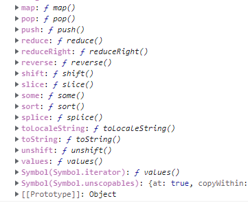
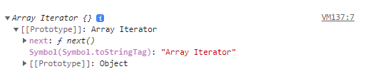

```
let arr = [1,2,3]
for(const a of arr){
  console.log(a)
} // 1,2,3
```

여러분은 위와 같은 방식의 반복문을 한번쯤은 보셨을겁니다. 그리고 원래 자바스크립트의
문법이 이렇다면서 저처럼 넘어가셨을 겁니다.

```
let arr = [1,2,3]
for(const a of arr){
  console.log(a)
} // 1,2,3

arr[Symbol.iterator] = null;
for(const a of arr){
  console.log(a)
} //Uncaught TypeError: arr is not iterable
```

arr에서 Symbol.iterator을 지워보겠습니다. 그러니 TypeError이 생기게 되었습니다.

처음 Symbol.iterator을 지우기 전 arr처럼 반복이 가능한 객체를 저희는 `이터러블 객체`라고 합니다.

그렇다면 Symbol.iterator이 뭐길래 arr에서 지워지니 arr의 iterable 속성이 없어질까요?

## 이터러블과 이터레이터

### iterable

이터러블은 이터레이터를 반환하는 [Symbol.iterator]() 메서드를 가진 객체입니다.
배열의 경우 Array.prototype 내부에 Symbol.iterator이 있기 때문에 이터러블의 속성을
가지게 됩니다.



위의 예시는 Array.prototype의 일부분을 보여준 것으로 앞서말한 Symbol.iterator이 있는 것을 확인 할 수 있습니다.

```
const arr = [1,2,3]
for(const item of array){
  console.log(item)
}
```

위처럼 Symbol.iterator을 가지고 있으면 for of 문에서 반복 순회가 가능하지만

```
const obj = {a:1, b:2}
for (const item of obj){
  console.log(item)
} // TypeError: obj is not iterable
```

일반객체처럼 Symbol.iterator을 가지고 있지 않으면 이터러블이 아니기 때문에
반복 순회할 수가 없습니다.

참고로 ES6에서 제공하는 빌트인 이터러블은 다음과 같습니다.

`Array, String, Map, Set, TypedArray(Int8Array, Uint8Array, Uint8ClampedArray, Int16Array, Uint16Array, Int32Array, Uint32Array, Float32Array, Float64Array), DOM data structure(NodeList, HTMLCollection), Arguments`

### iterator

이터레이터는 {value:값, done: 완료\_여부}에 따라서 이터레이터 객체를 반환하는
next()메서드를 가진 객체입니다. next를 통해 메서드를 순환할 수 있게됩니다.
예시로 확인해봅시다.

```
const arr = [1,4,3]; //arr는 그냥 평범한 배열

const iter = arr[Symbol.iterator]();

console.log(iter.next());//{value:1, done:false}
console.log(iter.next());//{value:4, done:false}
console.log(iter.next());//{value:3, done:false}
console.log(iter.next());//{done:true}
console.log(iter.next());//{done:true}
```

위와 같이 Symbol.iterator 내부에는 next() 메소드가 포함되어 있으며 next를 통해 순환할 수 있게 됩니다.



Symbol.iterator 내부에는 next 메소드가 있기 때문에 이터러블은 이터레이터입니다.

### 커스텀 이터러블

위에서 이터러블과 이터레이터의 정의와 성질을 살펴봤습니다. 하지만 이는 JS의 기본적으로
제공된 built In 이터러블이지 저희가 제어를 하지는 않았습니다.

이번에는 일반 객체에 Symbol.iterator을 추가하여 커스텀 이터레이터를 만들어 봅시다.

```
const fibonacci = {
  [Symbol.iterator]() {
    let [pre, cur] = [0, 1];
    const max = 10;
    return {
      next() {
        [pre, cur] = [cur, pre + cur];
        return {
          value: cur,
          done: cur >= max
        };
      }
    };
  }
};
for (const num of fibonacci) {
  console.log(num); // 1 2 3 5 8
}
const arr = [...fibonacci]; // 이렇게 스프레드 문법도 가능합니다.
console.log(arr);//[1,2,3,5,8]
```

Symbol.iterator은 next()를 반환하는 함수로 만들어져야합니다.
추후 반복 중 done이 true가 될 경우 멈추게 됩니다.

하지만 이 경우 next()를 반환하기는 하지만 next() 메소드를 가진 것이
이니기 때문에 이터레이터라고 할 수는 없습니다.

```
const fibonacci = {
  pre: 0,
  cre: 1,
  [Symbol.iterator]() {
    this.current = this.pre;
    this.last = this.cre;
    return this;
  },
  next() {
    if (this.current + this.last < 10) {
      let temp = this.current + this.last;
      this.current = this.last;
      this.last = temp;
      return { done: false, value: this.last };
    } else {
      return { done: true };
    }
  },
};

for (const num of fibonacci) {
  console.log(num); // 1 2 3 5 8
}
const arr = [...fibonacci]; // 이렇게 스프레드 문법도 가능합니다.
console.log(arr); //[1,2,3,5,8]
```

반면 위와 같이
Symbol.iterator은 next() 메소드를 가진 객체를 반환할 경우
이터레이터이면서 이터러블인 성질을 가질 수 있습니다.

### 이터러블이면서 이터레이터인 함수

```
const fibonacciFunc = function (max) {
  let [pre, cur] = [0, 1];

  return {
    [Symbol.iterator]() {
      return {
        next() {
          [pre, cur] = [cur, pre + cur];
          return {
            value: cur,
            done: cur >= max,
          };
        },
      };
    },
  };
};
for (const num of fibonacciFunc(10)) {
  console.log(num); // 1 2 3 5 8
}
```

먼저 이터러블을 만드는 함수를 만들어 봅시다.
앞서 만든 이터러블 성질을 가진 일반 객체처럼 위와 같이 함수를 만들 수 있습니다.

```
// 이터러블이면서 이터레이터인 객체를 반환하는 함수
const fibonacciFunc = function (max) {
  let [pre, cur] = [0, 1];

  // Symbol.iterator 메소드와 next 메소드를 소유한
  // 이터러블이면서 이터레이터인 객체를 반환
  return {
    // Symbol.iterator 메소드
    [Symbol.iterator]() {
      return this;
    },
    // next 메소드는 이터레이터 리절트 객체를 반환
    next() {
      [pre, cur] = [cur, pre + cur];
      return {
        value: cur,
        done: cur >= max
      };
    }
  };
};

// iter는 이터러블이면서 이터레이터이다.
let iter = fibonacciFunc(10);

// iter는 이터레이터이다.
console.log(iter.next()); // {value: 1, done: false}
console.log(iter.next()); // {value: 2, done: false}
console.log(iter.next()); // {value: 3, done: false}
console.log(iter.next()); // {value: 5, done: false}
console.log(iter.next()); // {value: 8, done: false}
console.log(iter.next()); // {value: 13, done: true}

iter = fibonacciFunc(10);

// iter는 이터러블이다.
for (const num of iter) {
  console.log(num); // 1 2 3 5 8
}
```

위처럼 Symbol.iterator을 통해 next메소드를 갖는 이터레이터(this)를 반환하면
이터러블이면서 이터레이터인 함수를 만들수 있게 됩니다.

https://inpa.tistory.com/entry/JS-%F0%9F%93%9A-%EC%9D%B4%ED%84%B0%EB%9F%AC%EB%B8%94-%EC%9D%B4%ED%84%B0%EB%A0%88%EC%9D%B4%ED%84%B0-%F0%9F%92%AF%EC%99%84%EB%B2%BD-%EC%9D%B4%ED%95%B4#thankYou

https://poiemaweb.com/es6-iteration-for-of
