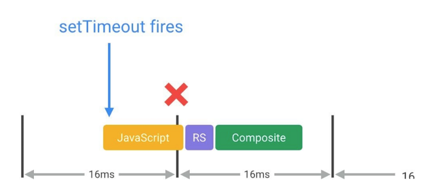

## 결론

상황에 따라서 다른 것을 쓰면 됩니다.

일단 알아둬야하는 것은 각 함수들의 용도가 전혀 다른 용도라는 것입니다. 무엇이 더 낫다기 보다는 무엇이 더 적합할지에 대해서 먼저 생각할 필요가 있습니다.

### 본론

setInterval, setTimeout을 다루는 글은 이 글을 읽으실 분이라면 실습을 해보면서 여러번 다뤄봤을테고 사용법에 대한 글은 다른 블로그에도 많이 있을테니 생략하겠습니다.

제가 지금부터 집중하고 싶은 부분은 requestAnimationFrame과 setInterval의 차이입니다.

requestAnimationFrame은 전에 말한 CRP과정이 시작하기 전에 JS 코드를 실행해서 보다 부드러운 애니매이션을 사용할 수 있게 됩니다.

브라우저의 이상적인 렌더링 프레임은 60프레임으로 약 16.6ms마다 한번씩 렌더링이 되는 것이 이상적이라고 합니다.
그렇다면 setInterval을 이용해서 16.6ms마다 함수를 실행하면 되지 않을까요?

안타깝게도 아닙니다. 이는 JS 이벤트 루프와 관련이 있습니다. JS 이벤트 루프에 대한 자세한 설명은 이전에 설명한 적이 있으므로 넘어가겠습니다.

setInterval은 16.6초마다 실행되는 것이 아닌 16.6ms가 지난 후 call stack이 비어있을 때 실행되는 것입니다. 즉, call stack이 비어있지 않는다면
16.6ms 이상의 시간이 지난 후가 되어서야 실행된다는 것입니다. 이러한 오차가 점점 쌓이게 되여 최적의 렌더링 주기와 맞지 않게 되는 드리프트 현상이 일어날 수도 있습니다.

반면 requestAnimationFrame은 렌더링 전에 코드를 실행하고 렌더링되는 함수이기 때문에 16.6ms에 대한 오차가 생기지 않아 드리프트 현상이 일어나지 않게 됩니다.

고로 
setInterval은 일정 시간 후에 한번 사용할 함수
setTimeout은 일정 시간 마다 반복 사용할 함수
requestAnimationFrame은 매 프레임마다 실행해야하는 함수
로 각각의 사용처라 다릅니다.

---

### requestAnimationFrame의 장점 추가 2022-07-31

requestAnimationFrame은 브라우저가 비활성 상태(다른 탭을 키는 행위 등)을 하면 화면에 렌더링을 할 필요가 없어지므로 requestAnimationFrame이 실행되지 않는다.
반면 setInterval은 비활성 상태일 때도 코드가 반복적으로 돌아가는 차이가 있다.

여기서 2가지의 장점을 requestAnimationFrame이 가져갈 수 있는데

1. 움직이던 애니매이션이 보던 부분에서 다시 시작된다.

2. 비활성 상태에서 실행되지 않으므로 리소스를 적게 잡아먹는다.

등이 있다.

~~~
https://codesandbox.io/s/requestanimationframe-forked-5ho0p4?file=/index.html
~~~

<iframe src="https://codesandbox.io/embed/requestanimationframe-forked-5ho0p4?fontsize=14&hidenavigation=1&theme=dark"
     style="width:100%; height:500px; border:0; border-radius: 4px; overflow:hidden;"
     title="requestAnimationFrame (forked)"
     allow="accelerometer; ambient-light-sensor; camera; encrypted-media; geolocation; gyroscope; hid; microphone; midi; payment; usb; vr; xr-spatial-tracking"
     sandbox="allow-forms allow-modals allow-popups allow-presentation allow-same-origin allow-scripts"
   ></iframe>

---

[참조1](https://javascript.plainenglish.io/better-understanding-of-timers-in-javascript-settimeout-vs-requestanimationframe-bf7f99b9ff9b)

[참조2](https://velog.io/@0715yk/HTML-requestAnimationFrame)